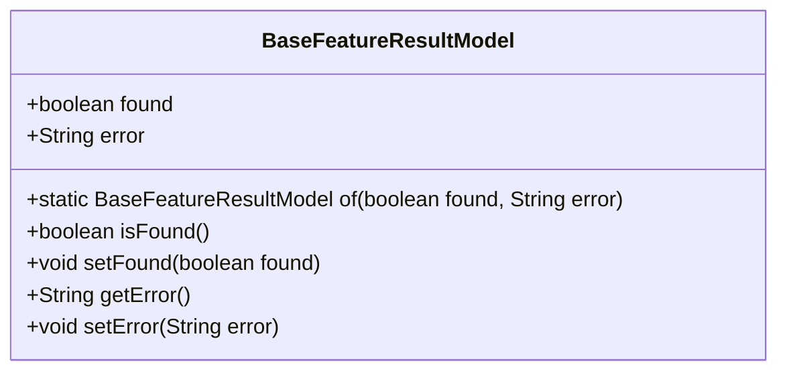
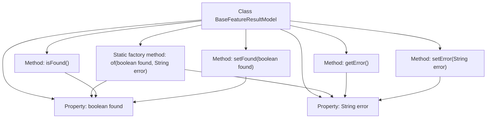

# Basic Information

|      |      |
|------|------|
| Name | BaseFeatureResultModel |
| Language | .java |
| Code Path | WeFe/serving/serving-sdk-java/src/main/java/com/welab/wefe/serving/sdk/model/BaseFeatureResultModel.java |
| Package Name | com.welab.wefe.serving.sdk.model |
| Dependencies | [] |
| Brief Description | The BaseFeatureResultModel class contains the attributes "found" and "error," and provides the constructor method "of" along with getter/setter methods, used to return feature lookup results and error messages. |

# Description

BaseFeatureResultModel is a base feature result model class, containing a boolean variable "found" indicating whether the feature is found, and a string variable "error" storing error messages. It provides a static method "of" for quick instance creation, and includes getter and setter methods for "found" and "error".

# Class Summary

| Name   | Type  | Description |
|-------|------|-------------|
| BaseFeatureResultModel | class | The BaseFeatureResultModel class includes the found and error attributes, providing the constructor method of and getter/setter methods, which are used to store and manipulate feature result states and error messages. |

## Class BaseFeatureResultModel

|      |      |
|------|------|
| Access Modifier | public |
| Type | class |
| Name | BaseFeatureResultModel |
| Description | The BaseFeatureResultModel class includes the found and error attributes, providing the constructor method of and getter/setter methods, which are used to store and manipulate feature result states and error messages. |

### UML Class Diagram

This code defines a class named `BaseFeatureResultModel`, which represents a base feature result model. The class contains two public fields: `found` indicates whether the result was found, and `error` stores error messages. It provides a static factory method `of()` for quick instance creation, along with standard getter/setter methods. The class design is straightforward and suitable as a base result encapsulation class, facilitating extension and reuse.

### Internal Method Call Graph

This code defines a class named BaseFeatureResultModel for encapsulating feature lookup result status information. The class contains two core properties: "found" indicates whether the feature was located, while "error" stores error messages. The static factory method of() enables quick object instance creation, along with standard getter/setter methods for property access. The flowchart clearly illustrates the class structure, invocation relationships between properties and methods, particularly showing how the factory method initializes property values and how accessor methods interact with properties.

### Field List

| Name  | Type  | Description |
|-------|-------|------|
| error = "" | String | Defined a public string variable named 'error', initialized as an empty string. |
| found = false | boolean | Defined a public boolean variable found with an initial value of false. |

### Method List

| Name  | Type  | Description |
|-------|-------|------|
| isFound | boolean | This is a Java method that returns the current state of the boolean variable found. |
| setFound | void | Public method to set the found boolean value. |
| of | BaseFeatureResultModel | The static method `of` creates and returns an instance of `BaseFeatureResultModel`, setting the values of the `found` and `error` properties. |
| getError | String | String methods for retrieving error messages. |
| setError | void | This is a Java method used to set error messages, assigning the passed string to the error member variable of the class. |

