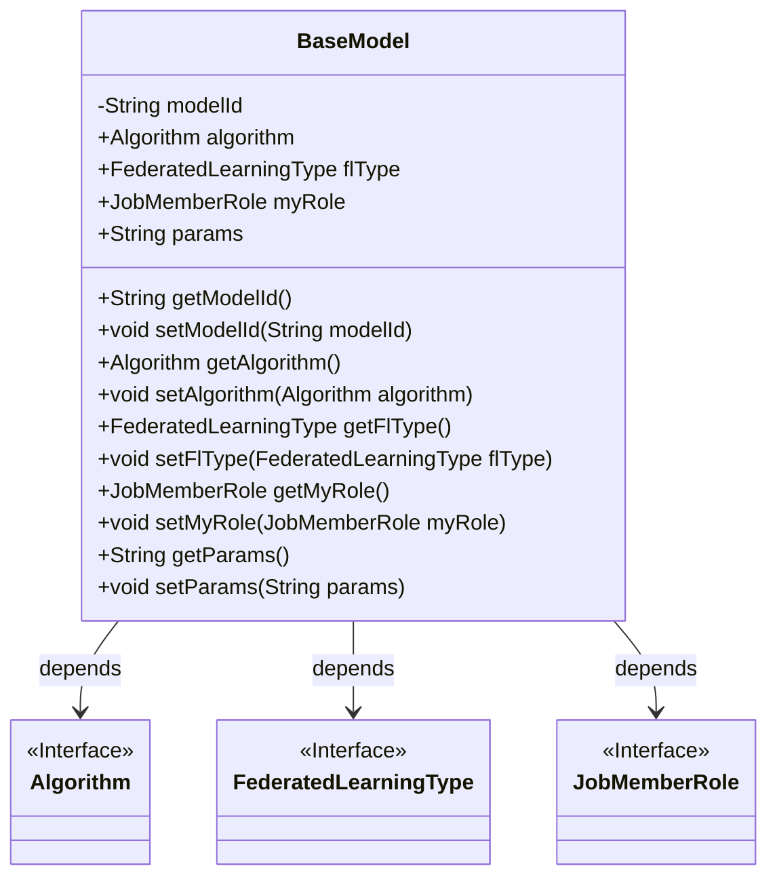

# Basic Information

|      |      |
|------|------|
| Name | BaseModel |
| Language | .java |
| Code Path | WeFe/serving/serving-sdk-java/src/main/java/com/welab/wefe/serving/sdk/model/BaseModel.java |
| Package Name | com.welab.wefe.serving.sdk.model |
| Dependencies | ['com.welab.wefe.common.wefe.enums.Algorithm', 'com.welab.wefe.common.wefe.enums.FederatedLearningType', 'com.welab.wefe.common.wefe.enums.JobMemberRole'] |
| Brief Description | The BaseModel class includes fields such as model ID, algorithm, federated learning type, member role, and parameters, providing getter and setter methods for each attribute. |

# Description

The BaseModel class is a foundational model class that includes five main attributes: modelId for identifying the model, algorithm representing the type of algorithm used, flType specifying the federated learning type, myRole defining the task member role, and params storing the model parameters. Each attribute has corresponding getter and setter methods for access and modification. This class provides the basic framework for models, supporting parameter management and role configuration in federated learning scenarios.

# Class Summary

| Name   | Type  | Description |
|-------|------|-------------|
| BaseModel | class | The BaseModel class includes attributes such as model ID, algorithm, federated learning type, member role, and parameters, providing corresponding getter and setter methods. |

## Class BaseModel

|      |      |
|------|------|
| Access Modifier | public |
| Type | class |
| Name | BaseModel |
| Description | The BaseModel class includes attributes such as model ID, algorithm, federated learning type, member role, and parameters, providing corresponding getter and setter methods. |

### UML Class Diagram

BaseModel is a foundational model class containing attributes such as model ID, algorithm, federated learning type, member role, and parameters. The class provides getter and setter methods for these attributes. BaseModel depends on three interfaces: Algorithm, FederatedLearningType, and JobMemberRole, which may define related behaviors or types. The design of BaseModel allows flexible configuration and management of different aspects of the model, making it suitable for scenarios like federated learning.

### Internal Method Call Graph

```mermaid
graph TD
    A["Class BaseModel"]
    B["Private attribute: String modelId"]
    C["Public attribute: Algorithm algorithm"]
    D["Public attribute: FederatedLearningType flType"]
    E["Public attribute: JobMemberRole myRole"]
    F["Public attribute: String params"]
    G["Method: String getModelId()"]
    H["Method: void setModelId(String modelId)"]
    I["Method: Algorithm getAlgorithm()"]
    J["Method: void setAlgorithm(Algorithm algorithm)"]
    K["Method: FederatedLearningType getFlType()"]
    L["Method: void setFlType(FederatedLearningType flType)"]
    M["Method: JobMemberRole getMyRole()"]
    N["Method: void setMyRole(JobMemberRole myRole)"]
    O["Method: String getParams()"]
    P["Method: void setParams(String params)"]

    A --> B
    A --> C
    A --> D
    A --> E
    A --> F
    A --> G
    A --> H
    A --> I
    A --> J
    A --> K
    A --> L
    A --> M
    A --> N
    A --> O
    A --> P
```

This flowchart illustrates the complete structure of the BaseModel class, including 5 member variables (1 private attribute and 4 public attributes) along with their corresponding getter/setter methods. All methods are directly associated with the class, forming a standard Java Bean pattern designed to encapsulate core properties of federated learning base models. These include critical information such as model ID, algorithm type, federated learning type, member role, and parameter strings.

### Field List

| Name  | Type  | Description |
|-------|-------|------|
| modelId | String | Declare a private string variable modelId. |
| flType | FederatedLearningType | Public federated learning type variable flType. |
| algorithm | Algorithm | Declare a public variable named algorithm of the Algorithm class. |
| myRole | JobMemberRole | A public variable myRole is defined, with the type JobMemberRole. |
| params | String | String type parameter variable. |

### Method List

| Name  | Type  | Description |
|-------|-------|------|
| getFlType | FederatedLearningType | Methods to obtain the federated learning type, returns the value of the flType field. |
| setModelId | void | This is a Java method used to set the modelId property value of an object. The method takes a string parameter modelId and assigns it to the property of the same name in the current object. |
| setAlgorithm | void | Set the algorithm property of the current object to the specified algorithm. |
| setMyRole | void | This is a Java method used to set the myRole property value of the current object to the passed JobMemberRole parameter. |
| getModelId | String | This is a Java method that returns the value of the modelId field as a string. |
| getAlgorithm | Algorithm | Methods to obtain the current algorithm instance. |
| setFlType | void | The method for setting the federated learning type assigns the parameter flType to the member variable flType of the class. |
| getMyRole | JobMemberRole | Get the current user's role information. |
| getParams | String | Get the string value of the params parameter. |
| setParams | void | Method for setting parameters, assigning the input parameters to the class member variable params. |

