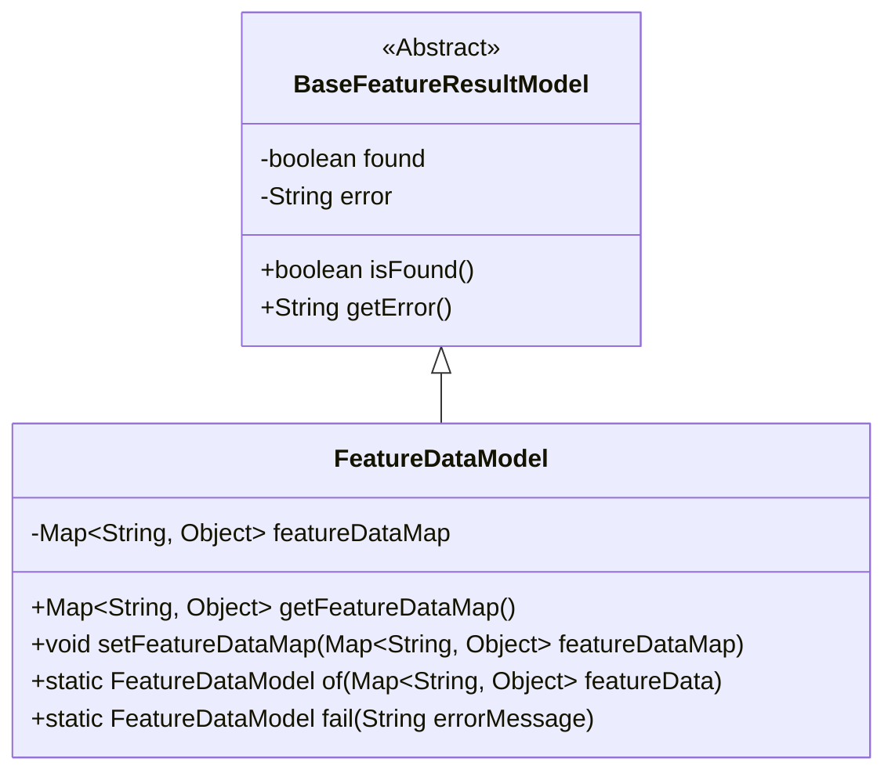
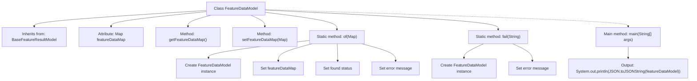

# Basic Information

|      |      |
|------|------|
| Name | FeatureDataModel |
| Language | .java |
| Code Path | WeFe/serving/serving-sdk-java/src/main/java/com/welab/wefe/serving/sdk/model/FeatureDataModel.java |
| Package Name | com.welab.wefe.serving.sdk.model |
| Dependencies | ['com.alibaba.fastjson.JSON', 'org.apache.commons.collections4.MapUtils', 'java.util.Map'] |
| Brief Description | The FeatureDataModel class inherits from BaseFeatureResultModel, containing the featureDataMap property and related operation methods. It supports creating instances via the of method while checking data validity, as well as handling error cases through the fail method. |

# Description

The code defines a class named FeatureDataModel, which inherits from BaseFeatureResultModel. The class includes a member variable featureDataMap of type Map, along with corresponding getter and setter methods. It provides two static methods: the of method is used to create an instance and initialize featureDataMap while setting the found and error properties based on whether the Map is empty; the fail method is used to create an instance with an error message. The main method demonstrates using the of method to create an instance and output a JSON string.

# Class Summary

| Name   | Type  | Description |
|-------|------|-------------|
| FeatureDataModel | class | The FeatureDataModel class inherits from BaseFeatureResultModel, containing the featureDataMap property and related operation methods. It supports creating instances via the of method while checking data validity, as well as handling error cases through the fail method. |

## Class FeatureDataModel

|      |      |
|------|------|
| Access Modifier | public |
| Type | class |
| Name | FeatureDataModel |
| Description | The FeatureDataModel class inherits from BaseFeatureResultModel, containing the featureDataMap property and related operation methods. It supports creating instances via the of method while checking data validity, as well as handling error cases through the fail method. |

### UML Class Diagram

Class diagram description: FeatureDataModel inherits from the abstract base class BaseFeatureResultModel, extending feature data storage capabilities. The base class contains a found status flag and error message, while the subclass stores key-value pair data via featureDataMap, providing static factory methods of() and fail() to create instances. The diagram clearly illustrates the inheritance relationship and core methods, embodying the encapsulation of feature data and error handling mechanism.

### Internal Method Call Graph

This flowchart illustrates the structure of the FeatureDataModel class and its key method invocation relationships. The class inherits from BaseFeatureResultModel and contains a Map-type attribute featureDataMap along with its getter/setter methods. The core static method of() is used to create instances and initialize data states, while fail() creates error instances. The main method demonstrates the invocation of of() and JSON output process. The diagram clearly presents attribute definitions, method call chains, and inheritance relationships, with particular emphasis on the initialization logic within static factory methods.

### Field List

| Name  | Type  | Description |
|-------|-------|------|
| featureDataMap | Map<String, Object> | The private mapping variable featureDataMap has keys of string type and values of object type. |

### Method List

| Name  | Type  | Description |
|-------|-------|------|
| setFeatureDataMap | void | This is a Java method used to set the featureDataMap property of a class, with the parameter being of type Map, where the key is String and the value is Object. |
| getFeatureDataMap | Map<String, Object> | Methods for obtaining feature data mapping, returning Map-type data with keys as String and values as Object. |
| fail | FeatureDataModel | The static method `fail` takes an error message, creates a `FeatureDataModel` instance, sets its `error` property, and then returns it. |
| of | FeatureDataModel | The static method `of` accepts a Map parameter, initializes a `FeatureDataModel` object, sets the `featureDataMap` property, and configures the `found` and `error` properties based on whether the Map is empty, finally returning the object. |
| main | void | Create an empty FeatureDataModel object in the Java main method and output its JSON string. |

