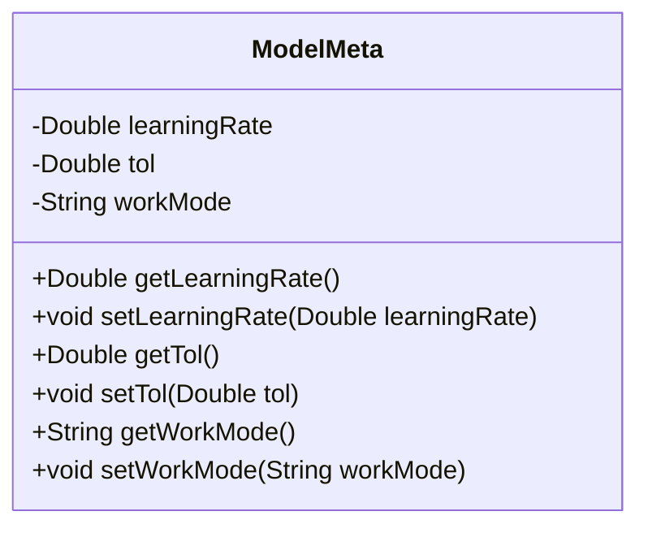
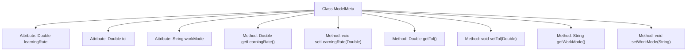

# Basic Information

|      |      |
|------|------|
| Name | ModelMeta |
| Language | .java |
| Code Path | WeFe/serving/serving-sdk-java/src/main/java/com/welab/wefe/serving/sdk/model/ModelMeta.java |
| Package Name | com.welab.wefe.serving.sdk.model |
| Dependencies | [] |
| Brief Description | The ModelMeta class includes three attributes: learning rate, tolerance, and working mode, and provides corresponding getter and setter methods. |

# Description

The `ModelMeta` class defines model metadata, containing three private attributes: `learningRate` represents the learning rate, `tol` denotes the tolerance, and `workMode` indicates the working mode. Each attribute has corresponding getter and setter methods for retrieving and assigning values. This class is used to manage key parameter configurations during model training or runtime.

# Class Summary

| Name   | Type  | Description |
|-------|------|-------------|
| ModelMeta | class | The ModelMeta class contains three attributes: learning rate, tolerance, and working mode, and provides corresponding getter and setter methods. |

## Class ModelMeta

|      |      |
|------|------|
| Access Modifier | public |
| Type | class |
| Name | ModelMeta |
| Description | The ModelMeta class contains three attributes: learning rate, tolerance, and working mode, and provides corresponding getter and setter methods. |

### UML Class Diagram

This code defines a class named ModelMeta, which is used to store and manage metadata for machine learning models. The class contains three private attributes: learningRate, tol (tolerance), and workMode, along with corresponding getter and setter methods for each attribute. These methods allow external code to safely access and modify these attribute values, ensuring data encapsulation.

### Internal Method Call Graph

This flowchart illustrates the structure of the ModelMeta class, which contains three private attributes and their corresponding getter/setter methods. The learningRate and tol are Double-type parameters, while workMode is a String-type parameter. Each attribute has matching accessor and mutator methods, forming a standard JavaBean pattern. The class exposes attribute access interfaces through methods to achieve data encapsulation.

### Field List

| Name  | Type  | Description |
|-------|-------|------|
| workMode | String | Define a private string variable workMode. |
| tol | Double | Private double-precision floating-point variable tol |
| learningRate | Double | The private double-precision floating-point variable learningRate is used to store the learning rate value. |

### Method List

| Name  | Type  | Description |
|-------|-------|------|
| setLearningRate | void | Methods for setting the learning rate, with the parameter being learningRate. |
| setTol | void | Method for setting tolerance value, parameter is of type Double. |
| getTol | Double | Methods for obtaining the tolerance value, returns a Double-type tol value. |
| getWorkMode | String | This is a Java method that returns the value of the string-type variable `workMode`. |
| setWorkMode | void | This is a Java method used to set the value of the workMode property of an object. The method takes a string parameter workMode and assigns it to the member variable of the same name in the current object. |
| getLearningRate | Double | Methods to obtain the learning rate, returning a Double type value. |

