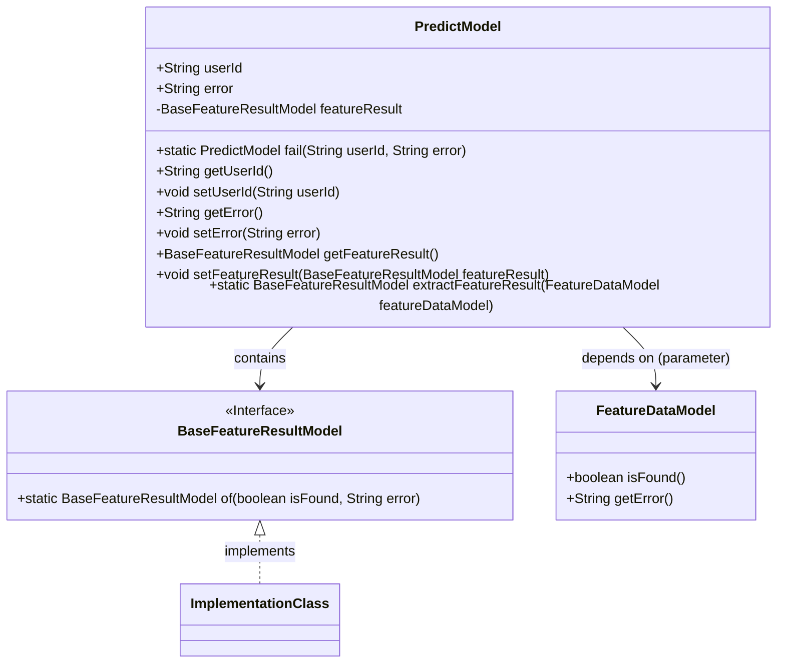
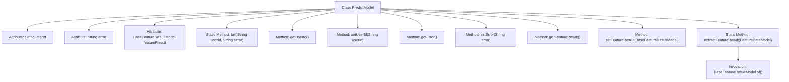

# Basic Information

|      |      |
|------|------|
| Name | PredictModel |
| Language | .java |
| Code Path | WeFe/serving/serving-sdk-java/src/main/java/com/welab/wefe/serving/sdk/model/PredictModel.java |
| Package Name | com.welab.wefe.serving.sdk.model |
| Dependencies | [] |
| Brief Description | The PredictModel class includes user ID, error messages, and feature results, providing static methods for failure and getter/setter, supporting feature result extraction. |

# Description

The `PredictModel` class is a model class designed for prediction, containing attributes such as user ID, error messages, and feature results. It provides getter and setter methods for `userId` and `error`, as well as getter and setter methods for `featureResult`. It includes a static method `fail` for creating a `PredictModel` instance with an error message. Additionally, it offers the static method `extractFeatureResult`, which extracts feature results from `FeatureDataModel` and generates a `BaseFeatureResultModel` instance.

# Class Summary

| Name   | Type  | Description |
|-------|------|-------------|
| PredictModel | class | The PredictModel class contains user ID, error message, and feature results, providing quick failure construction methods and related getters/setters. |

## Class PredictModel

|      |      |
|------|------|
| Access Modifier | public |
| Type | class |
| Name | PredictModel |
| Description | The PredictModel class contains user ID, error message, and feature results, providing quick failure construction methods and related getters/setters. |

### UML Class Diagram

This code demonstrates a prediction model class (PredictModel) containing user ID, error messages, and feature results. The class provides a static factory method fail() for creating failure instances, along with a feature result extraction method extractFeatureResult(). BaseFeatureResultModel is an interface defining the static factory method of(). FeatureDataModel serves as a parameter type, providing feature data query methods. The class diagram clearly illustrates containment and dependency relationships between classes, as well as interface implementation relationships.

### Internal Method Call Graph

This flowchart illustrates the complete structure of the PredictModel class, containing 3 attribute fields, 2 static methods, and 6 instance methods. Core functionalities include quickly creating error models via the fail() method, converting feature data through the extractFeatureResult() static method, and standard getter/setter methods. Notably, the extractFeatureResult() method internally invokes BaseFeatureResultModel.of() to create new feature result objects.

### Field List

| Name  | Type  | Description |
|-------|-------|------|
| userId | String | Declare a public string variable userId. |
| error = "" | String | Defined a public string variable named error with an initial value of empty. |
| featureResult | BaseFeatureResultModel | The private member variable `featureResult`, of type `BaseFeatureResultModel`. |

### Method List

| Name  | Type  | Description |
|-------|-------|------|
| setError | void | Methods for setting error messages, assigning the input string to the error variable of the class. |
| fail | PredictModel | The static method `fail` takes a user ID and an error message, creates and returns a `PredictModel` instance containing this data. |
| getFeatureResult | BaseFeatureResultModel | Methods to obtain featureResult, returning a result of type BaseFeatureResultModel. |
| setUserId | void | Methods for setting the user ID: assign the parameter userId to the userId property of the current object. |
| getError | String | Common method for obtaining error messages, returns a string variable named error. |
| getUserId | String | The method getUserId returns a userId of string type. |
| setFeatureResult | void | Methods for setting feature result objects, assigning input parameters to the class member variable `featureResult`. |
| extractFeatureResult | BaseFeatureResultModel | The static method `extractFeatureResult` accepts a `FeatureDataModel` parameter and returns a `BaseFeatureResultModel` instance, which includes whether a match was found and error messages. |

