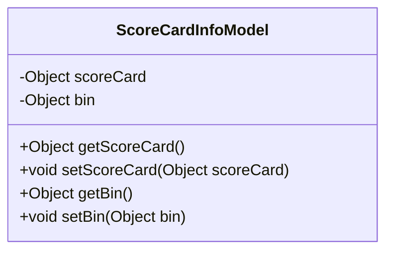
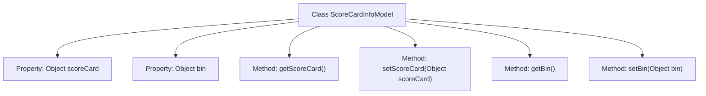

# Basic Information

|      |      |
|------|------|
| Name | ScoreCardInfoModel |
| Language | .java |
| Code Path | WeFe/serving/serving-sdk-java/src/main/java/com/welab/wefe/serving/sdk/model/ScoreCardInfoModel.java |
| Package Name | com.welab.wefe.serving.sdk.model |
| Dependencies | ['com.welab.wefe.common.util.JObject'] |
| Brief Description | The ScoreCardInfoModel class contains two Object-type attributes, scoreCard and bin, and provides corresponding getter and setter methods. |

# Description

The code defines a Java class named ScoreCardInfoModel, which contains two private member variables: scoreCard and bin, both of type Object. The class provides public getter and setter methods for these variables to retrieve and set their values. This model class is primarily used to encapsulate information related to scorecards and bins, featuring a simple structure that facilitates data access and manipulation operations.

# Class Summary

| Name   | Type  | Description |
|-------|------|-------------|
| ScoreCardInfoModel | class | The ScoreCardInfoModel class contains two Object attributes, scoreCard and bin, and provides corresponding getter and setter methods. |

## Class ScoreCardInfoModel

|      |      |
|------|------|
| Access Modifier | public |
| Type | class |
| Name | ScoreCardInfoModel |
| Description | The ScoreCardInfoModel class contains two Object attributes, scoreCard and bin, and provides corresponding getter and setter methods. |

### UML Class Diagram

This code demonstrates a simple Java class `ScoreCardInfoModel`, which contains two private attributes `scoreCard` and `bin`, along with their corresponding getter and setter methods. The class is primarily used to encapsulate and manage scorecard and bin information, providing access and modification capabilities to these private attributes through public methods. This design pattern adheres to the JavaBean specification, facilitating data encapsulation and secure access to object properties.

### Internal Method Call Graph

This flowchart depicts the structure of the ScoreCardInfoModel class, which contains two private properties of type Object: scoreCard and bin, along with their corresponding getter and setter methods. The class provides access and modification capabilities for these properties through four public methods, reflecting a typical data model class design. It encapsulates and manages scorecard and bin information, embodying the standard JavaBean pattern.

### Field List

| Name  | Type  | Description |
|-------|-------|------|
| scoreCard | Object | The private variable `scoreCard`, of type `Object`. |
| bin | Object | Private object variable `bin`. |

### Method List

| Name  | Type  | Description |
|-------|-------|------|
| getScoreCard | Object | This is a Java method that returns an object named scoreCard. |
| getBin | Object | The method returns the value of the object bin. |
| setBin | void | This is a Java method used to set the bin property value of an object. The method accepts an Object type parameter and assigns it to the bin field of the current object. |
| setScoreCard | void | This is a Java method used to set the scoreCard property of an object. The method accepts a parameter of type Object and assigns it to the scoreCard field of the current object. |

