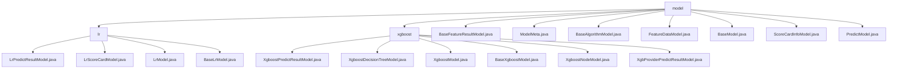

# Basic Information

|      |      |
|------|------|
| Name | model |
| Language | .java |
| Code Path | WeFe/serving/serving-sdk-java/src/main/java/com/welab/wefe/serving/sdk/model |
| Package Name | docs.serving.serving-sdk-java.src.main.java.com.welab.wefe.serving.sdk.model |
| Brief Description | This module implements logistic regression and XGBoost model prediction functionalities, including parameter storage, result encapsulation, and error handling. Key classes include LrModel, XgboostModel, etc., supporting scenarios such as credit scoring and risk prediction, designed with factory method and layered encapsulation patterns. |

# Description

## Overview  
The core responsibility of this module is to provide a unified framework for machine learning model prediction, supporting data encapsulation, parameter management, and result generation for algorithms such as Logistic Regression (LR) and XGBoost. The interface specification adopts the factory pattern (e.g., `of`/`fail`) and standard Getter/Setter methods. Key data structures include prediction result models (e.g., `LrPredictResultModel` and `XgboostPredictResultModel`), decision tree models (e.g., `XgboostNodeModel`), and base models (e.g., `BaseAlgorithmModel`). External dependencies involve Java collection classes, the XGBoost framework, and federated learning parameters (e.g., `flType`). For instance, `BaseModel` identifies models via `modelId`, while `FeatureDataModel` manages feature data using a DTO-like pattern.  

## Key Business Scenarios  
The module supports end-to-end prediction workflows: from model loading (e.g., `BaseXgboostModel` initializing tree structures), feature processing (e.g., `ScoreCardInfoModel` managing binning), to result encapsulation (e.g., `PredictModel` aggregating error messages). The interaction mode is designed in layers, similar to a microservices architecture, with `BaseFeatureResultModel` uniformly handling feature-missing scenarios. Typical applications include credit scoring (LR scorecard binning) and risk prediction (XGBoost multi-class classification). APIs cover model configuration (e.g., `ModelMeta` learning rate), node operations (e.g., XGBoost missing value handling), and result factories (e.g., `ofScores`). For example, federated learning scenarios achieve role control through the `myRole` parameter in `BaseModel`.

### Package Internal Structure View

This flowchart illustrates the hierarchical structure of Java models in the WeFe service SDK. The root node "model" contains two subdirectories (lr and xgboost) along with multiple foundational model files. The lr directory includes linear regression-related models, while the xgboost directory contains gradient boosting tree-related models, both designed with inheritance structures. Additionally, there are 8 universal base classes and utility classes at the same level, forming a comprehensive machine learning inference model system.

# File List

| Name   | Type  | Description |
|-------|------|-------------|
| [BaseFeatureResultModel.java](BaseFeatureResultModel.md) | file | The BaseFeatureResultModel class includes the found and error attributes, provides the constructor method of, and getter/setter methods, used to return feature lookup results and error messages. |
| [ModelMeta.java](ModelMeta.md) | file | The ModelMeta class contains three attributes: learning rate, tolerance, and working mode, and provides corresponding getter and setter methods. |
| [BaseAlgorithmModel.java](BaseAlgorithmModel.md) | file | The BaseAlgorithmModel class includes ModelMeta and ScoreCardInfoModel attributes, providing methods to obtain the learning rate and getter/setter methods for the attributes. |
| [FeatureDataModel.java](FeatureDataModel.md) | file | The FeatureDataModel class inherits from BaseFeatureResultModel, containing the featureDataMap property and related operation methods. It supports creating instances via the of method while checking data validity, as well as handling error cases through the fail method. |
| [BaseModel.java](BaseModel.md) | file | The BaseModel class includes fields such as model ID, algorithm, federated learning type, member role, and parameters, providing getter and setter methods for each attribute. |
| [ScoreCardInfoModel.java](ScoreCardInfoModel.md) | file | The ScoreCardInfoModel class contains two Object-type attributes, scoreCard and bin, and provides corresponding getter and setter methods. |
| [PredictModel.java](PredictModel.md) | file | The PredictModel class includes user ID, error messages, and feature results, providing static methods for failure and getter/setter, supporting feature result extraction. |
| [xgboost](xgboost/_module.md) | package | XgboostPredictResultModel stores prediction scores and error messages. XgboostDecisionTreeModel manages decision tree nodes and missing value handling. XgboostModel configures XGBoost model parameters and structure. BaseXgboostModel encapsulates model parameters. XgboostNodeModel defines node structure. XgbProviderPredictResultModel encapsulates prediction results. |
| [lr](lr/_module.md) | package | The LrPredictResultModel stores prediction results, including the score and scoreCard attributes along with factory methods. The LrScoreCardModel encapsulates scorecard data, containing attributes such as feature and value. The LrModel represents a linear regression model, with parameters including weight and intercept. The BaseLrModel inherits from BaseAlgorithmModel and encapsulates the parameters of LrModel. |

