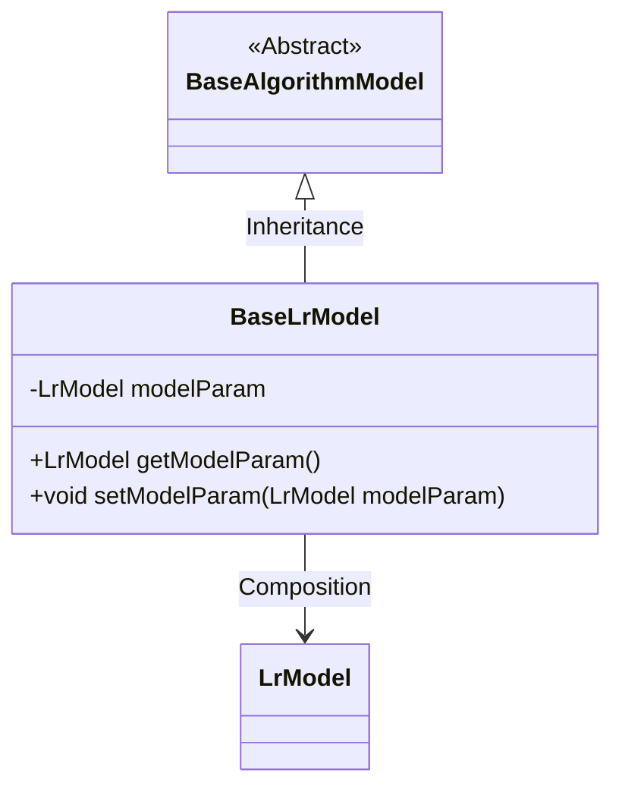
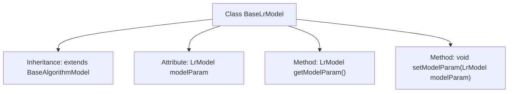

# Basic Information

|      |      |
|------|------|
| Name | BaseLrModel |
| Language | .java |
| Code Path | WeFe/serving/serving-sdk-java/src/main/java/com/welab/wefe/serving/sdk/model/lr/BaseLrModel.java |
| Package Name | com.welab.wefe.serving.sdk.model.lr |
| Dependencies | ['com.welab.wefe.serving.sdk.model.BaseAlgorithmModel'] |
| Brief Description | The BaseLrModel class inherits from BaseAlgorithmModel and includes a property modelParam of type LrModel along with its getter and setter methods. |

# Description

This code defines a class named `BaseLrModel`, which inherits from `BaseAlgorithmModel`. The class contains a private member variable `modelParam` of type `LrModel`. It provides two public methods: `getModelParam` for retrieving the current value of `modelParam`, and `setModelParam` for setting the value of `modelParam`. This class is primarily used to encapsulate and manage model parameters of type `LrModel`.

# Class Summary

| Name   | Type  | Description |
|-------|------|-------------|
| BaseLrModel | class | BaseLrModel inherits from BaseAlgorithmModel and includes the modelParam property of type LrModel along with its getter and setter methods. |

## Class BaseLrModel

|      |      |
|------|------|
| Access Modifier | public |
| Type | class |
| Name | BaseLrModel |
| Description | BaseLrModel inherits from BaseAlgorithmModel and includes the modelParam property of type LrModel along with its getter and setter methods. |

### UML Class Diagram

This class diagram illustrates that BaseLrModel inherits from the abstract class BaseAlgorithmModel and contains a private member modelParam of type LrModel. BaseLrModel provides getter and setter methods for modelParam, demonstrating encapsulation. LrModel exists as an independent class and is referenced by BaseLrModel through composition. This design decouples model parameters from algorithm models, facilitating parameter management and extension. The overall structure adheres to object-oriented design principles, with clear hierarchy and single responsibilities.

### Internal Method Call Graph

This flowchart describes the structure of the BaseLrModel class, which inherits from BaseAlgorithmModel and contains a private attribute modelParam of type LrModel, along with corresponding getter and setter methods. Through inheritance, BaseLrModel acquires the characteristics of its parent class, while encapsulating the modelParam attribute and providing methods to access and modify it, enabling management of model parameters. This design pattern embodies the encapsulation and inheritance features of object-oriented programming.

### Field List

| Name  | Type  | Description |
|-------|-------|------|
| modelParam | LrModel | Private model parameter object. |

### Method List

| Name  | Type  | Description |
|-------|-------|------|
| getModelParam | LrModel | Methods for obtaining model parameters, returns an object of type LrModel. |
| setModelParam | void | Method for setting model parameters, which assigns the passed LrModel object to the modelParam property of the current object. |

