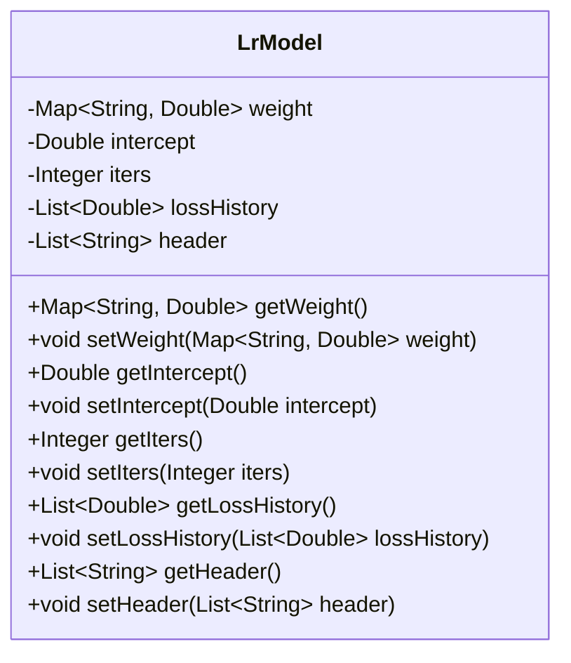

# Basic Information

|      |      |
|------|------|
| Name | LrModel |
| Language | .java |
| Code Path | WeFe/serving/serving-sdk-java/src/main/java/com/welab/wefe/serving/sdk/model/lr/LrModel.java |
| Package Name | com.welab.wefe.serving.sdk.model.lr |
| Dependencies | ['java.util.List', 'java.util.Map'] |
| Brief Description | Linear regression model class, containing weights, intercept, iteration count, loss history, header fields, and corresponding getter/setter methods. |

# Description

The code defines a class named `LrModel` to represent a linear regression model. The class contains five private attributes: `weight` (a weight map with keys as strings and values as double-precision floating-point numbers), `intercept` (the intercept, defaulting to 0.0), `iters` (the number of iterations), `lossHistory` (a list of loss history records), and `header` (a list of table headers). Each attribute has corresponding getter and setter methods for retrieving and setting the attribute values. This class is primarily used to store and manage the parameters of the linear regression model and related information during the training process.

# Class Summary

| Name   | Type  | Description |
|-------|------|-------------|
| LrModel | class | The LrModel class contains fields for weights, intercept, iteration count, loss history, and headers, providing getter and setter methods for each field. |

## Class LrModel

|      |      |
|------|------|
| Access Modifier | public |
| Type | class |
| Name | LrModel |
| Description | The LrModel class contains fields for weights, intercept, iteration count, loss history, and headers, providing getter and setter methods for each field. |

### UML Class Diagram

This code defines a class named LrModel, which represents a linear regression model. The class contains five private member variables: weight (a weight map), intercept, iters (iteration count), lossHistory (loss history records), and header (header information). Each member variable has corresponding getter and setter methods for accessing and modifying these private variables. This class is primarily used to store and manage the parameters of a linear regression model and related information during the training process, making it suitable for use in machine learning scenarios.

### Internal Method Call Graph

```mermaid
graph TD
    A["Class LrModel"]
    B["Private attribute: Map<String, Double> weight"]
    C["Private attribute: Double intercept = 0.0"]
    D["Private attribute: Integer iters"]
    E["Private attribute: List<Double> lossHistory"]
    F["Private attribute: List<String> header"]
    G["Public method: getWeight()"]
    H["Public method: setWeight(Map<String, Double>)"]
    I["Public method: getIntercept()"]
    J["Public method: setIntercept(Double)"]
    K["Public method: getIters()"]
    L["Public method: setIters(Integer)"]
    M["Public method: getLossHistory()"]
    N["Public method: setLossHistory(List<Double>)"]
    O["Public method: getHeader()"]
    P["Public method: setHeader(List<String>)"]

    A --> B
    A --> C
    A --> D
    A --> E
    A --> F
    A --> G
    A --> H
    A --> I
    A --> J
    A --> K
    A --> L
    A --> M
    A --> N
    A --> O
    A --> P
```

This flowchart illustrates the structure of the LrModel class, which contains 5 private attributes and 10 public methods. The attributes include weight (a weight mapping), intercept (default value 0.0), iters (iteration count), lossHistory (loss record history), and header (header information). Each attribute is paired with corresponding getter and setter methods for external access and modification of these private attributes. The class design adheres to the encapsulation principle by exposing private attribute access interfaces through public methods, following the typical Java Bean design pattern.

### Field List

| Name  | Type  | Description |
|-------|-------|------|
| lossHistory | List<Double> | Private double-precision floating-point list, recording the history of losses. |
| intercept = 0.0 | Double | Define a private double variable intercept with an initial value of 0.0. |
| weight | Map<String, Double> | Defined a private mapping variable `weight`, with keys of string type and values of double-precision floating-point type. |
| header | List<String> | Private string list header. |
| iters | Integer | private int variable iters |

### Method List

| Name  | Type  | Description |
|-------|-------|------|
| setLossHistory | void | Method for setting loss history, which assigns the input loss history list to the class member variable lossHistory. |
| setIters | void | Java Method: Set the value of integer variable iters. |
| getIntercept | Double | The method getIntercept returns the intercept value of type Double. |
| getWeight | Map<String, Double> | Method to obtain the weight mapping table, which returns a map with string keys and double-precision values. |
| setIntercept | void | The method to set the intercept value assigns the parameter `intercept` to the `intercept` property of the current object. |
| setWeight | void | Java Method: Set weight mapping, with parameters being a map from strings to double values, directly assigned to the class variable weight. |
| getLossHistory | List<Double> | The method to obtain the loss history, which returns a list of double-precision floating-point numbers. |
| setHeader | void | The method `setHeader` accepts a list of strings `header` and assigns it to the class's member variable `header`. |
| getHeader | List<String> | The method returns a string list named header. |
| getIters | Integer | Public method to get the iters value, returns Integer type. |

