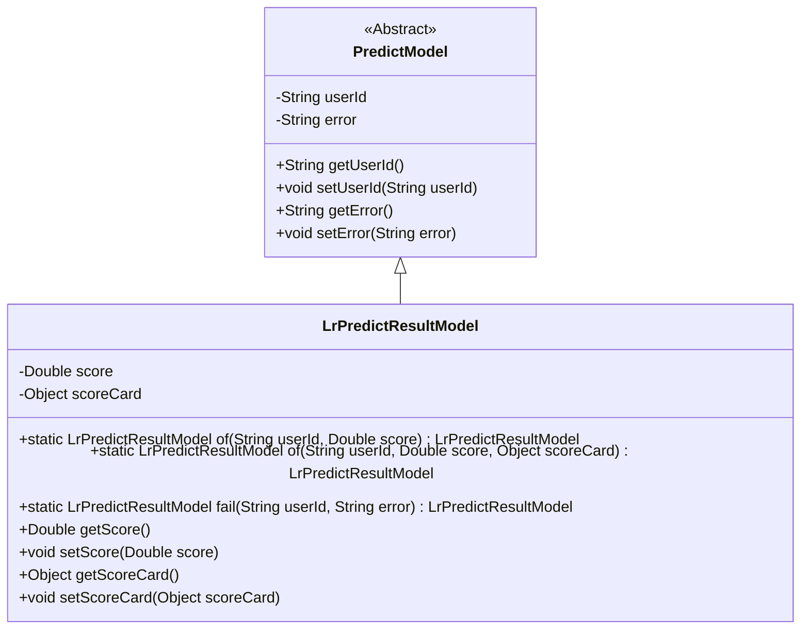
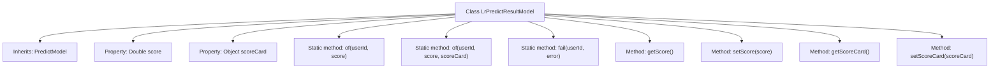

# Basic Information

|      |      |
|------|------|
| Name | LrPredictResultModel |
| Language | .java |
| Code Path | WeFe/serving/serving-sdk-java/src/main/java/com/welab/wefe/serving/sdk/model/lr/LrPredictResultModel.java |
| Package Name | com.welab.wefe.serving.sdk.model.lr |
| Dependencies | ['com.welab.wefe.serving.sdk.model.PredictModel'] |
| Brief Description | The LrPredictResultModel extends PredictModel and includes the score and scoreCard attributes. It provides two static construction methods with userId and score: one includes scoreCard, while the other handles failure cases. It also contains getter and setter methods. |

# Description

The `LrPredictResultModel` is a class that inherits from `PredictModel` and is used to store prediction results. It contains two main attributes: `score` (a Double type representing the score) and `scoreCard` (an Object type representing the scorecard). The class provides three static factory methods: the `of` method for creating an instance with a user ID and score, with an optional `scoreCard` parameter; the `fail` method for creating a failed instance with a user ID and error message. Additionally, the class includes getter and setter methods for `score` and `scoreCard` to access and modify the attribute values.

# Class Summary

| Name   | Type  | Description |
|-------|------|-------------|
| LrPredictResultModel | class | The LrPredictResultModel extends PredictModel, containing score and scoreCard attributes, providing static construction methods with userId, score, or scoreCard, as well as failure handling methods, including getters/setters. |

## Class LrPredictResultModel

|      |      |
|------|------|
| Access Modifier | public |
| Type | class |
| Name | LrPredictResultModel |
| Description | The LrPredictResultModel extends PredictModel, containing score and scoreCard attributes, providing static construction methods with userId, score, or scoreCard, as well as failure handling methods, including getters/setters. |

### UML Class Diagram

This class diagram illustrates the inheritance relationship where LrPredictResultModel extends the abstract class PredictModel. As a prediction result model, LrPredictResultModel contains two core attributes: score and scoreCard. It provides three static factory methods (two 'of' methods and one 'fail' method) for instance creation, along with standard getter/setter methods. The parent class PredictModel defines the base fields userId and error, reflecting the model's fundamental properties and error-handling capabilities.

### Internal Method Call Graph

This flowchart illustrates the structure and functionality of the LrPredictResultModel class. The class inherits from PredictModel, containing two private properties (score and scoreCard), along with multiple static factory methods (of and fail) and conventional getter/setter methods. The static factory methods are used to create and initialize object instances, where the of method has two overloaded forms for scenarios with or without the scoreCard parameter, while the fail method creates instances containing error information.

### Field List

| Name  | Type  | Description |
|-------|-------|------|
| score | Double | Declare a private double variable score. |
| scoreCard | Object | The private object scoreCard is used to store scorecard data. |

### Method List

| Name  | Type  | Description |
|-------|-------|------|
| of | LrPredictResultModel | The static method `of` creates an instance of `LrPredictResultModel`, sets the user ID and score, then returns it. |
| of | LrPredictResultModel | The static method `of` creates an instance of `LrPredictResultModel`, sets the user ID, score, and scorecard object, then returns it. |
| fail | LrPredictResultModel | Static method creates a failure result model containing user ID and error message. |
| setScoreCard | void | This is a Java method used to set the scoreCard property of an object. The method accepts a parameter of type Object and assigns it to the scoreCard field of the current object. |
| getScore | Double | This is a Java method that returns a Double type score value. |
| setScore | void | This is a Java method used to set the score property of an object to the passed Double type parameter. |
| getScoreCard | Object | Methods to obtain the scorecard object. |

