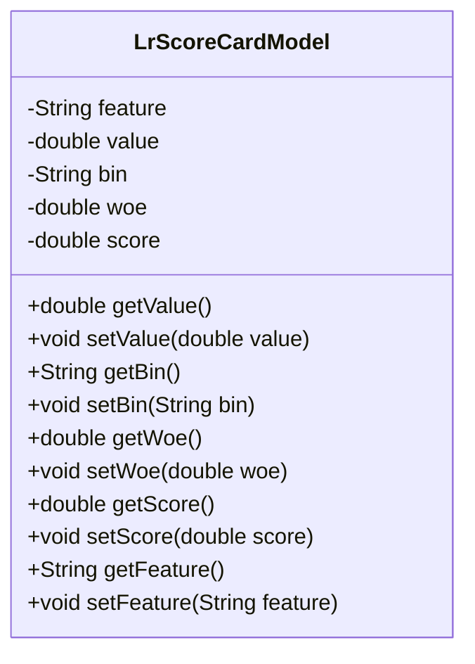

# Basic Information

|      |      |
|------|------|
| Name | LrScoreCardModel |
| Language | .java |
| Code Path | WeFe/serving/serving-sdk-java/src/main/java/com/welab/wefe/serving/sdk/model/lr/LrScoreCardModel.java |
| Package Name | com.welab.wefe.serving.sdk.model.lr |
| Dependencies | [] |
| Brief Description | The LrScoreCardModel class contains attributes such as features, values, binning, WOE, and scores, providing getter and setter methods for each field. |

# Description

The LrScoreCardModel class is a Java class designed to store data related to logistic regression scorecard models. It consists of five main attributes: `feature` represents the feature name, `value` denotes the feature value, `bin` indicates binning information, `woe` stands for Weight of Evidence, and `score` signifies the score. The class provides corresponding getter and setter methods for each attribute to retrieve and assign values. This class is primarily used to encapsulate features and their associated calculation results within a scorecard model.

# Class Summary

| Name   | Type  | Description |
|-------|------|-------------|
| LrScoreCardModel | class | The Java class LrScoreCardModel contains attributes such as features, values, binning, WOE, and scores, providing getter and setter methods for each field. |

## Class LrScoreCardModel

|      |      |
|------|------|
| Access Modifier | public |
| Type | class |
| Name | LrScoreCardModel |
| Description | The Java class LrScoreCardModel contains attributes such as features, values, binning, WOE, and scores, providing getter and setter methods for each field. |

### UML Class Diagram

This code defines a class named LrScoreCardModel, which represents data items in a logistic regression scorecard model. The class contains five private attributes: feature (feature name), value (feature value), bin (binning information), woe (weight of evidence value), and score (score). Corresponding getter and setter methods are provided for each attribute. This class is primarily used to store and manage information related to various features in the scorecard model, facilitating subsequent score calculation and model analysis.

### Internal Method Call Graph

```mermaid
graph TD
    A["Class LrScoreCardModel"]
    B["Attribute: String feature"]
    C["Attribute: double value"]
    D["Attribute: String bin"]
    E["Attribute: double woe"]
    F["Attribute: double score"]
    G["Method: getValue()"]
    H["Method: setValue(double value)"]
    I["Method: getBin()"]
    J["Method: setBin(String bin)"]
    K["Method: getWoe()"]
    L["Method: setWoe(double woe)"]
    M["Method: getScore()"]
    N["Method: setScore(double score)"]
    O["Method: getFeature()"]
    P["Method: setFeature(String feature)"]

    A --> B
    A --> C
    A --> D
    A --> E
    A --> F
    A --> G
    A --> H
    A --> I
    A --> J
    A --> K
    A --> L
    A --> M
    A --> N
    A --> O
    A --> P
```

This flowchart illustrates the structure of the LrScoreCardModel class, which contains 5 attributes and corresponding getter/setter methods. The attributes include feature (feature name), value (numerical value), bin (binning label), woe (weight of evidence), and score (scoring points). Each attribute has corresponding get and set methods for encapsulating data access. This is a typical POJO (Plain Old Java Object) class design, commonly used for storing feature data of logistic regression scorecard models, providing secure access and modification of private attributes through methods.

### Field List

| Name  | Type  | Description |
|-------|-------|------|
| bin | String | Declare a string variable named bin. |
| woe | double | Declared a double-precision floating-point variable woe. |
| score | double | Declare a double-precision floating-point variable score. |
| value | double | Declare a double-precision floating-point variable named value. |
| feature | String | String Features |

### Method List

| Name  | Type  | Description |
|-------|-------|------|
| setScore | void | Set the scoring method to assign the input value to the object's score property. |
| getWoe | double | The method getWoe returns the value of the double-precision floating-point number woe. |
| setBin | void | The method to set the bin attribute assigns the parameter bin to the object's member variable bin. |
| getScore | double | The method getScore returns the value of the double-precision floating-point number score. |
| setWoe | void | This is a Java method used to set the value of the class member variable 'woe'. The method accepts a parameter of type double and assigns it to the 'woe' property of the current object. |
| setValue | void | Set numerical method to assign the input value to the class member variable value. |
| getValue | double | This is a public method that returns a value of type double. |
| getFeature | String | Get the string value of the feature attribute. |
| getBin | String | Common methods for obtaining bin values. |
| setFeature | void | Set the value of the object property feature. |

