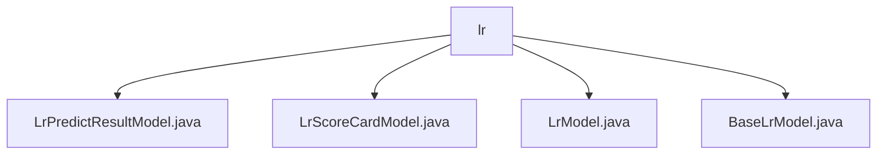

# Basic Information

|      |      |
|------|------|
| Name | lr |
| Language | .java |
| Code Path | WeFe/serving/serving-sdk-java/src/main/java/com/welab/wefe/serving/sdk/model/lr |
| Package Name | docs.serving.serving-sdk-java.src.main.java.com.welab.wefe.serving.sdk.model.lr |
| Brief Description | The LrPredictResultModel stores prediction results, including the score and scoreCard attributes along with factory methods. The LrScoreCardModel encapsulates scorecard data, containing attributes such as feature and value. The LrModel represents a linear regression model, with parameters including weight and intercept. The BaseLrModel inherits from BaseAlgorithmModel and encapsulates the parameters of LrModel. |

# Description

## Overview  
The core responsibility of this module is to manage prediction results and store parameters for logistic regression (LR) models, including encapsulating prediction results, storing scorecard data, and maintaining model parameters. The interface specifications include factory methods for creating prediction instances (e.g., `of` and `fail`) and standard Getter/Setter access to attributes. Key data structures are `LrPredictResultModel` (containing scores and scorecards), `LrScoreCardModel` (feature binning and scores), and `LrModel` (weights and training history). External dependencies are limited to Java primitive types and collection classes. For example, `LrModel` stores feature weights via a Map, and the `BaseLrModel` inheritance hierarchy resembles the template pattern.  

## Main Business Scenarios  
The module supports the complete LR prediction workflow: from model loading (e.g., `BaseLrModel` managing parameters), feature calculation (e.g., `LrScoreCardModel` recording WOE values), to result generation (e.g., `LrPredictResultModel` factories constructing responses). The interaction pattern adopts layered encapsulation, similar to DTO conversion—for instance, prediction results isolate construction logic through static factories. Typical applications include credit scoring (using scorecard feature binning) and risk prediction (relying on weight mapping). API types cover parameter access, instance construction, and error handling, such as the `fail` method encapsulating exception scenarios.

### Package Internal Structure View

This flowchart illustrates the Java class file structure related to the logistic regression model in the WeFe project. The parent node 'lr' contains four child node files: LrPredictResultModel.java, LrScoreCardModel.java, LrModel.java, and BaseLrModel.java. These files belong to the implementation part of the logistic regression model under the serving-sdk-java module.

# File List

| Name   | Type  | Description |
|-------|------|-------------|
| [LrPredictResultModel.java](LrPredictResultModel.md) | file | The LrPredictResultModel extends PredictModel and includes the score and scoreCard attributes. It provides two static construction methods with userId and score, one with scoreCard and the other handling failure cases, along with getter and setter methods. |
| [LrScoreCardModel.java](LrScoreCardModel.md) | file | The LrScoreCardModel class contains attributes such as features, values, binning, WOE, and scores, providing getter and setter methods for each field. |
| [LrModel.java](LrModel.md) | file | Linear regression model class, containing weights, intercept, iteration count, loss history, header fields, and corresponding getter/setter methods. |
| [BaseLrModel.java](BaseLrModel.md) | file | The BaseLrModel class inherits from BaseAlgorithmModel and includes a modelParam property of type LrModel along with its getter and setter methods. |

