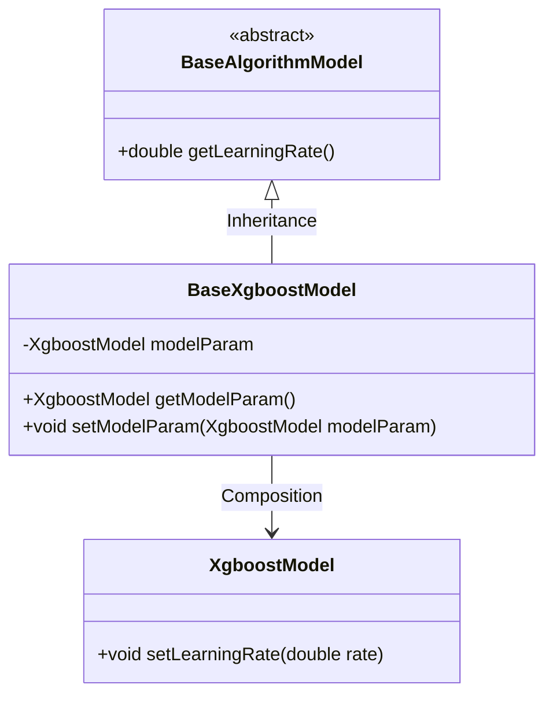
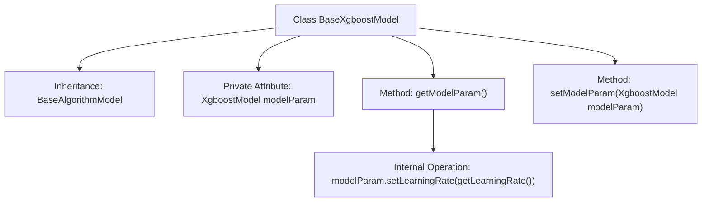

# Basic Information

|      |      |
|------|------|
| Name | BaseXgboostModel |
| Language | .java |
| Code Path | WeFe/serving/serving-sdk-java/src/main/java/com/welab/wefe/serving/sdk/model/xgboost/BaseXgboostModel.java |
| Package Name | com.welab.wefe.serving.sdk.model.xgboost |
| Dependencies | ['com.welab.wefe.serving.sdk.model.BaseAlgorithmModel'] |
| Brief Description | The BaseXgboostModel inherits from BaseAlgorithmModel, containing parameters of XgboostModel and their getter/setter methods, where the getter will set the learning rate. |

# Description

The BaseXgboostModel class inherits from BaseAlgorithmModel and contains a private member variable modelParam of type XgboostModel. It provides the getModelParam method, which sets the learning rate of modelParam to the current object's learning rate value before returning it. Additionally, it offers the setModelParam method for setting the value of modelParam. This class is primarily used to encapsulate Xgboost model parameters and related operations.

# Class Summary

| Name   | Type  | Description |
|-------|------|-------------|
| BaseXgboostModel | class | The BaseXgboostModel inherits from BaseAlgorithmModel and includes parameters of XgboostModel along with their getter and setter methods. |

## Class BaseXgboostModel

|      |      |
|------|------|
| Access Modifier | public |
| Type | class |
| Name | BaseXgboostModel |
| Description | The BaseXgboostModel inherits from BaseAlgorithmModel and includes parameters of XgboostModel along with their getter and setter methods. |

### UML Class Diagram

This class diagram illustrates that BaseXgboostModel inherits from the abstract class BaseAlgorithmModel and contains an XgboostModel object. The BaseXgboostModel's getModelParam() method calls setLearningRate() to update model parameters before returning, demonstrating the invocation relationship with the parent class's getLearningRate() method. The overall structure clearly depicts the inheritance and composition relationships between the classes.

### Internal Method Call Graph

The flowchart depicts the structure of the BaseXgboostModel class, which inherits from BaseAlgorithmModel. It contains a private attribute modelParam and two methods. The getModelParam() method updates the learning rate by calling setLearningRate() before returning modelParam, while the setModelParam() method is used to set the value of modelParam. The diagram illustrates the calling relationships between class members and the attribute operation flow.

### Field List

| Name  | Type  | Description |
|-------|-------|------|
| modelParam | XgboostModel | Private XGBoost model parameter variables. |

### Method List

| Name  | Type  | Description |
|-------|-------|------|
| getModelParam | XgboostModel | This method returns the Xgboost model parameters and returns the modelParam object after setting the learning rate. |
| setModelParam | void | Methods for setting parameters of Xgboost models. |

