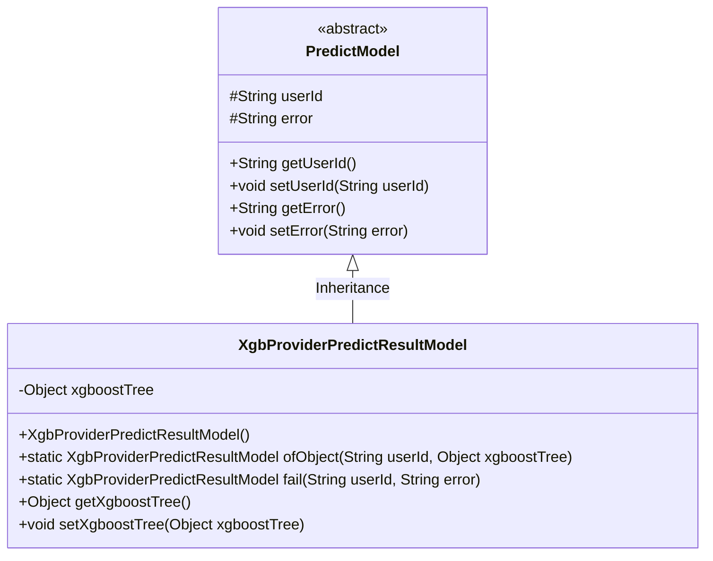
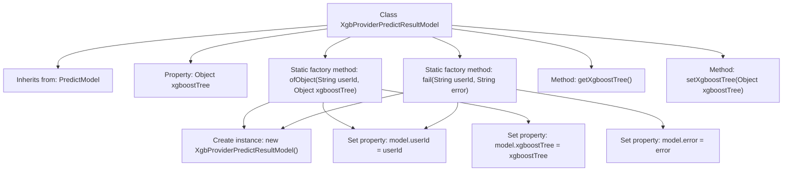

# Basic Information

|      |      |
|------|------|
| Name | XgbProviderPredictResultModel |
| Language | .java |
| Code Path | WeFe/serving/serving-sdk-java/src/main/java/com/welab/wefe/serving/sdk/model/xgboost/XgbProviderPredictResultModel.java |
| Package Name | com.welab.wefe.serving.sdk.model.xgboost |
| Dependencies | ['com.welab.wefe.serving.sdk.model.PredictModel', 'com.welab.wefe.serving.sdk.model.lr.LrPredictResultModel'] |
| Brief Description | The XgbProviderPredictResultModel inherits from PredictModel, containing the xgboostTree attribute and two static methods: ofObject for creating an instance with a user ID and xgboostTree, and fail for creating an instance with an error message. It provides getter and setter methods for xgboostTree. |

# Description

XgbProviderPredictResultModel is a class that inherits from PredictModel, used to encapsulate the prediction results of an XGBoost model. It contains an xgboostTree object attribute with corresponding getter and setter methods. The class provides two static factory methods: ofObject for creating an instance containing a user ID and an xgboostTree object, and fail for creating a failure instance containing a user ID and an error message. This class primarily serves as a data structure for managing XGBoost model prediction results.

# Class Summary

| Name   | Type  | Description |
|-------|------|-------------|
| XgbProviderPredictResultModel | class | XgbProviderPredictResultModel extends PredictModel and includes the xgboostTree field. It provides two construction methods, ofObject and fail, and supports get/set operations. |

## Class XgbProviderPredictResultModel

|      |      |
|------|------|
| Access Modifier | public |
| Type | class |
| Name | XgbProviderPredictResultModel |
| Description | XgbProviderPredictResultModel extends PredictModel and includes the xgboostTree field. It provides two construction methods, ofObject and fail, and supports get/set operations. |

### UML Class Diagram

This code demonstrates an XgbProviderPredictResultModel class that inherits from the abstract class PredictModel. Its primary function is to encapsulate XGBoost tree model prediction results, providing two static factory methods: ofObject for creating model instances containing valid results, and fail for creating failure instances with error messages. The class includes a private xgboostTree field and its accessor methods, inheriting the userId and error fields from the parent class. This design implements standardized encapsulation for both success and failure states of prediction results, suitable for scenarios requiring standardized returns of machine learning model predictions.

### Internal Method Call Graph

This flowchart illustrates the structure of the XgbProviderPredictResultModel class, which inherits from the PredictModel class and contains an Object-type xgboostTree property. The class provides two static factory methods: ofObject for creating instances containing xgboostTree objects, and fail for creating instances containing error messages. It also includes standard getter/setter methods for manipulating the xgboostTree property. The flowchart clearly shows the relationships between class members and the operational steps within the factory methods.

### Field List

| Name  | Type  | Description |
|-------|-------|------|
| xgboostTree | Object | The private variable `xgboostTree` is used to store the XGBoost tree model object. |

### Method List

| Name  | Type  | Description |
|-------|-------|------|
| ofObject | XgbProviderPredictResultModel | Create an XGB prediction result model using a static method, passing in the user ID and XGBoost tree object, and returning the populated model instance. |
| setXgboostTree | void | Methods for setting XGBoost tree objects. |
| fail | XgbProviderPredictResultModel | Static method creates a failure result model containing user ID and error message. |
| getXgboostTree | Object | This is a Java method that returns an object named xgboostTree. |

