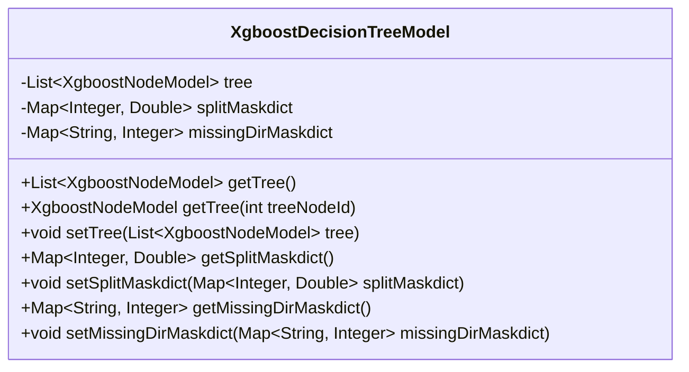
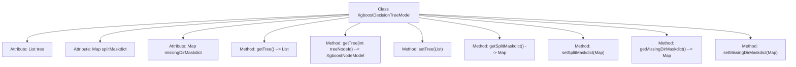

# Basic Information

|      |      |
|------|------|
| Name | XgboostDecisionTreeModel |
| Language | .java |
| Code Path | WeFe/serving/serving-sdk-java/src/main/java/com/welab/wefe/serving/sdk/model/xgboost/XgboostDecisionTreeModel.java |
| Package Name | com.welab.wefe.serving.sdk.model.xgboost |
| Dependencies | ['java.util.List', 'java.util.Map'] |
| Brief Description | XGBoost decision tree model class, containing a list of tree nodes, a split mask dictionary, and a missing direction mask dictionary, providing getter and setter methods for each attribute. |

# Description

This is a Java class named XgboostDecisionTreeModel, which represents an XGBoost decision tree model. The class includes three main member variables: `tree` is a list of type XgboostNodeModel, storing the decision tree nodes; `splitMaskdict` is a map from integers to double-precision floating-point numbers, used to store split mask information; and `missingDirMaskdict` is a map from strings to integers, handling missing value directions. The class provides getter and setter methods for these variables, including functionalities such as retrieving the entire tree structure, obtaining a specific node by its ID, setting the tree structure, getting and setting the split mask dictionary, and getting and setting the missing value direction dictionary.

# Class Summary

| Name   | Type  | Description |
|-------|------|-------------|
| XgboostDecisionTreeModel | class | XGBoost decision tree model class, containing a list of tree nodes, a split mask dictionary, and a missing direction mask dictionary, providing getter and setter methods for each attribute. |

## Class XgboostDecisionTreeModel

|      |      |
|------|------|
| Access Modifier | public |
| Type | class |
| Name | XgboostDecisionTreeModel |
| Description | XGBoost decision tree model class, containing a list of tree nodes, a split mask dictionary, and a missing direction mask dictionary, providing getter and setter methods for each attribute. |

### UML Class Diagram

This code defines an XGBoost decision tree model class containing three private member variables: `tree` (node list), `splitMaskdict` (split mask dictionary), and `missingDirMaskdict` (missing direction mask dictionary). The class provides getter and setter methods for these variables, with the `getTree` method having two overloaded versions—one returning the entire tree structure and the other returning a specific node based on a node ID. This class is primarily used to manage the structure of decision trees and related mask information in the XGBoost algorithm, supporting flexible access and modification of tree nodes and mask dictionaries.

### Internal Method Call Graph

This code defines an XGBoost decision tree model class containing three core attributes: tree (node list), splitMaskdict (split mask dictionary), and missingDirMaskdict (missing direction mask dictionary). The class provides complete getter/setter methods, with getTree() having two overloaded forms that return either the entire node list or a single node. All methods revolve around data access operations for these three attributes, forming a typical POJO class structure designed to encapsulate decision tree-related data and operations in the XGBoost algorithm.

### Field List

| Name  | Type  | Description |
|-------|-------|------|
| splitMaskdict | Map<Integer, Double> | Private mapping with integer keys and double-precision floating-point values. |
| missingDirMaskdict | Map<String, Integer> | Define a private variable missingDirMaskdict, of type Map, with String as the key and Integer as the value. |
| tree | List<XgboostNodeModel> | The private variable `tree`, which is a list of type `XgboostNodeModel`. |

### Method List

| Name  | Type  | Description |
|-------|-------|------|
| getMissingDirMaskdict | Map<String, Integer> | Method to obtain the missing directory mask dictionary, with a return type of Map<String, Integer>. |
| getSplitMaskdict | Map<Integer, Double> | This method returns a dictionary mapping integers to double-precision floating-point numbers called splitMaskdict. |
| setTree | void | This is a Java method used to set a list of tree structures of type XgboostNodeModel. The method accepts a list parameter and assigns it to the member variable tree of the class. |
| setSplitMaskdict | void | This is a Java method used to set the splitMaskdict property, with the parameter being a mapping from integers to double-precision floating-point numbers. |
| getTree | List<XgboostNodeModel> | Get the node list of an XGBoost tree model. |
| getTree | XgboostNodeModel | This method returns the corresponding XGBoost tree model node based on the passed tree node ID. |
| setMissingDirMaskdict | void | Java Method: Set Missing Directory Mask Dictionary, with parameters as a mapping from strings to integers. |

