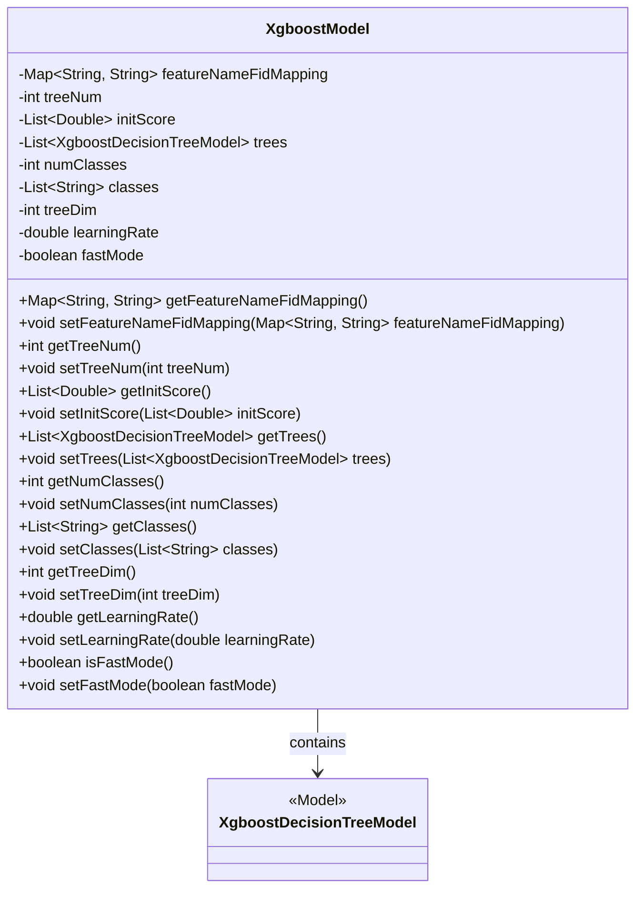

# Basic Information

|      |      |
|------|------|
| Name | XgboostModel |
| Language | .java |
| Code Path | WeFe/serving/serving-sdk-java/src/main/java/com/welab/wefe/serving/sdk/model/xgboost/XgboostModel.java |
| Package Name | com.welab.wefe.serving.sdk.model.xgboost |
| Dependencies | ['java.util.HashMap', 'java.util.List', 'java.util.Map'] |
| Brief Description | The XgboostModel class includes attributes such as feature mapping, number of trees, initial score, decision tree list, number of categories, category names, tree dimension, learning rate, and fast mode, along with their corresponding getter/setter methods. |

# Description

The XgboostModel class is a Java class designed to implement XGBoost models, containing multiple key attributes and their corresponding getter/setter methods. The main attributes include featureNameFidMapping (mapping between feature names and IDs), treeNum (number of trees), initScore (list of initial scores), trees (list of decision tree models), numClasses (number of classes), classes (list of classes), treeDim (dimension of trees), learningRate (learning rate), and fastMode (fast mode flag). These attributes are used to configure and manage the behavior and structure of the XGBoost model.

# Class Summary

| Name   | Type  | Description |
|-------|------|-------------|
| XgboostModel | class | The XgboostModel class includes attributes such as feature name mapping, number of trees, initial score, decision tree list, number of categories, category names, tree dimension, learning rate, and fast mode, and provides getter and setter methods for each attribute. |

## Class XgboostModel

|      |      |
|------|------|
| Access Modifier | public |
| Type | class |
| Name | XgboostModel |
| Description | The XgboostModel class includes attributes such as feature name mapping, number of trees, initial score, decision tree list, number of categories, category names, tree dimension, learning rate, and fast mode, and provides getter and setter methods for each attribute. |

### UML Class Diagram

This class diagram illustrates the XgboostModel class and its relationship with XgboostDecisionTreeModel. XgboostModel is a class encapsulating XGBoost model parameters, including feature name mappings, tree count, initial scores, a collection of decision trees, number of classes, class list, tree dimension, learning rate, and a fast mode flag. These attributes are managed via getter and setter methods, forming an aggregation relationship with XgboostDecisionTreeModel to indicate the model's composition of multiple decision trees. The design supports flexible model configuration and parameter tuning.

### Internal Method Call Graph

```mermaid
graph TD
    A["Class XgboostModel"]
    B["Attribute: Map<String,String> featureNameFidMapping"]
    C["Attribute: int treeNum"]
    D["Attribute: List<Double> initScore"]
    E["Attribute: List<XgboostDecisionTreeModel> trees"]
    F["Attribute: int numClasses"]
    G["Attribute: List<String> classes"]
    H["Attribute: int treeDim"]
    I["Attribute: double learningRate"]
    J["Attribute: boolean fastMode"]
    K["Method: get/setFeatureNameFidMapping"]
    L["Method: get/setTreeNum"]
    M["Method: get/setInitScore"]
    N["Method: get/setTrees"]
    O["Method: get/setNumClasses"]
    P["Method: get/setClasses"]
    Q["Method: get/setTreeDim"]
    R["Method: get/setLearningRate"]
    S["Method: is/setFastMode"]

    A --> B
    A --> C
    A --> D
    A --> E
    A --> F
    A --> G
    A --> H
    A --> I
    A --> J
    A --> K
    A --> L
    A --> M
    A --> N
    A --> O
    A --> P
    A --> Q
    A --> R
    A --> S
```

This flowchart illustrates the complete structure of the XgboostModel class, comprising 9 core attributes and corresponding 16 getter/setter methods. The attributes cover key XGBoost model configurations such as feature mapping, tree count, initial scores, decision tree collection, and class quantities, while the methods provide standardized access interfaces to these attributes. The class design follows the typical JavaBean pattern, implementing encapsulation through private attributes and public access methods to support parameter management and state control of machine learning models.

### Field List

| Name  | Type  | Description |
|-------|-------|------|
| treeNum | int | The private integer variable treeNum is used to store the number of trees. |
| treeDim | int | private int treeDim |
| numClasses | int | Declare a private integer variable numClasses. |
| featureNameFidMapping = new HashMap<>() | Map<String, String> | Defined a private HashMap to store the mapping between feature names and feature IDs. |
| classes | List<String> | Declare a private string list variable classes. |
| learningRate | double | Private double-precision floating-point variable representing the learning rate. |
| fastMode = true | boolean | The boolean variable fastMode has an initial value of true, indicating that fast mode is enabled. |
| trees | List<XgboostDecisionTreeModel> | Private variable `trees`, of type list containing XGBoost decision tree models. |
| initScore | List<Double> | Declare a private list variable initScore to store Double type data. |

### Method List

| Name  | Type  | Description |
|-------|-------|------|
| setFastMode | void | The method to enable fast mode by controlling the fastMode state with a boolean parameter. |
| setTreeDim | void | The method to set the tree dimension assigns the input parameter `treeDim` to the `treeDim` property of the current object. |
| setLearningRate | void | Methods for setting the learning rate, assigning the input value to the class's learningRate variable. |
| getClasses | List<String> | The method returns a list of strings, classes. |
| isFastMode | boolean | The Java method `isFastMode` returns a boolean value `fastMode`, indicating whether the fast mode is enabled. |
| setNumClasses | void | Set the classification quantity method, assigning the input parameter to the member variable `numClasses` of the class. |
| getNumClasses | int | The method returns the value of the variable numClasses, indicating the retrieval of the number of categories. |
| getTreeNum | int | Method to obtain the number of trees, returns the value of the integer variable treeNum. |
| setTreeNum | void | Set the number of trees method, assign the input parameter treeNum to the class member variable treeNum. |
| getInitScore | List<Double> | Method for obtaining the initial score list. |
| setTrees | void | Set the XGBoost decision tree model list to the current object. |
| setFeatureNameFidMapping | void | Set the mapping relationship between feature names and FIDs. |
| getLearningRate | double | Methods to obtain the learning rate, with a return value of type double. |
| getFeatureNameFidMapping | Map<String, String> | This method returns a mapping table containing key-value pairs of feature names and their corresponding IDs. |
| getTreeDim | int | Get the dimension values of the tree structure. |
| getTrees | List<XgboostDecisionTreeModel> | Methods to obtain the list of Xgboost decision tree models, returning the `trees` variable. |
| setInitScore | void | The method setInitScore is used to set the initial score list. |
| setClasses | void | Methods for setting the class list, which assigns the input parameter `classes` to the `classes` property of the current object. |

