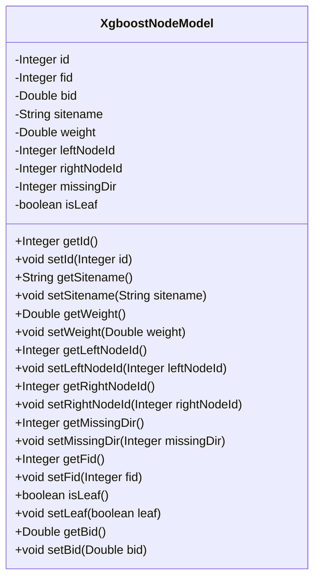

# Basic Information

|      |      |
|------|------|
| Name | XgboostNodeModel |
| Language | .java |
| Code Path | WeFe/serving/serving-sdk-java/src/main/java/com/welab/wefe/serving/sdk/model/xgboost/XgboostNodeModel.java |
| Package Name | com.welab.wefe.serving.sdk.model.xgboost |
| Dependencies | [] |
| Brief Description | The XgboostNodeModel class defines the attributes of an XGBoost tree node, including ID, feature ID, split value, weight, left and right child node IDs, missing value handling direction, and whether it is a leaf node. It provides getter and setter methods for each attribute. |

# Description

The XgboostNodeModel class defines the node structure in an XGBoost model, including node ID, feature ID, split threshold, site name, weight, left and right child node IDs, missing value handling direction, and a flag indicating whether it is a leaf node. It provides getter and setter methods for all attributes to access and modify these properties.

# Class Summary

| Name   | Type  | Description |
|-------|------|-------------|
| XgboostNodeModel | class | The XgboostNodeModel class defines the XGBoost tree node model, which includes attributes such as node ID, feature ID, split value, site name, weight, left and right child node IDs, missing value handling direction, and whether it is a leaf node. |

## Class XgboostNodeModel

|      |      |
|------|------|
| Access Modifier | public |
| Type | class |
| Name | XgboostNodeModel |
| Description | The XgboostNodeModel class defines the XGBoost tree node model, which includes attributes such as node ID, feature ID, split value, site name, weight, left and right child node IDs, missing value handling direction, and whether it is a leaf node. |

### UML Class Diagram

This code defines a class named XgboostNodeModel, which represents a node in an XGBoost decision tree model. The class includes multiple private fields such as node ID, feature ID, split threshold, site name, weight, left and right child node IDs, missing value handling direction, and a flag indicating whether it is a leaf node. Each field has corresponding getter and setter methods for accessing and modifying these attributes. This class is primarily used to store and manage decision tree node information, supporting the construction and prediction processes of the XGBoost model.

### Internal Method Call Graph

```mermaid
graph TD
    A["Class XgboostNodeModel"]
    B["Attribute: Integer id = 0"]
    C["Attribute: Integer fid"]
    D["Attribute: Double bid"]
    E["Attribute: String sitename"]
    F["Attribute: Double weight"]
    G["Attribute: Integer leftNodeId"]
    H["Attribute: Integer rightNodeId"]
    I["Attribute: Integer missingDir"]
    J["Attribute: boolean isLeaf = false"]
    K["Method: Integer getId()"]
    L["Method: void setId(Integer id)"]
    M["Method: String getSitename()"]
    N["Method: void setSitename(String sitename)"]
    O["Method: Double getWeight()"]
    P["Method: void setWeight(Double weight)"]
    Q["Method: Integer getLeftNodeId()"]
    R["Method: void setLeftNodeId(Integer leftNodeId)"]
    S["Method: Integer getRightNodeId()"]
    T["Method: void setRightNodeId(Integer rightNodeId)"]
    U["Method: Integer getMissingDir()"]
    V["Method: void setMissingDir(Integer missingDir)"]
    W["Method: Integer getFid()"]
    X["Method: void setFid(Integer fid)"]
    Y["Method: boolean isLeaf()"]
    Z["Method: void setLeaf(boolean leaf)"]
    AA["Method: Double getBid()"]
    AB["Method: void setBid(Double bid)"]

    A --> B
    A --> C
    A --> D
    A --> E
    A --> F
    A --> G
    A --> H
    A --> I
    A --> J
    A --> K
    A --> L
    A --> M
    A --> N
    A --> O
    A --> P
    A --> Q
    A --> R
    A --> S
    A --> T
    A --> U
    A --> V
    A --> W
    A --> X
    A --> Y
    A --> Z
    A --> AA
    A --> AB
```

This code defines a node class for an XGBoost tree model, containing attributes such as node ID, feature ID, split threshold, site name, weight, left and right child node IDs, missing value handling direction, and whether it is a leaf node. Each attribute has corresponding getter and setter methods for encapsulating and accessing these private attributes. This class is primarily used to represent the node structure of decision trees in the XGBoost algorithm, supporting various operations and attribute access for nodes.

### Field List

| Name  | Type  | Description |
|-------|-------|------|
| sitename | String | Define a private string variable sitename. |
| weight | Double | Declare a private double variable weight. |
| rightNodeId | Integer | Private integer variable used to store the right node ID. |
| bid | Double | Private double-precision floating-point variable bid. |
| missingDir | Integer | The private integer variable `missingDir` is used to represent the status or identifier of a missing directory. |
| isLeaf = false | boolean | The private boolean variable `isLeaf` indicates whether it is a leaf node, with a default value of `false`. |
| id = 0 | Integer | The private integer variable id has an initial value of 0. |
| leftNodeId | Integer | Private integer variable leftNodeId, used to store the left node ID. |
| fid | Integer | Private integer field fid. |

### Method List

| Name  | Type  | Description |
|-------|-------|------|
| setId | void | Methods for setting object ID, with the parameter being an integer id. |
| getLeftNodeId | Integer | Method to obtain the left node ID, with a return value of type Integer. |
| getSitename | String | Methods to obtain the site name, returning the value of the variable `sitename`. |
| setLeaf | void | Set whether a node is in leaf state. |
| getWeight | Double | The method returns a weight value of type Double. |
| getBid | Double | This is a Java method that returns a Double type bid value. |
| getId | Integer | Methods to obtain the object ID, returns an integer value. |
| setRightNodeId | void | The method to set the right node ID, which takes an Integer parameter and assigns it to the member variable rightNodeId. |
| setLeftNodeId | void | Method to set the left node ID, with parameter of integer type leftNodeId, which is assigned to the leftNodeId property of the current object. |
| getFid | Integer | This is a Java method that returns the value of the private integer variable fid. |
| setBid | void | Methods for setting the bid price, assigning the input Double type value to the object's bid property. |
| setSitename | void | Defined a public method setSitename for setting the value of the class member variable sitename. |
| setMissingDir | void | A public method `setMissingDir` is defined to set the integer value of the `missingDir` property. |
| getRightNodeId | Integer | The method to obtain the right node ID, with the return value being of integer type. |
| setFid | void | This is a Java method used to set the value of the class member variable fid. The method takes an Integer parameter and assigns it to the fid field of the class. |
| setWeight | void | Methods for setting the object's weight property, with parameters of type Double. |
| isLeaf | boolean | This method returns a boolean value indicating whether the current node is a leaf node. |
| getMissingDir | Integer | Get the integer value of the missing directory. |

