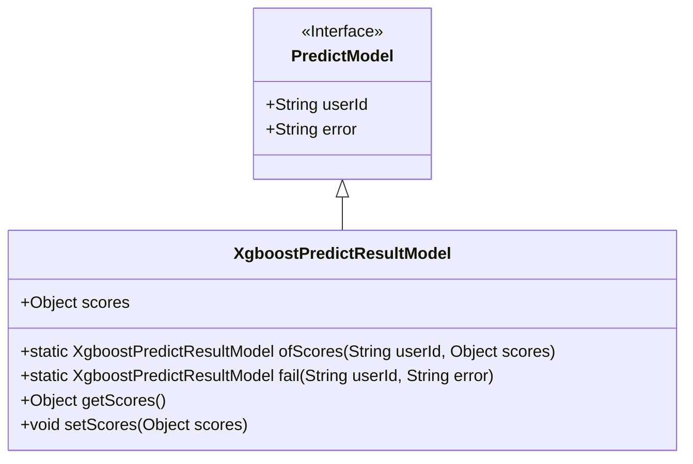
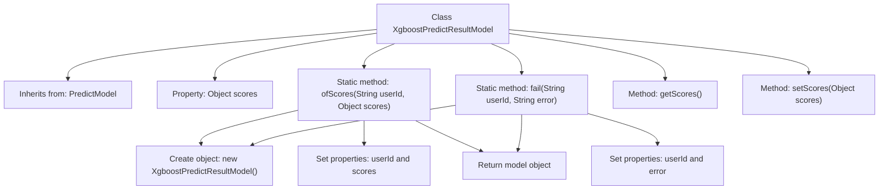

# Basic Information

|      |      |
|------|------|
| Name | XgboostPredictResultModel |
| Language | .java |
| Code Path | WeFe/serving/serving-sdk-java/src/main/java/com/welab/wefe/serving/sdk/model/xgboost/XgboostPredictResultModel.java |
| Package Name | com.welab.wefe.serving.sdk.model.xgboost |
| Dependencies | ['com.welab.wefe.serving.sdk.model.PredictModel'] |
| Brief Description | The XgboostPredictResultModel inherits from PredictModel, containing a scores attribute and two static methods: ofScores for setting user IDs and scores, and fail for setting user IDs and error messages. It provides getter and setter methods for scores. |

# Description

XgboostPredictResultModel is a class that inherits from PredictModel, used to store the prediction results of an XGBoost model. This class contains a scores attribute for storing prediction scores, which can be accessed and modified via the getScores and setScores methods. It provides two static factory methods: ofScores for creating an instance containing user IDs and prediction scores, and fail for creating a failed instance containing user IDs and error messages. This class is primarily used to encapsulate prediction results or error information for unified processing.

# Class Summary

| Name   | Type  | Description |
|-------|------|-------------|
| XgboostPredictResultModel | class | XgboostPredictResultModel inherits from PredictModel, containing a scores attribute, providing two construction methods: ofScores and fail, and supports getting and setting scores. |

## Class XgboostPredictResultModel

|      |      |
|------|------|
| Access Modifier | public |
| Type | class |
| Name | XgboostPredictResultModel |
| Description | XgboostPredictResultModel inherits from PredictModel, containing a scores attribute, providing two construction methods: ofScores and fail, and supports getting and setting scores. |

### UML Class Diagram

This code demonstrates an Xgboost prediction result model class that inherits from the PredictModel interface. XgboostPredictResultModel contains an Object-type scores field, provides static factory methods ofScores() and fail() to create instances, along with getter/setter methods. The class diagram clearly shows the inheritance relationship and member structure, where PredictModel serves as the interface defining base fields, and XgboostPredictResultModel extends functionality as the implementation class.

### Internal Method Call Graph

This code demonstrates the implementation of an XGBoost prediction result model, which inherits from the PredictModel class. It primarily includes two static factory methods: ofScores for creating a successful result model containing a user ID and prediction scores, and fail for creating a failed result model containing a user ID and error message. The class also provides getter and setter methods for the scores property. The flowchart clearly illustrates the class inheritance, property definitions, and the method invocation flow, particularly the object creation and property setting processes within the two static factory methods.

### Field List

| Name  | Type  | Description |
|-------|-------|------|
| scores | Object | Defined a public variable scores, of type Object. |

### Method List

| Name  | Type  | Description |
|-------|-------|------|
| getScores | Object | The method getScores returns the scores object. |
| setScores | void | The method setScores is used to set the scores attribute, with the parameter being of type Object. |
| ofScores | XgboostPredictResultModel | Create an instance of XgboostPredictResultModel, set the user ID and score, and return it. |
| fail | XgboostPredictResultModel | Static method creates a failure prediction result object, sets the user ID and error message, then returns it. |

