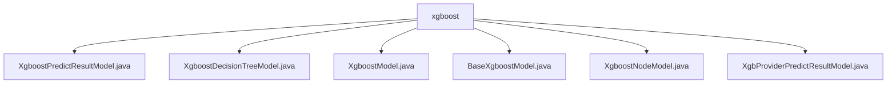

# Basic Information

|      |      |
|------|------|
| Name | xgboost |
| Language | .java |
| Code Path | WeFe/serving/serving-sdk-java/src/main/java/com/welab/wefe/serving/sdk/model/xgboost |
| Package Name | docs.serving.serving-sdk-java.src.main.java.com.welab.wefe.serving.sdk.model.xgboost |
| Brief Description | XgboostPredictResultModel stores prediction scores and error messages. XgboostDecisionTreeModel manages decision tree nodes and missing value handling. XgboostModel configures XGBoost model parameters and structure. BaseXgboostModel encapsulates model parameters. XgboostNodeModel defines node structure. XgbProviderPredictResultModel encapsulates prediction results. |

# Description

## Overview  
The core responsibility of this module is to implement data encapsulation and processing for XGBoost model prediction functionality, including model structure definition, prediction result storage, and error handling. The interface specification uniformly adopts the Getter/Setter pattern. For example, `XgboostModel` manages feature mapping through `featureNameFidMapping`, while `XgboostNodeModel` controls decision logic via node attributes. Key data structures include `XgboostNodeModel` (tree node), `XgboostDecisionTreeModel` (decision tree), and `XgboostPredictResultModel` (prediction result). The only external dependency is the XGBoost algorithm framework. For instance, `XgboostModel` stores multiple decision trees in the `trees` list, resembling a forest structure.  

## Primary Business Scenarios  
The module supports the complete XGBoost prediction workflow: first loading parameters via `BaseXgboostModel`, then constructing the tree structure using `XgboostDecisionTreeModel`, and finally returning results with `XgboostPredictResultModel`. The interaction pattern employs factory methods (e.g., `ofScores` for creating successful results) and unified error handling (e.g., the `fail` method). Typical applications include feature mapping transformation, missing value handling (via `missingDirMaskdict`), and multi-class prediction (controlled by `numClasses`). API types encompass model configuration, node operations, and result encapsulation. For example, `XgbProviderPredictResultModel` integrates tree structure data through the `xgboostTree` object.

### Package Internal Structure View

This flowchart illustrates the hierarchical structure of XGBoost-related Java files. All files are located under the xgboost directory, comprising six specific model class files designed for different functional modules such as prediction results, decision trees, base models, and node models. It reflects the comprehensive implementation system of XGBoost models within the serving-sdk.

# File List

| Name   | Type  | Description |
|-------|------|-------------|
| [XgboostPredictResultModel.java](XgboostPredictResultModel.md) | file | XgboostPredictResultModel inherits from PredictModel, containing the scores attribute and two static methods: ofScores for setting user IDs and scores, and fail for setting user IDs and error messages. It provides getter and setter methods for scores. |
| [XgboostDecisionTreeModel.java](XgboostDecisionTreeModel.md) | file | XGBoost decision tree model class, containing a list of tree nodes, a split mask dictionary, and a missing direction mask dictionary, providing getter and setter methods for each attribute. |
| [XgboostModel.java](XgboostModel.md) | file | The XgboostModel class includes attributes such as feature mapping, number of trees, initial score, decision tree list, number of categories, category names, tree dimension, learning rate, and fast mode, along with their corresponding getter/setter methods. |
| [BaseXgboostModel.java](BaseXgboostModel.md) | file | The BaseXgboostModel inherits from BaseAlgorithmModel and includes parameters for XgboostModel along with their getter/setter methods, where the getter will set the learning rate. |
| [XgboostNodeModel.java](XgboostNodeModel.md) | file | The XgboostNodeModel class defines the attributes of an XGBoost tree node, including ID, feature ID, split value, weight, left and right child node IDs, missing value handling direction, and whether it is a leaf node. It provides getter and setter methods for each attribute. |
| [XgbProviderPredictResultModel.java](XgbProviderPredictResultModel.md) | file | XgbProviderPredictResultModel extends PredictModel, containing the xgboostTree property and two static methods: ofObject for creating an instance with a user ID and xgboostTree, and fail for creating an instance with an error message. It provides getter and setter methods for xgboostTree. |

