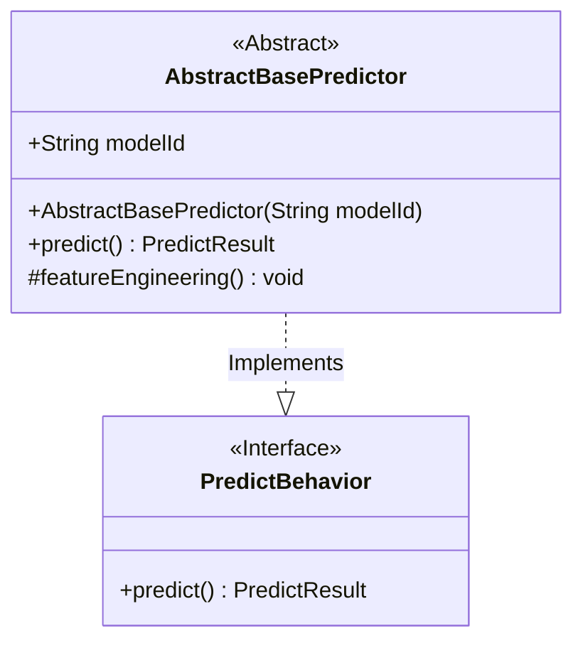
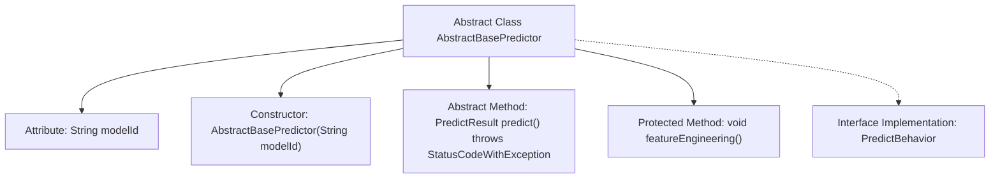

# Basic Information

|      |      |
|------|------|
| Name | AbstractBasePredictor |
| Language | .java |
| Code Path | WeFe/serving/serving-sdk-java/src/main/java/com/welab/wefe/serving/sdk/predicter/AbstractBasePredictor.java |
| Package Name | com.welab.wefe.serving.sdk.predicter |
| Dependencies | ['com.welab.wefe.common.exception.StatusCodeWithException', 'com.welab.wefe.serving.sdk.dto.PredictResult'] |
| Brief Description | The abstract base class AbstractBasePredictor implements the PredictBehavior interface, includes a model ID attribute and prediction methods, and supports feature engineering processing. |

# Description

AbstractBasePredictor is an abstract base class that implements the PredictBehavior interface. It includes a member variable named modelId of type String, which is initialized via the constructor. The class defines an abstract method predict for model prediction, which may throw a StatusCodeWithException. Additionally, it provides a protected empty method featureEngineering for feature engineering processing. This class establishes a foundational framework for prediction behavior but requires subclasses to implement the specific prediction logic.

# Class Summary

| Name   | Type  | Description |
|-------|------|-------------|
| AbstractBasePredictor | class | Abstract prediction base class, containing model ID attribute and constructor, providing abstract prediction method and default empty implementation for feature engineering methods. |

## Class AbstractBasePredictor

|      |      |
|------|------|
| Access Modifier | public abstract |
| Type | class |
| Name | AbstractBasePredictor |
| Description | Abstract prediction base class, containing model ID attribute and constructor, providing abstract prediction method and default empty implementation for feature engineering methods. |

### UML Class Diagram

This class diagram describes a foundational abstract class structure for predictors. The `AbstractBasePredictor` serves as an abstract base class implementing the `PredictBehavior` interface. It contains a model ID attribute and constructor, defines an abstract `predict()` method for model prediction (which may throw `StatusCodeWithException`), and provides a protected empty `featureEngineering()` method for feature processing. This design exemplifies the Template Method pattern, enforcing subclasses to implement core prediction logic while allowing optional override of feature processing methods.

### Internal Method Call Graph

This flowchart illustrates the structure of the abstract class AbstractBasePredictor, which implements the PredictBehavior interface. The class contains a modelId attribute, a constructor, an abstract predict() method that must be implemented by subclasses, and a feature engineering method featureEngineering() that can be overridden by subclasses. The arrows clearly depict the hierarchical relationships between class members and the interface implementation.

### Field List

| Name  | Type  | Description |
|-------|-------|------|
| modelId | String | Declare a public string-type variable modelId. |

### Method List

| Name  | Type  | Description |
|-------|-------|------|
| predict | PredictResult | The abstract method predict() returns a PredictResult and may throw a StatusCodeWithException. |
| featureEngineering | void | Empty method, used for feature engineering processing, with no specific implementation. |

