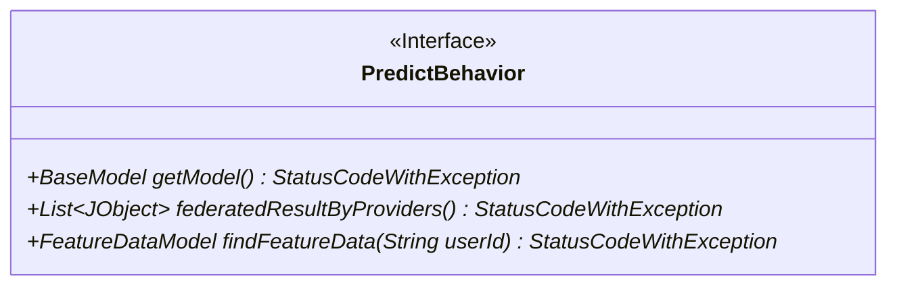
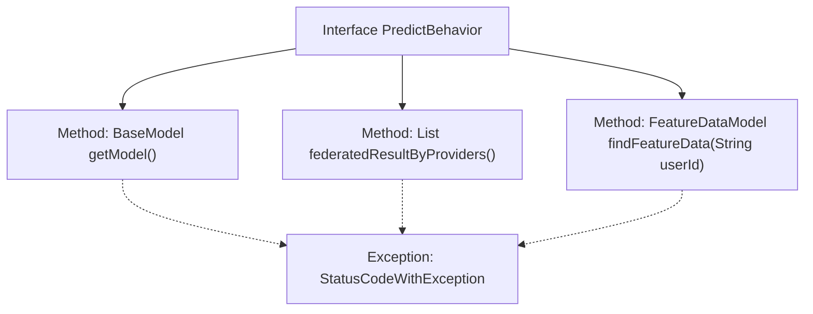

# Basic Information

|      |      |
|------|------|
| Name | PredictBehavior |
| Language | .java |
| Code Path | WeFe/serving/serving-sdk-java/src/main/java/com/welab/wefe/serving/sdk/predicter/PredictBehavior.java |
| Package Name | com.welab.wefe.serving.sdk.predicter |
| Dependencies | ['com.welab.wefe.common.exception.StatusCodeWithException', 'com.welab.wefe.common.util.JObject', 'com.welab.wefe.serving.sdk.model.BaseModel', 'com.welab.wefe.serving.sdk.model.FeatureDataModel', 'com.welab.wefe.serving.sdk.processor.AbstractModelProcessor', 'java.util.List'] |
| Brief Description | The PredictBehavior interface defines methods for obtaining models, processing federated results, and retrieving feature data, all of which may throw a StatusCodeWithException. |

# Description

The PredictBehavior interface defines three core methods: getModel is used to retrieve the base model object and may throw a StatusCodeWithException; federatedResultByProviders returns a list of federated results generated by providers in the format of a JObject collection, which may also throw an exception; findFeatureData queries feature data based on user ID, requiring the return format to be a FeatureDataModel object as a key-value pair mapping, and may throw an exception as well. All methods involve exception handling mechanisms.

# Class Summary

| Name   | Type  | Description |
|-------|------|-------------|
| PredictBehavior | interface | The PredictBehavior interface defines three methods: getModel for retrieving the model, federatedResultByProviders for obtaining federated results, and findFeatureData for locating feature data, all of which may throw a StatusCodeWithException. |

## Class PredictBehavior

|      |      |
|------|------|
| Access Modifier | public |
| Type | interface |
| Name | PredictBehavior |
| Description | The PredictBehavior interface defines three methods: getModel for retrieving the model, federatedResultByProviders for obtaining federated results, and findFeatureData for locating feature data, all of which may throw a StatusCodeWithException. |

### UML Class Diagram

This class diagram describes an interface named PredictBehavior, which defines three methods: getModel() for retrieving the base model and potentially throwing a StatusCodeWithException; federatedResultByProviders() returns a list of JObjects representing federated computation results; findFeatureData() searches for feature data based on a user ID and returns a FeatureDataModel object. This interface primarily standardizes predictive behavior, requiring implementing classes to provide model retrieval, federated computation, and feature lookup functionalities.

### Internal Method Call Graph

This flowchart illustrates the structure of the PredictBehavior interface, which defines three core methods: getModel() for model retrieval, federatedResultByProviders() for processing federated results, and findFeatureData() for feature data lookup. All methods may throw the StatusCodeWithException. As a behavioral specification, the interface establishes the functional contract that implementation classes must provide, with particular focus on three key areas: model operations, data federation, and feature lookup, while exception handling permeates all method invocation processes.

### Field List

| Name  | Type  | Description |
|-------|-------|------|

### Method List

| Name  | Type  | Description |
|-------|-------|------|
| federatedResultByProviders | List<JObject> | The method returns a provider federated result list and may throw a status code exception. |
| getModel | BaseModel | Obtain model method, may throw status code exceptions. |
| findFeatureData | FeatureDataModel | Query the feature data model based on user ID, which may throw status code exceptions. |

