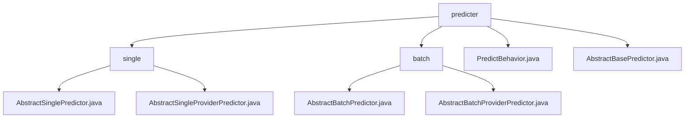

# Basic Information

|      |      |
|------|------|
| Name | predicter |
| Language | .java |
| Code Path | WeFe/serving/serving-sdk-java/src/main/java/com/welab/wefe/serving/sdk/predicter |
| Package Name | docs.serving.serving-sdk-java.src.main.java.com.welab.wefe.serving.sdk.predicter |
| Brief Description | The single prediction module encapsulates the prediction process, supporting model loading and feature processing. The batch prediction framework provides support for both conventional and federated computing scenarios. The PredictBehavior interface defines methods for obtaining models and feature data. AbstractBasePredictor provides a foundational framework for prediction behavior. |

# Description

## Overview  
The core responsibility of this module is to provide a unified framework for single and batch predictions by encapsulating the prediction process through abstract classes, supporting both conventional prediction and federated learning scenarios. The interface specifications include parameter passing via `PredictParams`, model processor retrieval via `getProcessor`, prediction execution via `predict`, etc. Key data structures include `PredictResult` (algorithm type, etc.) and `BatchPredictParams` (roles, etc.). External dependencies involve the `AlgorithmManager`, federated learning framework, and model processing components. For example, `AbstractSinglePredictor` implements single predictions, while `AbstractBatchPredictor` handles batch tasks.  

## Key Business Scenarios  
The module adopts the template method pattern, where parent classes (e.g., `AbstractBasePredictor`) define the prediction skeleton, and subclasses can extend specific logic (e.g., federated learning result processing). A typical workflow includes: parameter initialization → model loading → algorithm execution → result return, resembling a factory assembly line. It supports two scenarios: conventional prediction (e.g., single/batch) and federated computation (requiring subclass implementation of `federatedResultByProviders`). APIs cover parameter constructors and prediction executors, such as the `PredictBehavior` interface, which standardizes core methods like model retrieval and feature query.

### Package Internal Structure View

This flowchart illustrates the hierarchical structure of the predictor module in the WeFe service SDK. The top level is the `predicter` directory, which contains two subdirectories (`single` and `batch`) along with two abstract base class files. The `single` directory holds two single-instance predictor implementations, while the `batch` directory contains two batch predictor implementations. The entire structure clearly demonstrates the inheritance relationships and functional division of the predictor module.

# File List

| Name   | Type  | Description |
|-------|------|-------------|
| [PredictBehavior.java](PredictBehavior.md) | file | The PredictBehavior interface defines methods for obtaining models, processing federated results, and retrieving feature data, all of which may throw a StatusCodeWithException. |
| [AbstractBasePredictor.java](AbstractBasePredictor.md) | file | The abstract base class AbstractBasePredictor implements the PredictBehavior interface, contains the model ID attribute and prediction methods, and supports feature engineering processing. |
| [batch](batch/_module.md) | package | AbstractBatchPredictor is an abstract class for batch prediction, inheriting from AbstractBasePredictor, encompassing parameter initialization, model processing, and prediction workflow. AbstractBatchProviderPredictor extends it by overriding the federatedResultByProviders method to support federated computation. |
| [single](single/_module.md) | package | AbstractSinglePredictor is an abstract class inherited from AbstractBasePredictor, designed for single predictions. It contains the predictParams property and predict method, involving the collaboration between model processors and algorithms. AbstractSingleProviderPredictor inherits from AbstractSinglePredictor, overriding the federatedResultByProviders method without implementing specific functionality. |

