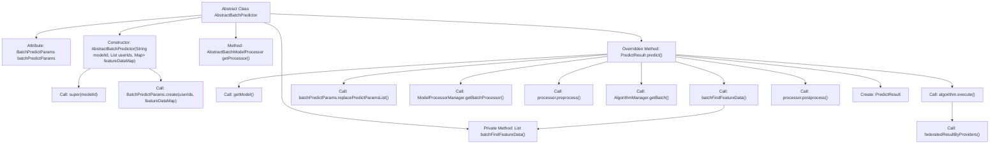

# Basic Information

|      |      |
|------|------|
| Name | AbstractBatchPredictor |
| Language | .java |
| Code Path | WeFe/serving/serving-sdk-java/src/main/java/com/welab/wefe/serving/sdk/predicter/batch/AbstractBatchPredictor.java |
| Package Name | com.welab.wefe.serving.sdk.predicter.batch |
| Dependencies | ['com.welab.wefe.common.exception.StatusCodeWithException', 'com.welab.wefe.serving.sdk.algorithm.AbstractBatchAlgorithm', 'com.welab.wefe.serving.sdk.dto.BatchPredictParams', 'com.welab.wefe.serving.sdk.dto.PredictParams', 'com.welab.wefe.serving.sdk.dto.PredictResult', 'com.welab.wefe.serving.sdk.manager.AlgorithmManager', 'com.welab.wefe.serving.sdk.manager.ModelProcessorManager', 'com.welab.wefe.serving.sdk.model.BaseModel', 'com.welab.wefe.serving.sdk.predicter.AbstractBasePredictor', 'com.welab.wefe.serving.sdk.processor.AbstractBatchModelProcessor', 'java.util.HashMap', 'java.util.List', 'java.util.Map', 'java.util.stream.Collectors'] |
| Brief Description | The abstract class AbstractBatchPredictor inherits from AbstractBasePredictor and implements batch prediction functionality. It includes parameter processing, model processor acquisition, preprocessing, algorithm execution, and postprocessing steps, ultimately returning prediction results. |

# Description

The `AbstractBatchPredictor` is an abstract class that inherits from `AbstractBasePredictor` and is designed for batch prediction. It includes a `BatchPredictParams` parameter object, which initializes the model ID, user ID list, and feature data mapping through the constructor. It provides the method `getProcessor` to retrieve the corresponding model processor. The core method `predict` executes the prediction workflow: fetching the model, replacing the prediction parameter list, preprocessing, obtaining and executing the batch algorithm, postprocessing, and finally returning a `PredictResult` containing the algorithm type, federated learning type, role, and results. The internal method `batchFindFeatureData` iterates through user IDs, creates a `PredictParams` object for each user, and collects them into a list.

# Class Summary

| Name   | Type  | Description |
|-------|------|-------------|
| AbstractBatchPredictor | class | The abstract class AbstractBatchPredictor inherits from AbstractBasePredictor and implements batch prediction functionality. It includes parameter processing, model processor acquisition, preprocessing, algorithm execution, and postprocessing steps, ultimately returning the prediction results. |

## Class AbstractBatchPredictor

|      |      |
|------|------|
| Access Modifier | public abstract |
| Type | class |
| Name | AbstractBatchPredictor |
| Description | The abstract class AbstractBatchPredictor inherits from AbstractBasePredictor and implements batch prediction functionality. It includes parameter processing, model processor acquisition, preprocessing, algorithm execution, and postprocessing steps, ultimately returning the prediction results. |

### UML Class Diagram

```mermaid
classDiagram
    class AbstractBasePredictor {
        <<abstract>>
        #String modelId
        +AbstractBasePredictor(String modelId)
        +PredictResult predict()* PredictResult
        #BaseModel getModel()* BaseModel
    }

    class AbstractBatchPredictor {
        <<abstract>>
        #BatchPredictParams batchPredictParams
        +AbstractBatchPredictor(String modelId, List~String~ userIds, Map~String, Map~String, Object~~ featureDataMap)
        +AbstractBatchModelProcessor getProcessor() AbstractBatchModelProcessor
        +PredictResult predict() PredictResult
        -List~PredictParams~ batchFindFeatureData() List~PredictParams~
    }

    class BatchPredictParams {
        <<DataType>>
        +List~String~ userIds
        +Map~String, Map~String, Object~~ featureDataMap
        +static BatchPredictParams create(List~String~, Map~String, Map~String, Object~~) BatchPredictParams
        +void replacePredictParamsList(List~PredictParams~) void
    }

    class PredictParams {
        <<DataType>>
        +String userId
        +Map~String, Object~ featureData
        +static PredictParams create(String, Map~String, Object~) PredictParams
    }

    class AbstractBatchModelProcessor {
        <<abstract>> <<Interface>>
        +void preprocess(BaseModel, BatchPredictParams)* void
        +void postprocess(Object, BaseModel, BatchPredictParams)* void
    }

    class ModelProcessorManager {
        <<Utility>>
        +static AbstractBatchModelProcessor getBatchProcessor(String) AbstractBatchModelProcessor
    }

    class AlgorithmManager {
        <<Utility>>
        +static AbstractBatchAlgorithm getBatch(BaseModel) AbstractBatchAlgorithm
    }

    class AbstractBatchAlgorithm {
        <<abstract>> <<Interface>>
        +Object execute(Map~String, Object~, BatchPredictParams, Object)* Object
    }

    class PredictResult {
        <<DataType>>
        +String algorithm
        +String flType
        +String myRole
        +Object result
        +PredictResult(String, String, String, Object)
    }

    AbstractBasePredictor <|-- AbstractBatchPredictor
    AbstractBatchPredictor --> BatchPredictParams : contains
    AbstractBatchPredictor --> ModelProcessorManager : invokes
    AbstractBatchPredictor --> AlgorithmManager : invokes
    AbstractBatchPredictor .. PredictParams : generates
    AbstractBatchPredictor ..> AbstractBatchModelProcessor : depends
    AbstractBatchPredictor ..> AbstractBatchAlgorithm : depends
    AbstractBatchPredictor ..> PredictResult : generates
    BatchPredictParams .. PredictParams : associates
```

This class diagram illustrates the core structure of a batch prediction framework. The AbstractBatchPredictor serves as an abstract base class that handles batch prediction parameters through composition with BatchPredictParams, relies on ModelProcessorManager to obtain processor instances, and utilizes AlgorithmManager to acquire algorithm implementations. The entire workflow involves four key stages: feature data lookup, preprocessing, algorithm execution, and postprocessing, ultimately producing a PredictResult object. Each component has clearly defined responsibilities, achieving decoupling of algorithm and processor logic through interface abstraction, and supporting flexible extension of different models and algorithms.

### Internal Method Call Graph

This flowchart illustrates the core structure and execution flow of the AbstractBatchPredictor class. As an abstract batch predictor inheriting from AbstractBasePredictor, its primary function is to perform batch prediction tasks through model processors and algorithm managers. The process starts with constructor initialization, retrieves the processor via getProcessor, and sequentially executes steps including model retrieval, feature data replacement, preprocessing, algorithm execution, and postprocessing in the predict method, ultimately returning prediction results. The private method batchFindFeatureData is responsible for creating prediction parameters for each user ID and handling exceptions. The entire flow demonstrates the complete lifecycle of batch prediction and the collaborative relationships between components.

### Field List

| Name  | Type  | Description |
|-------|-------|------|
| batchPredictParams | BatchPredictParams | Batch prediction parameter object for protection types. |

### Method List

| Name  | Type  | Description |
|-------|-------|------|
| predict | PredictResult | The method `predict` executes the prediction process: it retrieves the model and parameters, performs preprocessing, invokes the algorithm for execution, processes the results, and returns the prediction outcome, which includes the algorithm type, federation type, role, and execution results. |
| getProcessor | AbstractBatchModelProcessor | Get the batch processing model processor instance corresponding to the specified modelId. |
| batchFindFeatureData | List<PredictParams> | Method to batch fetch user feature data, iterates through the user ID list, and creates a PredictParams object for each ID. On success, it includes the feature data; on failure, it returns an empty Map and logs the exception. Finally, it returns a list of PredictParams. |

