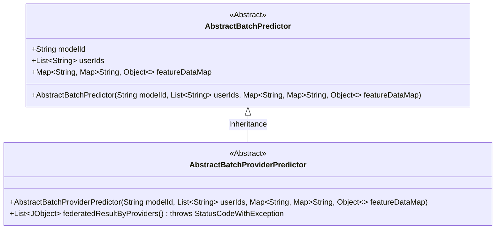
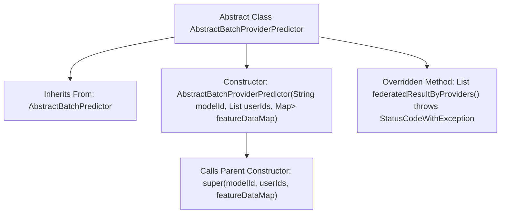

# Basic Information

|      |      |
|------|------|
| Name | AbstractBatchProviderPredictor |
| Language | .java |
| Code Path | WeFe/serving/serving-sdk-java/src/main/java/com/welab/wefe/serving/sdk/predicter/batch/AbstractBatchProviderPredictor.java |
| Package Name | com.welab.wefe.serving.sdk.predicter.batch |
| Dependencies | ['com.welab.wefe.common.exception.StatusCodeWithException', 'com.welab.wefe.common.util.JObject', 'java.util.List', 'java.util.Map'] |
| Brief Description | Abstract batch prediction class, inheriting from AbstractBatchPredictor, containing model ID, user ID list, and feature data mapping, providing empty-implemented federated result methods. |

# Description

This is an abstract class named `AbstractBatchProviderPredictor`, which inherits from `AbstractBatchPredictor`. It receives a model ID, a list of user IDs, and a feature data map through its constructor, passing them to the parent class. The class overrides the `federatedResultByProviders` method, currently returning `null`, with the expectation that concrete logic will be implemented in subclasses. The method declaration indicates it may throw a `StatusCodeWithException` exception. The overall design is intended to support federated computation results based on providers.

# Class Summary

| Name   | Type  | Description |
|-------|------|-------------|
| AbstractBatchProviderPredictor | class | Abstract batch predictor base class, supporting model ID, user lists, and feature data, providing federated result methods. |

## Class AbstractBatchProviderPredictor

|      |      |
|------|------|
| Access Modifier | public abstract |
| Type | class |
| Name | AbstractBatchProviderPredictor |
| Description | Abstract batch predictor base class, supporting model ID, user lists, and feature data, providing federated result methods. |

### UML Class Diagram

This class diagram illustrates an abstract class inheritance relationship where AbstractBatchProviderPredictor inherits from AbstractBatchPredictor. The parent class contains fundamental attributes such as model ID, user ID list, and feature data mapping table, while the child class adds a federated result processing method. Both classes are marked as abstract, indicating that concrete subclasses need to implement core logic. The diagram clearly reflects the hierarchical structure and member composition, with details like generic collections and exception declarations accurately expressed.

### Internal Method Call Graph

This code illustrates the inheritance structure and key methods of the abstract class `AbstractBatchProviderPredictor`. The class inherits from `AbstractBatchPredictor`, initializes parent class attributes through its constructor, and overrides the `federatedResultByProviders()` method (currently returning null). The flowchart clearly reflects the class inheritance relationship, the parent class constructor call chain, and the method overriding logic, demonstrating a typical base class design pattern for abstract classes.

### Field List

| Name  | Type  | Description |
|-------|-------|------|

### Method List

| Name  | Type  | Description |
|-------|-------|------|
| federatedResultByProviders | List<JObject> | The method `federatedResultByProviders` overrides the parent class, returns a list of `JObject`, may throw a `StatusCodeWithException` exception, and currently returns `null`. |

