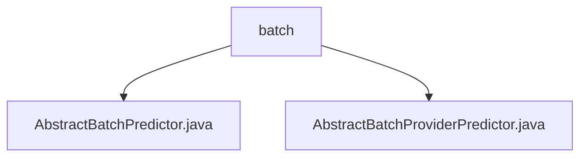

# Basic Information

|      |      |
|------|------|
| Name | batch |
| Language | .java |
| Code Path | WeFe/serving/serving-sdk-java/src/main/java/com/welab/wefe/serving/sdk/predicter/batch |
| Package Name | docs.serving.serving-sdk-java.src.main.java.com.welab.wefe.serving.sdk.predicter.batch |
| Brief Description | AbstractBatchPredictor is an abstract class for batch prediction, inheriting from AbstractBasePredictor, encompassing parameter initialization, model processing, and prediction workflow. AbstractBatchProviderPredictor extends it by overriding the federatedResultByProviders method to support federated computation. |

# Description

## Overview  
The core responsibility of this module is to provide an abstract implementation framework for batch prediction, supporting both conventional batch prediction and federated computation scenarios based on providers. The interface specifications include methods such as PredictParams parameter construction, model processor acquisition, and federated result processing. Key data structures involve BatchPredictParams, PredictResult, etc., containing fields such as algorithm type and role. External dependencies include federated learning frameworks and model processing components. For example, AbstractBatchPredictor implements the standard prediction process, while AbstractBatchProviderPredictor reserves extension points for federated computation.  

## Main Business Scenarios  
The module supports two typical application modes: the conventional batch prediction process (obtain model → parameter replacement → algorithm execution) and the federated computation extension scenario. The interaction pattern resembles the template method, where the parent class controls the main flow, and child classes override specific steps. Functional completeness is reflected in the chained processing of preprocessing, algorithm execution, and post-processing. For instance, AbstractBatchProviderPredictor supports provider-specific result customization through the federatedResultByProviders method, but requires child classes to implement the specific logic. API types encompass parameter constructors and prediction executors.

### Package Internal Structure View

This flowchart illustrates the relationship between two Java class files under the batch directory. Both AbstractBatchPredictor.java and AbstractBatchProviderPredictor.java are directly subordinate to the batch directory, with no deeper nested structure. The entire structure is concise and clear, consisting only of one parent node and two parallel child node files.

# File List

| Name   | Type  | Description |
|-------|------|-------------|
| [AbstractBatchPredictor.java](AbstractBatchPredictor.md) | file | The abstract class `AbstractBatchPredictor` inherits from `AbstractBasePredictor` and implements batch prediction functionality. It includes parameter processing, model processor acquisition, preprocessing, algorithm execution, and postprocessing steps, ultimately returning the prediction results. |
| [AbstractBatchProviderPredictor.java](AbstractBatchProviderPredictor.md) | file | Abstract batch prediction class, inherits from AbstractBatchPredictor, includes model ID, user ID list, and feature data mapping, provides empty-implemented federated result methods. |

