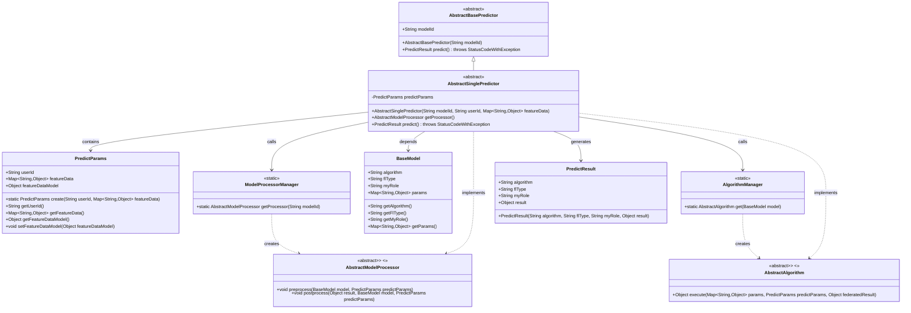
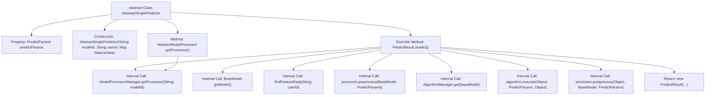

# Basic Information

|      |      |
|------|------|
| Name | AbstractSinglePredictor |
| Language | .java |
| Code Path | WeFe/serving/serving-sdk-java/src/main/java/com/welab/wefe/serving/sdk/predicter/single/AbstractSinglePredictor.java |
| Package Name | com.welab.wefe.serving.sdk.predicter.single |
| Dependencies | ['com.welab.wefe.common.exception.StatusCodeWithException', 'com.welab.wefe.serving.sdk.algorithm.AbstractAlgorithm', 'com.welab.wefe.serving.sdk.dto.PredictParams', 'com.welab.wefe.serving.sdk.dto.PredictResult', 'com.welab.wefe.serving.sdk.manager.AlgorithmManager', 'com.welab.wefe.serving.sdk.manager.ModelProcessorManager', 'com.welab.wefe.serving.sdk.model.BaseModel', 'com.welab.wefe.serving.sdk.predicter.AbstractBasePredictor', 'com.welab.wefe.serving.sdk.processor.AbstractModelProcessor', 'java.util.Map'] |
| Brief Description | The abstract class AbstractSinglePredictor inherits from AbstractBasePredictor, encapsulating single-prediction logic that includes parameter processing, model retrieval, preprocessing, algorithm execution, and postprocessing steps, ultimately returning the prediction result. |

# Description

AbstractSinglePredictor is an abstract class that inherits from AbstractBasePredictor and is used to implement single prediction functionality. It contains a predictParams attribute of type PredictParams, initialized via the constructor with model ID, user ID, and feature data. It provides the getProcessor method for obtaining the model processor. The core method predict executes the prediction workflow: fetching the model, setting feature data, preprocessing, obtaining the algorithm via AlgorithmManager to perform prediction, postprocessing, and finally returning a PredictResult object containing algorithm type, federated learning type, role, and results. The entire process involves collaborative work between the model processor and algorithms.

# Class Summary

| Name   | Type  | Description |
|-------|------|-------------|
| AbstractSinglePredictor | class | The abstract class AbstractSinglePredictor inherits from AbstractBasePredictor, encapsulating single-prediction logic that includes parameter processing, model processor acquisition, and prediction workflow, ultimately returning the prediction result. |

## Class AbstractSinglePredictor

|      |      |
|------|------|
| Access Modifier | public abstract |
| Type | class |
| Name | AbstractSinglePredictor |
| Description | The abstract class AbstractSinglePredictor inherits from AbstractBasePredictor, encapsulating single-prediction logic that includes parameter processing, model processor acquisition, and prediction workflow, ultimately returning the prediction result. |

### UML Class Diagram

This class diagram illustrates the core structure of the abstract predictor `AbstractSinglePredictor` and its associated classes. As a subclass of `AbstractBasePredictor`, it manages prediction parameters through `PredictParams`, relies on `ModelProcessorManager` and `AlgorithmManager` to obtain processor and algorithm instances, and ultimately generates `PredictResult`. The diagram includes 6 main classes and 2 interfaces, clearly presenting the interaction relationships of key components in the prediction workflow, such as the collaboration methods between model preprocessing, algorithm execution, and post-processing stages.

### Internal Method Call Graph

This flowchart illustrates the core structure and prediction workflow of the AbstractSinglePredictor abstract class. The class contains a predictParams property and constructor, with its key method being predict(). This method completes prediction through 7 internal call steps: retrieving model data, finding feature data, obtaining processor, preprocessing, acquiring algorithm, executing algorithm computation, postprocessing, and finally returning prediction results. The getProcessor() method retrieves the corresponding processor via ModelProcessorManager. The entire process demonstrates the standard processing chain for prediction requests.

### Field List

| Name  | Type  | Description |
|-------|-------|------|
| predictParams | PredictParams | The protected member predictParams, of type PredictParams. |

### Method List

| Name  | Type  | Description |
|-------|-------|------|
| getProcessor | AbstractModelProcessor | Get the AbstractModelProcessor instance corresponding to the specified modelId. |
| predict | PredictResult | The method predict() executes the prediction process: it retrieves the model and feature data, performs preprocessing, executes the prediction via the algorithm, post-processes the results, and returns the prediction result object. |

