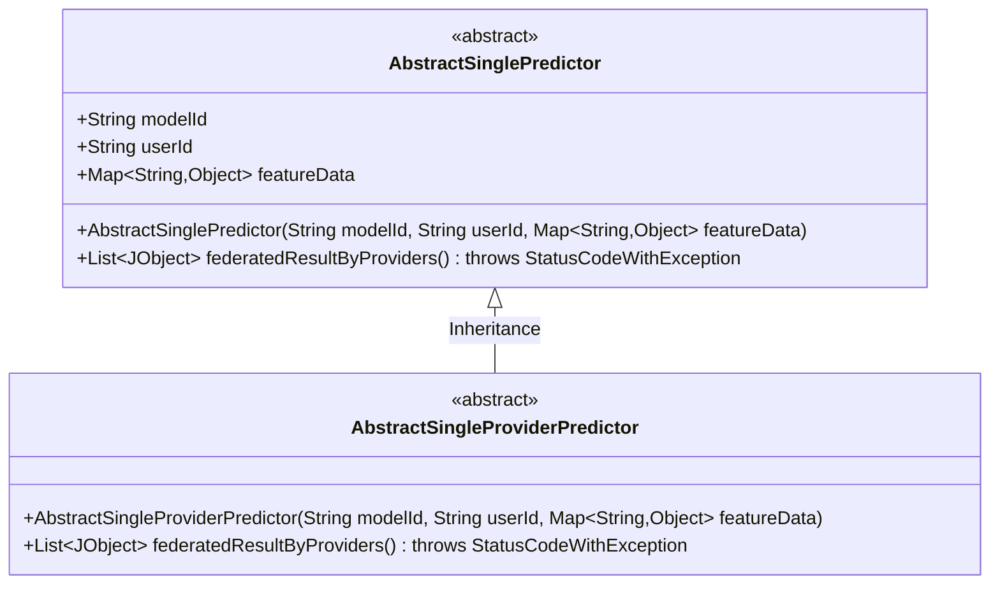
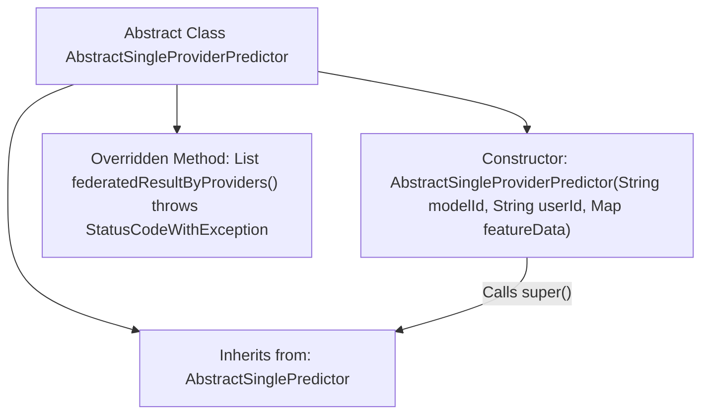

# Basic Information

|      |      |
|------|------|
| Name | AbstractSingleProviderPredictor |
| Language | .java |
| Code Path | WeFe/serving/serving-sdk-java/src/main/java/com/welab/wefe/serving/sdk/predicter/single/AbstractSingleProviderPredictor.java |
| Package Name | com.welab.wefe.serving.sdk.predicter.single |
| Dependencies | ['com.welab.wefe.common.exception.StatusCodeWithException', 'com.welab.wefe.common.util.JObject', 'java.util.List', 'java.util.Map'] |
| Brief Description | The abstract class `AbstractSingleProviderPredictor` extends `AbstractSinglePredictor`, providing prediction functionality based on models and user features, without implementing the joint result method. |

# Description

This is an abstract class named AbstractSingleProviderPredictor, which inherits from the AbstractSinglePredictor class. It includes a constructor that takes three parameters: modelId, userId, and featureData, and calls the parent class constructor for initialization. The class overrides the federatedResultByProviders method, but the current implementation only returns null without providing specific functionality.

# Class Summary

| Name   | Type  | Description |
|-------|------|-------------|
| AbstractSingleProviderPredictor | class | The abstract class `AbstractSingleProviderPredictor` extends `AbstractSinglePredictor`, providing provider-based joint result methods that return null by default. |

## Class AbstractSingleProviderPredictor

|      |      |
|------|------|
| Access Modifier | public abstract |
| Type | class |
| Name | AbstractSingleProviderPredictor |
| Description | The abstract class `AbstractSingleProviderPredictor` extends `AbstractSinglePredictor`, providing provider-based joint result methods that return null by default. |

### UML Class Diagram

Class diagram description: This diagram illustrates an abstract class inheritance structure where `AbstractSingleProviderPredictor` inherits from `AbstractSinglePredictor`. The parent class contains core attributes such as model ID, user ID, and feature data, while the child class overrides the federated result calculation method but currently returns null. Both are abstract classes, reflecting the foundational design pattern of predictors applicable to scenarios requiring multi-provider collaborative computation.

### Internal Method Call Graph

This code illustrates the inheritance structure and key methods of the abstract class `AbstractSingleProviderPredictor`. The class inherits from `AbstractSinglePredictor`, includes an initialization method that invokes the parent class constructor, and overrides the `federatedResultByProviders()` method (currently returning null). The flowchart clearly depicts the class inheritance relationship, the super() call chain in the constructor, and the method overriding relationship, reflecting the design intent of this abstract class as an intermediate layer.

### Field List

| Name  | Type  | Description |
|-------|-------|------|

### Method List

| Name  | Type  | Description |
|-------|-------|------|
| federatedResultByProviders | List<JObject> | Rewrite the method federatedResultByProviders to return a list of JObject, which may throw a StatusCodeWithException, currently returns null. |

