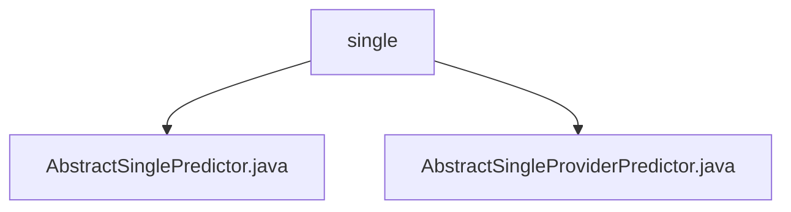

# Basic Information

|      |      |
|------|------|
| Name | single |
| Language | .java |
| Code Path | WeFe/serving/serving-sdk-java/src/main/java/com/welab/wefe/serving/sdk/predicter/single |
| Package Name | docs.serving.serving-sdk-java.src.main.java.com.welab.wefe.serving.sdk.predicter.single |
| Brief Description | AbstractSinglePredictor is an abstract class inherited from AbstractBasePredictor, designed for single predictions. It contains the predictParams property and predict method, involving the collaboration between model processors and algorithms. AbstractSingleProviderPredictor inherits from AbstractSinglePredictor, overriding the federatedResultByProviders method without implementing specific functionality. |

# Description

## Overview  
The core responsibility of this module is to implement single prediction functionality by encapsulating the prediction process through an abstract class, supporting steps such as model loading, feature processing, and algorithm execution. The interface specifications include passing parameters via PredictParams, obtaining model processors via getProcessor, and executing the complete prediction process via predict. Key data structures include PredictResult (containing fields such as algorithm type and federated learning type) and PredictParams (including model ID, etc.). External dependencies involve the AlgorithmManager for algorithm management and model processors. For example, AbstractSinglePredictor coordinates algorithm execution for prediction via AlgorithmManager.  

## Primary Business Scenarios  
The module adopts the template method pattern, where the parent class defines the prediction skeleton (e.g., pre-processing/post-processing), and subclasses can extend specific logic (e.g., AbstractSingleProviderPredictor reserves methods for federated result processing). A typical workflow involves: initializing model parameters → loading processors → executing algorithm prediction → returning structured results. It is suitable for prediction tasks requiring phased processing, similar to a factory pipeline model. For instance, subclasses can override federatedResultByProviders to customize federated learning scenarios.

### Package Internal Structure View

This flowchart illustrates the predictor class file structure in the serving-sdk-java module of the WeFe project. The root node "single" directory contains two abstract class files: AbstractSinglePredictor.java and AbstractSingleProviderPredictor.java. Both classes reside under the path com/welab/wefe/serving/sdk/predicter/single and serve as core implementation files for singleton predictors, demonstrating the typical abstract base class design pattern in Java projects.

# File List

| Name   | Type  | Description |
|-------|------|-------------|
| [AbstractSinglePredictor.java](AbstractSinglePredictor.md) | file | The abstract class AbstractSinglePredictor inherits from AbstractBasePredictor, encapsulating single-prediction logic that includes parameter processing, model retrieval, preprocessing, algorithm execution, and postprocessing steps, ultimately returning the prediction result. |
| [AbstractSingleProviderPredictor.java](AbstractSingleProviderPredictor.md) | file | The abstract class `AbstractSingleProviderPredictor` extends `AbstractSinglePredictor`, providing prediction functionality based on models and user features, without implementing the joint result method. |

