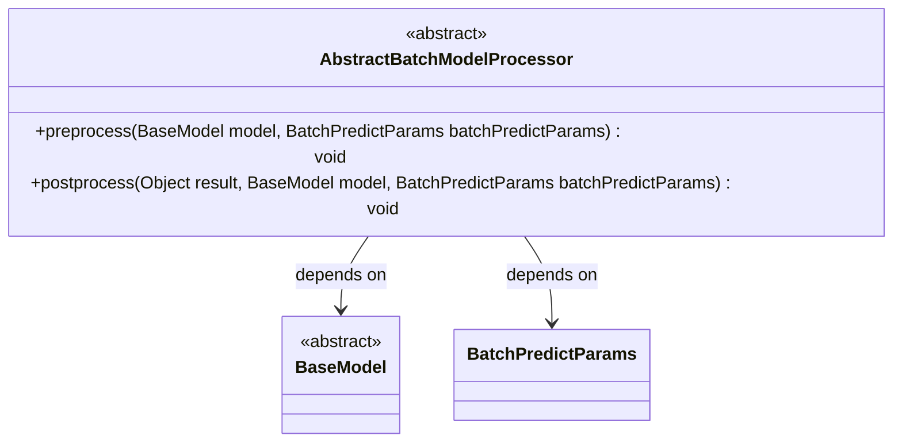
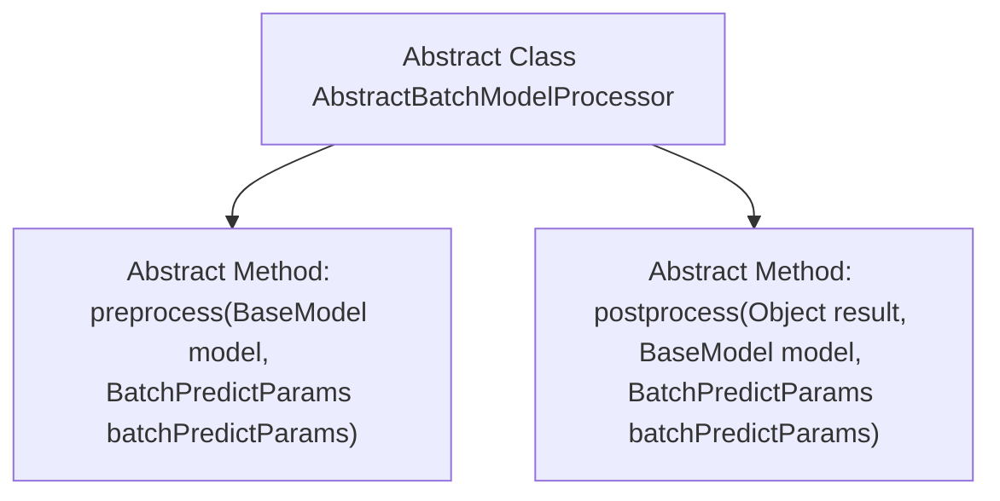

# Basic Information

|      |      |
|------|------|
| Name | AbstractBatchModelProcessor |
| Language | .java |
| Code Path | WeFe/serving/serving-sdk-java/src/main/java/com/welab/wefe/serving/sdk/processor/AbstractBatchModelProcessor.java |
| Package Name | com.welab.wefe.serving.sdk.processor |
| Dependencies | ['com.welab.wefe.serving.sdk.dto.BatchPredictParams', 'com.welab.wefe.serving.sdk.dto.PredictResult', 'com.welab.wefe.serving.sdk.model.BaseModel'] |
| Brief Description | The abstract class AbstractBatchModelProcessor defines pre-processing and post-processing methods, which are used for operations before and after model prediction respectively. The pre-processing method takes the model and parameters as input, while the post-processing method receives the result, model, and parameters. |

# Description

This is an abstract class AbstractBatchModelProcessor, which defines two core abstract methods. The preprocess method executes before model prediction, taking BaseModel and BatchPredictParams as parameters. The postprocess method executes after model prediction, taking the prediction results, BaseModel, and BatchPredictParams as parameters. These two methods provide a framework for preprocessing and postprocessing in batch model processing, with specific implementations to be completed by subclasses.

# Class Summary

| Name   | Type  | Description |
|-------|------|-------------|
| AbstractBatchModelProcessor | class | The abstract class AbstractBatchModelProcessor defines the methods preprocess and postprocess for model prediction pre- and post-processing, requiring the model and parameters to be passed in. |

## Class AbstractBatchModelProcessor

|      |      |
|------|------|
| Access Modifier | public abstract |
| Type | class |
| Name | AbstractBatchModelProcessor |
| Description | The abstract class AbstractBatchModelProcessor defines the methods preprocess and postprocess for model prediction pre- and post-processing, requiring the model and parameters to be passed in. |

### UML Class Diagram

This code defines an abstract class `AbstractBatchModelProcessor`, which provides abstract definitions for pre-processing and post-processing methods in batch model prediction. The class depends on two other classes: `BaseModel` representing the base model and `BatchPredictParams` representing batch prediction parameters. The `preprocess` and `postprocess` methods in the abstract class require implementation by subclasses to perform specific operations before and after model prediction. The class diagram clearly illustrates the relationships between these classes and the structure of the abstract class.

### Internal Method Call Graph

This code defines an abstract class named AbstractBatchModelProcessor, which contains two abstract methods: preprocess and postprocess. The preprocess method executes before model prediction, accepting BaseModel and BatchPredictParams parameters; the postprocess method executes after model prediction, additionally receiving the prediction result Object parameter. This abstract class provides a template structure for batch model processing, with concrete implementations requiring subclasses to complete the preprocessing and postprocessing logic.

### Field List

| Name  | Type  | Description |
|-------|-------|------|

### Method List

| Name  | Type  | Description |
|-------|-------|------|
| preprocess | void | Abstract preprocessing method that takes a base model and batch prediction parameters. |
| postprocess | void | Abstract method postprocess, handling the result object, base model, and batch prediction parameters. |

