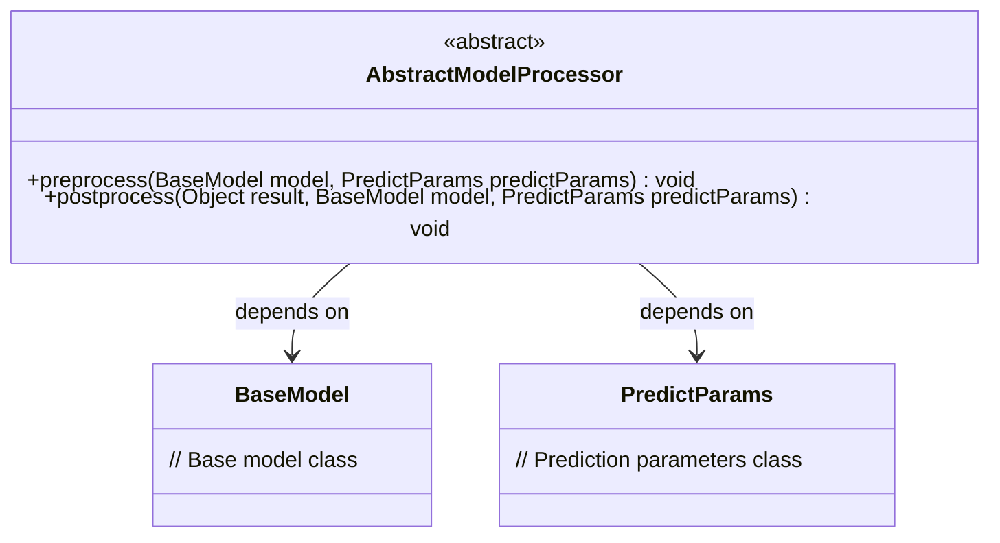
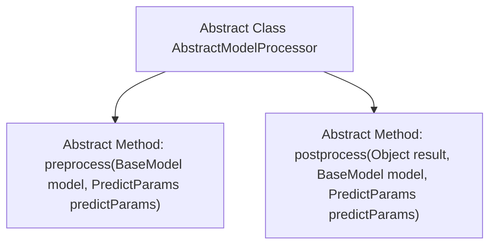

# Basic Information

|      |      |
|------|------|
| Name | AbstractModelProcessor |
| Language | .java |
| Code Path | WeFe/serving/serving-sdk-java/src/main/java/com/welab/wefe/serving/sdk/processor/AbstractModelProcessor.java |
| Package Name | com.welab.wefe.serving.sdk.processor |
| Dependencies | ['com.welab.wefe.serving.sdk.dto.PredictParams', 'com.welab.wefe.serving.sdk.dto.PredictResult', 'com.welab.wefe.serving.sdk.model.BaseModel'] |
| Brief Description | The abstract class AbstractModelProcessor defines the interfaces for pre- and post-processing of model predictions: preprocess for preprocessing and postprocess for post-processing, requiring the model and prediction parameters to be passed in. |

# Description

This is an abstract class named AbstractModelProcessor, which defines two abstract methods for pre- and post-model prediction processing. The preprocess method executes before model prediction, accepting BaseModel and PredictParams parameters. The postprocess method executes after prediction, additionally receiving the prediction result as a parameter. These two methods provide standardized pre- and post-processing interfaces for the model processing workflow.

# Class Summary

| Name   | Type  | Description |
|-------|------|-------------|
| AbstractModelProcessor | class | The abstract class AbstractModelProcessor defines the interfaces for pre- and post-processing of model predictions: preprocess handles preprocessing of the model and parameters, while postprocess manages post-processing of results, the model, and parameters. |

## Class AbstractModelProcessor

|      |      |
|------|------|
| Access Modifier | public abstract |
| Type | class |
| Name | AbstractModelProcessor |
| Description | The abstract class AbstractModelProcessor defines the interfaces for pre- and post-processing of model predictions: preprocess handles preprocessing of the model and parameters, while postprocess manages post-processing of results, the model, and parameters. |

### UML Class Diagram

This class diagram describes an abstract model processor `AbstractModelProcessor`, which defines two abstract methods: `preprocess` for pre-processing operations before model prediction, and `postprocess` for post-processing operations after model prediction. The class depends on two classes, `BaseModel` and `PredictParams`, representing the base model and prediction parameters respectively. This is a typical template method pattern design, providing a processing framework for concrete model processors, where subclasses need to implement specific pre-processing and post-processing logic.

### Internal Method Call Graph

This flowchart illustrates the structure of the abstract class AbstractModelProcessor, which contains two core abstract methods. The preprocess method performs preprocessing operations before model prediction, accepting BaseModel and PredictParams parameters; the postprocess method executes post-processing after prediction, additionally receiving the prediction result Object parameter. The arrows denote the hierarchical relationship between the class and its methods, emphasizing that subclasses must implement these two critical processing stages.

### Field List

| Name  | Type  | Description |
|-------|-------|------|

### Method List

| Name  | Type  | Description |
|-------|-------|------|
| preprocess | void | The abstract method `preprocess` is used to preprocess the `BaseModel` and `PredictParams` objects. |
| postprocess | void | The abstract method `postprocess` handles prediction results, accepting the result object, base model, and prediction parameters. |

