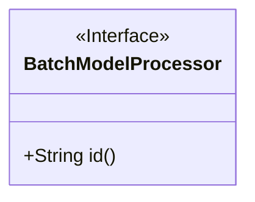
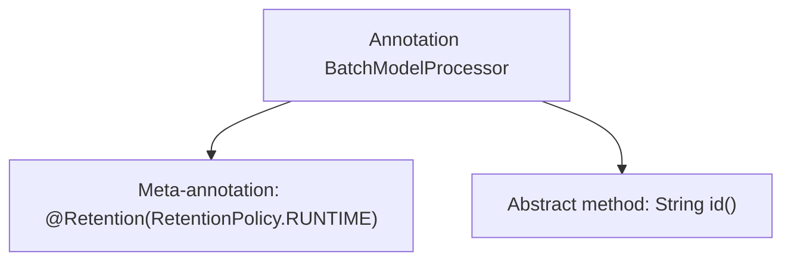

# Basic Information

|      |      |
|------|------|
| Name | BatchModelProcessor |
| Language | .java |
| Code Path | WeFe/serving/serving-sdk-java/src/main/java/com/welab/wefe/serving/sdk/processor/BatchModelProcessor.java |
| Package Name | com.welab.wefe.serving.sdk.processor |
| Dependencies | ['java.lang.annotation.Retention', 'java.lang.annotation.RetentionPolicy'] |
| Brief Description | The annotation `BatchModelProcessor` retained at runtime requires specifying the `id` attribute. |

# Description

The content defines a Java annotation named BatchModelProcessor, using @Retention(RetentionPolicy.RUNTIME) to specify that the annotation is retained at runtime. The annotation includes a mandatory string-type attribute named id. This annotation is suitable for scenarios requiring runtime processing via reflection.

# Class Summary

| Name   | Type  | Description |
|-------|------|-------------|
| BatchModelProcessor | annotation | The Java annotation `@BatchModelProcessor` is retained at runtime and requires a unique identifier `id` to be specified. |

## Class BatchModelProcessor

|      |      |
|------|------|
| Access Modifier | @Retention(RetentionPolicy.RUNTIME);public |
| Type | annotation |
| Name | BatchModelProcessor |
| Description | The Java annotation `@BatchModelProcessor` is retained at runtime and requires a unique identifier `id` to be specified. |

### UML Class Diagram

The diagram illustrates an annotated interface named BatchModelProcessor, denoted by the <<Interface>> stereotype. This interface declares a public method id() that returns a String type. The annotation is retained at runtime (as specified by @Retention(RetentionPolicy.RUNTIME)) and primarily serves to identify batch model processors. This design is commonly used in frameworks to implement extensible batch processing logic, enabling dynamic identification of different processors via annotation IDs.

### Internal Method Call Graph

This code defines a runtime annotation named `BatchModelProcessor`, which contains a mandatory `id()` method to be implemented. The `@Retention(RetentionPolicy.RUNTIME)` meta-annotation declares that this annotation is retained at runtime, enabling its information to be read via reflection mechanisms. Annotations are typically used to mark or configure elements such as classes and methods. Here, the designed `id()` method is likely used to identify different batch model processors.

### Field List

| Name  | Type  | Description |
|-------|-------|------|
| id | String | Method declaration: Returns an ID of type string. |

### Method List

| Name  | Type  | Description |
|-------|-------|------|

