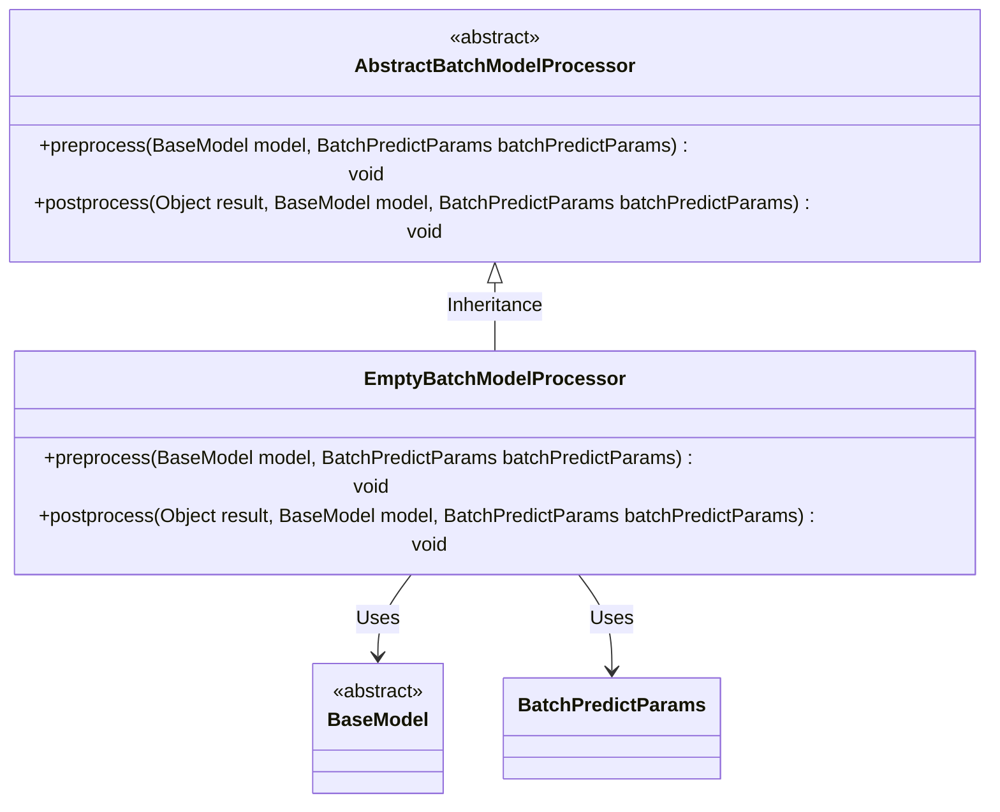
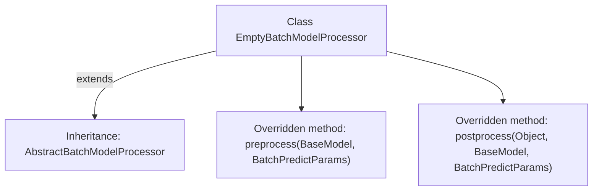

# Basic Information

|      |      |
|------|------|
| Name | EmptyBatchModelProcessor |
| Language | .java |
| Code Path | WeFe/serving/serving-sdk-java/src/main/java/com/welab/wefe/serving/sdk/processor/EmptyBatchModelProcessor.java |
| Package Name | com.welab.wefe.serving.sdk.processor |
| Dependencies | ['com.welab.wefe.serving.sdk.dto.BatchPredictParams', 'com.welab.wefe.serving.sdk.dto.PredictResult', 'com.welab.wefe.serving.sdk.model.BaseModel'] |
| Brief Description | Empty batch processing model processor, inherits from an abstract class, includes pre-processing and post-processing methods, none of which have concrete implementations. |

# Description

The `EmptyBatchModelProcessor` is a class that inherits from `AbstractBatchModelProcessor`, primarily designed for pre- and post-processing in batch model operations. This class includes two empty implementation methods: `preprocess`, which handles preprocessing before model prediction and accepts `BaseModel` and `BatchPredictParams` as parameters; and `postprocess`, which manages post-processing of prediction results, taking the result object, `BaseModel`, and `BatchPredictParams` as parameters. The class contains no specific logic and may serve as a template or default implementation.

# Class Summary

| Name   | Type  | Description |
|-------|------|-------------|
| EmptyBatchModelProcessor | class | Empty batch processing model processor class, inherits from the abstract batch class, includes pre-processing and post-processing methods, all without concrete implementations. |

## Class EmptyBatchModelProcessor

|      |      |
|------|------|
| Access Modifier | public |
| Type | class |
| Name | EmptyBatchModelProcessor |
| Description | Empty batch processing model processor class, inherits from the abstract batch class, includes pre-processing and post-processing methods, all without concrete implementations. |

### UML Class Diagram

This class diagram illustrates that EmptyBatchModelProcessor inherits from the abstract class AbstractBatchModelProcessor and implements its preprocess and postprocess methods. Both methods take BaseModel and BatchPredictParams as parameters but currently have empty implementations. BaseModel is an abstract base class, while BatchPredictParams is a parameter class. The structure exemplifies a typical Template Method pattern, where the parent class defines the algorithm skeleton and child classes can optionally override specific steps.

### Internal Method Call Graph

This code demonstrates an empty implementation class named EmptyBatchModelProcessor, which inherits from the abstract class AbstractBatchModelProcessor. The class overrides two methods: preprocess for preprocessing before model prediction (currently empty implementation), and postprocess for post-processing after prediction (also empty). The flowchart clearly reflects the inheritance relationship and the structure of overridden methods, indicating this is a template class awaiting concrete implementation.

### Field List

| Name  | Type  | Description |
|-------|-------|------|

### Method List

| Name  | Type  | Description |
|-------|-------|------|
| postprocess | void | This is a Java method override used for post-processing prediction results, which takes the result object, base model, and batch prediction parameters as inputs. |
| preprocess | void | Java method overriding, pre-processing logic with empty implementation, accepting BaseModel and BatchPredictParams parameters. |

