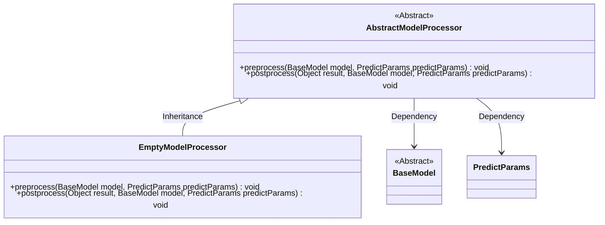
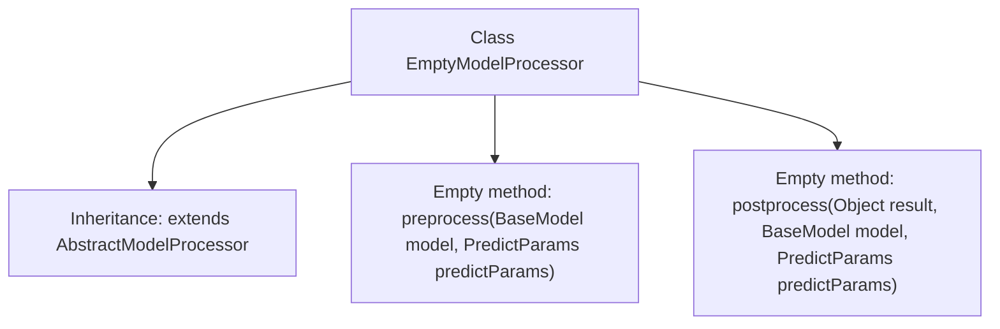

# Basic Information

|      |      |
|------|------|
| Name | EmptyModelProcessor |
| Language | .java |
| Code Path | WeFe/serving/serving-sdk-java/src/main/java/com/welab/wefe/serving/sdk/processor/EmptyModelProcessor.java |
| Package Name | com.welab.wefe.serving.sdk.processor |
| Dependencies | ['com.welab.wefe.serving.sdk.dto.PredictParams', 'com.welab.wefe.serving.sdk.dto.PredictResult', 'com.welab.wefe.serving.sdk.model.BaseModel'] |
| Brief Description | The EmptyModelProcessor is an empty implementation class that inherits from AbstractModelProcessor, containing two empty methods for pre-processing and post-processing. |

# Description

This is a class named EmptyModelProcessor, which inherits from AbstractModelProcessor. It contains two empty-implemented methods: preprocess and postprocess. The preprocess method takes BaseModel and PredictParams parameters but performs no operations, while the postprocess method similarly has an empty implementation despite receiving Object, BaseModel, and PredictParams parameters. This class may serve as a default or placeholder implementation for model processors.

# Class Summary

| Name   | Type  | Description |
|-------|------|-------------|
| EmptyModelProcessor | class | Empty model processor class, inheriting from the abstract model processor, containing pre-processing and post-processing methods, both without concrete implementations. |

## Class EmptyModelProcessor

|      |      |
|------|------|
| Access Modifier | public |
| Type | class |
| Name | EmptyModelProcessor |
| Description | Empty model processor class, inheriting from the abstract model processor, containing pre-processing and post-processing methods, both without concrete implementations. |

### UML Class Diagram

This class diagram illustrates that EmptyModelProcessor inherits from the abstract class AbstractModelProcessor and implements its preprocess and postprocess methods. AbstractModelProcessor depends on two classes, BaseModel and PredictParams, to handle pre- and post-prediction logic. As a concrete implementation, EmptyModelProcessor currently has empty method bodies, likely serving as a default or placeholder scenario. The overall structure demonstrates the application of the Template Method pattern, where the parent class defines the algorithm skeleton and child classes can selectively override specific steps.

### Internal Method Call Graph

This flowchart illustrates the structure of the EmptyModelProcessor class, which is an empty implementation inheriting from AbstractModelProcessor. The diagram includes two empty methods: preprocess for model prediction preprocessing (without concrete logic) and postprocess for post-processing after model prediction (also unimplemented). Serving as a default implementation of the abstract processor, this class provides a template method structure for subclasses to override, suitable for scenarios requiring no preprocessing/postprocessing.

### Field List

| Name  | Type  | Description |
|-------|-------|------|

### Method List

| Name  | Type  | Description |
|-------|-------|------|
| postprocess | void | Java method overriding, used for post-processing prediction results, receives the result object, base model, and prediction parameters. |
| preprocess | void | Java method overriding, empty implementation for preprocessing logic, accepting BaseModel and PredictParams parameters. |

