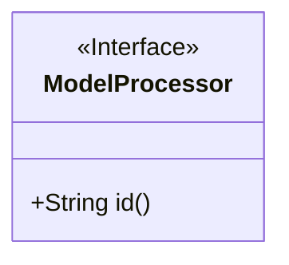
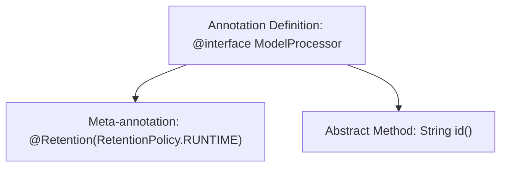

# Basic Information

|      |      |
|------|------|
| Name | ModelProcessor |
| Language | .java |
| Code Path | WeFe/serving/serving-sdk-java/src/main/java/com/welab/wefe/serving/sdk/processor/ModelProcessor.java |
| Package Name | com.welab.wefe.serving.sdk.processor |
| Dependencies | ['java.lang.annotation.Retention', 'java.lang.annotation.RetentionPolicy'] |
| Brief Description | This is a Java runtime-retained annotation `ModelProcessor`, which includes a required attribute `id` used to identify the model processor. |

# Description

The content defines a Java annotation named ModelProcessor, using @Retention(RetentionPolicy.RUNTIME) to specify its retention policy as runtime-visible. This annotation contains a string-type attribute named id.

# Class Summary

| Name   | Type  | Description |
|-------|------|-------------|
| ModelProcessor | annotation | Define the runtime-retained annotation ModelProcessor, which includes the required attribute id. |

## Class ModelProcessor

|      |      |
|------|------|
| Access Modifier | @Retention(RetentionPolicy.RUNTIME);public |
| Type | annotation |
| Name | ModelProcessor |
| Description | Define the runtime-retained annotation ModelProcessor, which includes the required attribute id. |

### UML Class Diagram

This code defines a runtime annotation interface named `ModelProcessor`, which contains a mandatory `id()` method to be implemented. The annotation is marked with the `@Retention(RetentionPolicy.RUNTIME)` meta-annotation, indicating it can be retrieved via reflection during runtime. In the class diagram, the `<<Interface>>` notation signifies this is an annotation interface, while the public method `id()` returns a string type, conforming to the specification of annotation attribute definitions. Such design is commonly used in frameworks to identify model classes or processor components that require handling.

### Internal Method Call Graph

This flowchart illustrates the structural definition of the Java annotation `ModelProcessor`. The top node represents the annotation declaration, which specifies the runtime retention policy via the `@Retention` meta-annotation and includes an abstract method named `id()`. The diagram clearly presents the hierarchical relationship between the annotation's metadata configuration and member methods, conforming to Java annotation syntax specifications.

### Field List

| Name  | Type  | Description |
|-------|-------|------|
| id | String | Define a method to return a string-type ID. |

### Method List

| Name  | Type  | Description |
|-------|-------|------|

