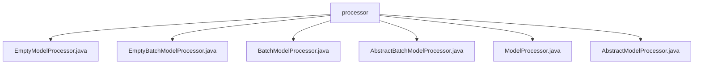

# Basic Information

|      |      |
|------|------|
| Name | processor |
| Language | .java |
| Code Path | WeFe/serving/serving-sdk-java/src/main/java/com/welab/wefe/serving/sdk/processor |
| Package Name | docs.serving.serving-sdk-java.src.main.java.com.welab.wefe.serving.sdk.processor |
| Brief Description | EmptyModelProcessor and EmptyBatchModelProcessor are model processor classes with empty implementations, designed for single-instance and batch processing respectively. BatchModelProcessor and ModelProcessor are runtime annotations containing an id attribute. AbstractModelProcessor and AbstractBatchModelProcessor are abstract classes that define framework methods for pre-processing and post-processing. |

# Description

## Overview  
This module provides a standard framework for model processing, supporting both single-item and batch processing modes. Its core responsibility is to define interface specifications for pre- and post-processing through abstract classes and empty implementations, such as `preprocess` accepting `BaseModel` and prediction parameters, and `postprocess` handling prediction results. Key data structures include `BaseModel`, `PredictParams`, and `BatchPredictParams`. It relies on runtime annotations (e.g., `@ModelProcessor`) to enable reflection-based processing, similar to placeholder implementations in the strategy pattern. For example, `EmptyModelProcessor` serves as the default implementation, while `AbstractBatchModelProcessor` defines the batch processing template.

## Key Business Scenarios  
The module supports end-to-end model prediction processing, including pre-processing parameter validation and post-processing result transformation. A typical interaction pattern involves identifying processor IDs via annotations, with subclasses implementing specific logic. For instance, single-item processing uses `PredictParams`, while batch processing employs `BatchPredictParams`. Complete functionality is enforced through standardized abstract methods, covering use cases such as real-time prediction and offline batch processing. API types include runtime annotations and template methods, with integration examples demonstrated in the placeholder usage of empty implementation classes.

### Package Internal Structure View

This flowchart illustrates the class structure relationships within the processor module of the WeFe service SDK. All processor classes are directly located under the processor directory, including the base abstract classes AbstractModelProcessor and AbstractBatchModelProcessor, along with their implementation classes ModelProcessor and BatchModelProcessor, as well as two special processors EmptyModelProcessor and EmptyBatchModelProcessor.

# File List

| Name   | Type  | Description |
|-------|------|-------------|
| [EmptyModelProcessor.java](EmptyModelProcessor.md) | file | The EmptyModelProcessor is an empty implementation class that inherits from AbstractModelProcessor, containing two empty methods for preprocessing and postprocessing. |
| [EmptyBatchModelProcessor.java](EmptyBatchModelProcessor.md) | file | Empty batch processing model processor, inherits from an abstract class, includes pre-processing and post-processing methods, none of which have concrete implementations. |
| [BatchModelProcessor.java](BatchModelProcessor.md) | file | The annotation BatchModelProcessor retained at runtime requires specifying the id attribute. |
| [AbstractBatchModelProcessor.java](AbstractBatchModelProcessor.md) | file | The abstract class `AbstractBatchModelProcessor` defines pre-processing and post-processing methods, which are used for operations before and after model prediction respectively. The pre-processing method accepts the model and parameters, while the post-processing method receives the results, model, and parameters. |
| [ModelProcessor.java](ModelProcessor.md) | file | This is a Java runtime-retained annotation `ModelProcessor`, which includes a required attribute `id` for identifying the model processor. |
| [AbstractModelProcessor.java](AbstractModelProcessor.md) | file | The abstract class AbstractModelProcessor defines the interfaces for pre- and post-processing of model predictions: preprocess for preprocessing and postprocess for post-processing, which require passing in the model and prediction parameters. |

