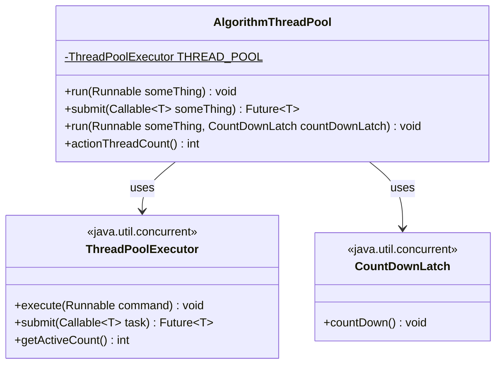
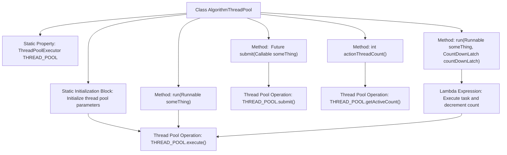

# Basic Information

|      |      |
|------|------|
| Name | AlgorithmThreadPool |
| Language | .java |
| Code Path | WeFe/serving/serving-sdk-java/src/main/java/com/welab/wefe/serving/sdk/utils/AlgorithmThreadPool.java |
| Package Name | com.welab.wefe.serving.sdk.utils |
| Dependencies | ['java.util.concurrent'] |
| Brief Description | The AlgorithmThreadPool class implements a static thread pool with the core thread count equal to the number of CPU cores and the maximum thread count twice the core count. It provides methods to execute Runnable and Callable tasks, supports CountDownLatch counting, and can retrieve the number of active threads. |

# Description

The `AlgorithmThreadPool` class implements a static thread pool with the number of core threads equal to the number of CPU cores, a maximum thread count of twice the core count, a 100-millisecond idle timeout, and an unbounded capacity queue. It provides three task execution methods: directly executing a `Runnable` task, submitting a `Callable` task and returning a `Future`, and executing an asynchronous task with a `CountDownLatch` (decrementing the counter after execution). It also includes a method to retrieve the number of active threads. All methods are statically invoked.

# Class Summary

| Name   | Type  | Description |
|-------|------|-------------|
| AlgorithmThreadPool | class | The AlgorithmThreadPool class implements thread pool management, with the core thread count set to the number of CPU cores and the maximum thread count set to twice the number of cores. It provides methods for executing Runnable tasks, submitting Callable tasks, and handling asynchronous tasks with CountDownLatch, while supporting retrieval of the active thread count. |

## Class AlgorithmThreadPool

|      |      |
|------|------|
| Access Modifier | public |
| Type | class |
| Name | AlgorithmThreadPool |
| Description | The AlgorithmThreadPool class implements thread pool management, with the core thread count set to the number of CPU cores and the maximum thread count set to twice the number of cores. It provides methods for executing Runnable tasks, submitting Callable tasks, and handling asynchronous tasks with CountDownLatch, while supporting retrieval of the active thread count. |

### UML Class Diagram

This code defines an algorithmic thread pool utility class AlgorithmThreadPool, which encapsulates the functionality of ThreadPoolExecutor and provides three task execution methods: directly executing Runnable tasks, submitting Callable tasks and returning Futures, and task execution with CountDownLatch notification. The class diagram illustrates the dependency relationship between AlgorithmThreadPool and Java standard library's ThreadPoolExecutor and CountDownLatch. AlgorithmThreadPool provides thread pool services externally through static methods, internally maintains a static thread pool instance, and supports obtaining active thread counts and different types of task submission methods.

### Internal Method Call Graph

This code demonstrates the implementation of a thread pool utility class AlgorithmThreadPool. A thread pool with core threads equal to CPU cores and maximum threads twice the CPU cores is created via a static initialization block. It provides four operation methods: directly executing Runnable tasks, submitting Callable tasks with Future return, task execution with CountDownLatch counting, and obtaining active thread count. The CountDownLatch method ensures counter decrement after task execution through Lambda expressions, showcasing the combined use of thread pools and synchronization tools.

### Field List

| Name  | Type  | Description |
|-------|-------|------|
| THREAD_POOL | ThreadPoolExecutor | Private static thread pool executor THREAD_POOL. |

### Method List

| Name  | Type  | Description |
|-------|-------|------|
| submit | Future<T> | Java Method: Submitting a Callable Task to a Thread Pool and Returning a Future Object. |
| run | void | Execute tasks using a thread pool, then decrement the CountDownLatch count upon completion. |
| run | void | Define a static method `run` that accepts a `Runnable` parameter and executes the task using the thread pool `THREAD_POOL`. |
| actionThreadCount | int | This method returns the current number of active threads in the thread pool. |

