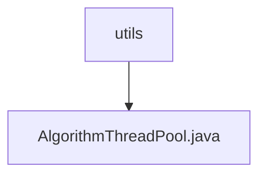

# Basic Information

|      |      |
|------|------|
| Name | utils |
| Language | .java |
| Code Path | WeFe/serving/serving-sdk-java/src/main/java/com/welab/wefe/serving/sdk/utils |
| Package Name | docs.serving.serving-sdk-java.src.main.java.com.welab.wefe.serving.sdk.utils |
| Brief Description | The `AlgorithmThreadPool` class implements a static thread pool with a core thread count equal to the number of CPU cores and a maximum thread count twice the core count. It provides methods to execute `Runnable` and `Callable` tasks, supports `CountDownLatch` counting, and can retrieve the number of active threads. |

# Description

The `AlgorithmThreadPool` class implements a static thread pool with a core thread count equal to the number of CPU cores and a maximum thread count twice the core count. It uses a 100-millisecond idle timeout and an unbounded capacity queue. It provides three task execution methods: directly executing a `Runnable` task, submitting a `Callable` task and returning a `Future`, and executing an asynchronous task with a `CountDownLatch` (decrementing the counter after execution). It also includes a method to retrieve the number of active threads. All methods are statically invoked.

### Package Internal Structure View

This flowchart illustrates the hierarchical structure of the utils utility package under the serving-sdk-java module in the WeFe project, where utils serves as the parent directory containing the AlgorithmThreadPool.java thread pool utility class. It represents a typical three-level directory structure, reflecting the common organization of utility classes in Java projects, with the total node count strictly matching the number of input paths.

# File List

| Name   | Type  | Description |
|-------|------|-------------|
| [AlgorithmThreadPool.java](AlgorithmThreadPool.md) | file | The `AlgorithmThreadPool` class implements a static thread pool with a core thread count equal to the number of CPU cores and a maximum thread count of twice the core count. It provides methods to execute `Runnable` and `Callable` tasks, supports `CountDownLatch` counting, and can retrieve the number of active threads. |

