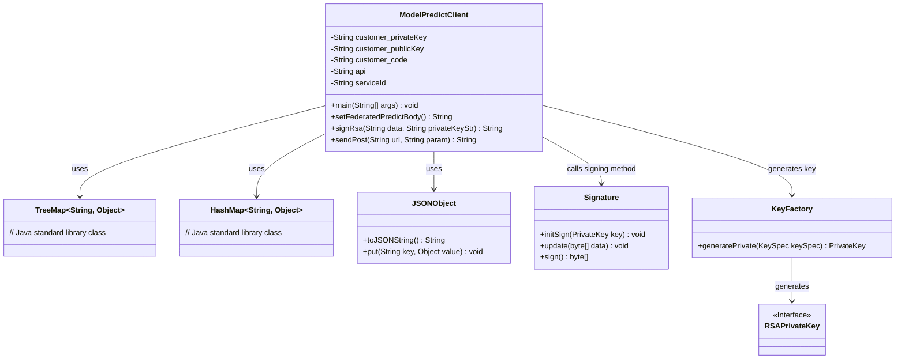
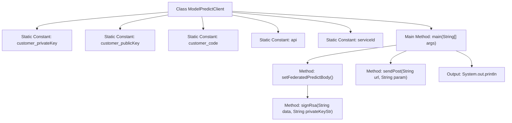
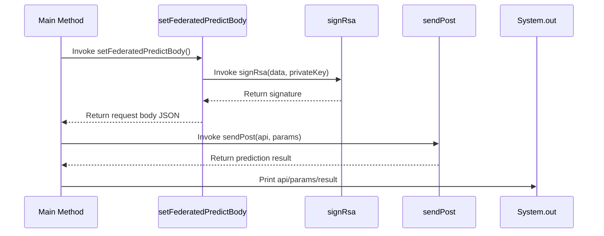

# Basic Information

|      |      |
|------|------|
| Name | ModelPredictClient |
| Language | .java |
| Code Path | WeFe/serving/serving-service/sdk_dir/ModelPredictClient.java |
| Package Name | com.welab.wefe.mpc |
| Dependencies | ['com.alibaba.fastjson.JSONObject', 'java.io', 'java.math.BigInteger', 'java.net', 'java.nio.charset.StandardCharsets', 'java.security.KeyFactory', 'java.security.Signature', 'java.security.interfaces.RSAPrivateKey', 'java.security.spec.PKCS8EncodedKeySpec', 'java.util'] |
| Brief Description | Java client class ModelPredictClient, used for invoking prediction APIs, includes key configuration, request parameter signing (RSA/SM2), and POST request sending functionality. |

# Description

The code implements a model prediction client class `ModelPredictClient`, which includes key configuration, API address setup, and prediction request functionality. Key features include: constructing a request body containing feature data, user ID, and service ID via the `setFederatedPredictBody` method, and signing the data using an RSA private key; sending a POST request to a specified URL via the `sendPost` method, setting request headers and processing the response. The code also includes commented-out implementations for SM2 signature methods, though these are currently inactive. The entire workflow ensures secure data transmission and model prediction request functionality.

# Class Summary

| Name   | Type  | Description |
|-------|------|-------------|
| ModelPredictClient | class | Java client class ModelPredictClient, which includes key configuration, API invocation, and RSA signature functionality, is used to send prediction requests and process responses. |

## Class ModelPredictClient

|      |      |
|------|------|
| Access Modifier | public |
| Type | class |
| Name | ModelPredictClient |
| Description | Java client class ModelPredictClient, which includes key configuration, API invocation, and RSA signature functionality, is used to send prediction requests and process responses. |

### UML Class Diagram

Class diagram description:
ModelPredictClient is a client class for model prediction, encompassing key management, request body construction, digital signature, and HTTP request functionalities. It utilizes TreeMap and HashMap to organize request parameters, serializes data via JSONObject, invokes Signature for RSA signing, and relies on KeyFactory to generate private keys. The class encapsulates the complete prediction request workflow, including parameter assembly, signature generation, and POST request transmission, reflecting a design focused on secure communication and data processing.

### Internal Method Call Graph

This flowchart illustrates the structure of the ModelPredictClient class, containing 5 static constants and 4 core methods. The sequence diagram depicts the complete workflow where the main method sequentially calls setFederatedPredictBody to generate a signed request body, sends the prediction request via sendPost, and finally outputs the result. The signing process employs RSA algorithm, with the request body containing parameters such as feature data, user ID, and service identifier, transmitted via POST request to the prediction API endpoint.

### Field List

| Name  | Type  | Description |
|-------|-------|------|
| customer_publicKey = "***" | String | Private static constant string stores the customer's public key. |
| serviceId = "***" | String | The private static constant serviceId has a value of "***". |
| api = "{{baseUrl}}/api/predict/%s" | String | Define a static constant string api, formatted as baseUrl concatenated with /api/predict/ plus parameters. |
| customer_privateKey = "***" | String | The code defines a private static constant string that stores the customer's private key with the value "***". |
| customer_code = "***" | String | private static final String customer_code = "***"; |

### Method List

| Name  | Type  | Description |
|-------|-------|------|
| sendPost | String | Methods for sending POST requests, setting request headers, handling input/output streams, catching exceptions, and returning response results. |
| main | void | Java main method: Set parameters and send a POST request, then print the API, parameters, and results. |
| signRsa | String | Sign the data using the SHA1withRSA algorithm, input the data and private key string, and return the Base64-encoded signature result. |
| setFederatedPredictBody | String | Method to generate a federated prediction request body: Construct a TreeMap containing parameters such as feature data, user ID, and service ID, convert it to JSON, then sign it using RSA, and finally return a JSON string containing the signature and data. |

