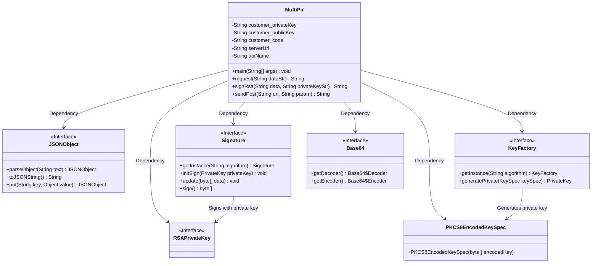
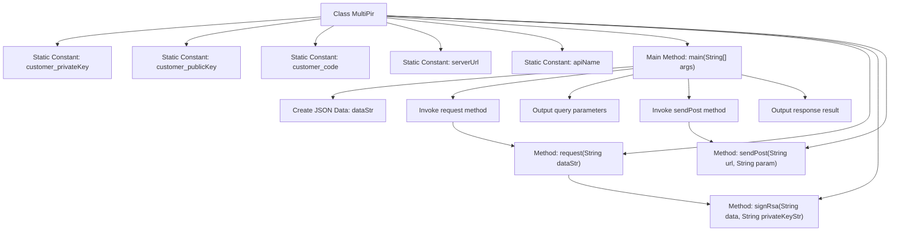

# Basic Information

|      |      |
|------|------|
| Name | MultiPir |
| Language | .java |
| Code Path | WeFe/serving/serving-service/sdk_dir/MultiPir.java |
| Package Name | com.welab.wefe.mpc |
| Dependencies | ['com.alibaba.fastjson.JSONObject', 'com.welab.wefe.mpc.util.RSAUtil', 'java.io.BufferedReader', 'java.io.IOException', 'java.io.InputStreamReader', 'java.io.PrintWriter', 'java.net.URL', 'java.net.URLConnection', 'java.util.TreeMap', 'java.math.BigInteger', 'java.nio.charset.StandardCharsets', 'java.security.KeyFactory', 'java.security.Signature', 'java.util', 'java.security.interfaces.RSAPrivateKey', 'java.security.spec.PKCS8EncodedKeySpec'] |
| Brief Description | The Java class MultiPir implements multi-party private information retrieval, incorporating RSA signatures, POST requests, and JSON data processing functionalities. |

# Description

This Java class implements a client for a multi-party anonymous query system. The class defines configuration parameters such as the client's private key, public key, client code, service address, and API name. The main method constructs JSON request data containing multiple member IDs and model IDs, generates signed request parameters through the request method, and then uses the sendPost method to send a POST request to the specified service address. The request method employs the RSA algorithm to sign the data and builds a JSON request body containing the client ID, signature, data, and request ID. The sendPost method handles the HTTP connection, sets request headers, sends the POST request, and finally returns the server's response. The class also includes a commented-out implementation of the SM2 signing method, which is currently unused. The entire process ensures secure communication and data transmission between the client and server.

# Class Summary

| Name   | Type  | Description |
|-------|------|-------------|
| MultiPir | class | The Java class MultiPir implements multi-party private information retrieval, incorporating public-private key configuration, data signing (RSA), and HTTP POST request functionality, designed to send encrypted query requests to specified service addresses and retrieve responses. |

## Class MultiPir

|      |      |
|------|------|
| Access Modifier | public |
| Type | class |
| Name | MultiPir |
| Description | The Java class MultiPir implements multi-party private information retrieval, incorporating public-private key configuration, data signing (RSA), and HTTP POST request functionality, designed to send encrypted query requests to specified service addresses and retrieve responses. |

### UML Class Diagram

This code describes the implementation class MultiPir for Multi-Party Private Information Retrieval, primarily handling encrypted communication and HTTP requests. The class includes functionalities such as private key signing, data encapsulation, and HTTP POST requests, relying on utility classes like JSON processing, RSA signatures, and Base64 encoding/decoding. The code processes structured data using TreeMap and JSONObject, employs SHA1withRSA algorithm for digital signatures, and implements HTTP communication via URLConnection. The commented-out SM2 signature scheme (a Chinese cryptographic standard) demonstrates extensibility despite being inactive.

### Internal Method Call Graph

This code implements a multi-party private information retrieval system, primarily consisting of key management, data signing, and HTTP request functionalities. The flowchart illustrates the complete workflow starting from the main method, sequentially executing data preparation, RSA signature generation, parameter assembly, and HTTP POST request transmission. The core logic involves constructing a signed request body through the request method, then sending the encrypted request to the server via the sendPost method, ultimately outputting query parameters and response results. The code employs RSA algorithm for data signing and reserves an SM2 signing interface, reflecting secure communication design in its cryptographic implementation.

### Field List

| Name  | Type  | Description |
|-------|-------|------|
| customer_privateKey = "***" | String | Private static constant string stores the customer's private key. |
| apiName = "api/*****" | String | The private static constant string variable apiName has a value of "api/*****". |
| customer_code = "***" | String | private static final String customer_code = "***"; |
| customer_publicKey = "***" | String | Private static constant string stores the customer public key. |
| serverUrl = "https://***/***/" | String | private static final String serverUrl stores the server address "https://***/***/" |

### Method List

| Name  | Type  | Description |
|-------|-------|------|
| request | String | Java Method: Accepts a string parameter, parses it into JSON, adds a signature, constructs a JSON object containing customer ID, signature, data, and request ID, then returns the string. Handles exceptions by printing errors. |
| sendPost | String | The Java method `sendPost` sends a POST request to the specified URL, sets the request headers, processes parameters and responses, finally closes the streams, and returns the result. Errors are printed when exceptions occur. |
| signRsa | String | Sign the data using the SHA1withRSA algorithm and a Base64-encoded private key, returning the Base64-encoded signature result. |
| main | void | Java main method definition, including a JSON data string, calling the request method to process the data, outputting multi-party anonymous query parameters and service address, and finally sending a POST request and printing the response result. |

