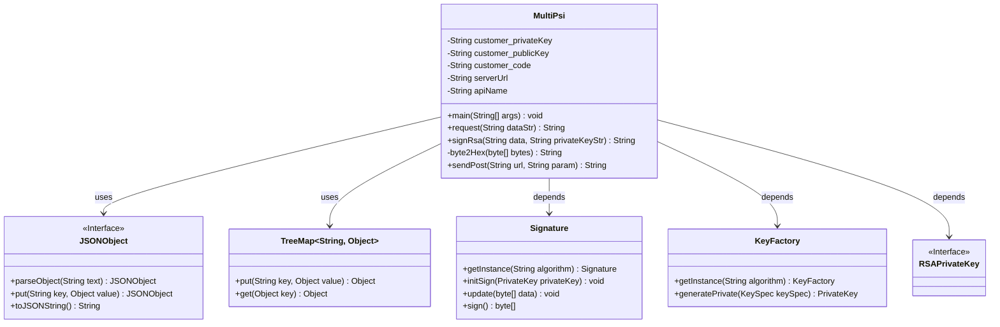
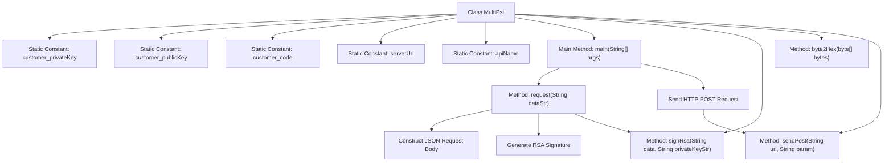

# Basic Information

|      |      |
|------|------|
| Name | MultiPsi |
| Language | .java |
| Code Path | WeFe/serving/serving-service/sdk_dir/MultiPsi.java |
| Package Name | com.welab.wefe.mpc |
| Dependencies | ['com.alibaba.fastjson.JSONObject', 'java.io.BufferedReader', 'java.io.IOException', 'java.io.InputStreamReader', 'java.io.PrintWriter', 'java.net.URL', 'java.net.URLConnection', 'java.util.TreeMap', 'java.math.BigInteger', 'java.nio.charset.StandardCharsets', 'java.security.KeyFactory', 'java.security.Signature', 'java.util', 'java.security.interfaces.RSAPrivateKey', 'java.security.spec.PKCS8EncodedKeySpec'] |
| Brief Description | The Java class MultiPsi implements multi-party private set intersection queries, incorporating RSA signature and POST request functionalities, requiring configuration of public-private keys and service addresses. |

# Description

The MultiPsi class implements a client-side functionality for multi-party private set intersection queries. It includes configuration items such as the client's private key, public key, client code, and service address. The main method constructs JSON request data containing the client ID, invokes the request method to generate signed request parameters, and sends them to the server via the sendPost method. The request method uses the RSA algorithm to sign the request data and builds a request body containing the client ID, signature, and data. The sendPost method implements an HTTP POST request, sets request headers, and processes the response. The class also provides commented explanations for the SM2 signature method and a helper method for converting bytes to hexadecimal. The entire process ensures secure data transmission and an authentication mechanism.

# Class Summary

| Name   | Type  | Description |
|-------|------|-------------|
| MultiPsi | class | Java class MultiPsi implements multi-party private set intersection queries, including RSA signature and POST request functionalities, requiring configuration of public/private keys, client code, and service address. |

## Class MultiPsi

|      |      |
|------|------|
| Access Modifier | public |
| Type | class |
| Name | MultiPsi |
| Description | Java class MultiPsi implements multi-party private set intersection queries, including RSA signature and POST request functionalities, requiring configuration of public/private keys, client code, and service address. |

### UML Class Diagram

This code describes a class named MultiPsi, primarily used for handling request signing and sending in multi-party secure computation. The class includes functionalities such as private key signing (RSA), data format conversion, and HTTP POST request sending. The core functionality involves constructing a signed request body through the request method and sending the request via the sendPost method. The class diagram illustrates dependencies related to JSON processing, collection operations, and encryption, reflecting the core workflow of secure data transmission. The code structure is clear, but it contains hardcoded configurations and an unimplemented SM2 signing method (commented out).

### Internal Method Call Graph

This flowchart illustrates the complete processing flow of the MultiPsi class. Starting from the main method entry point, it first invokes the request method to construct a JSON request body containing customer ID, signature, and data, where the signature is generated using the RSA algorithm via the signRsa method. Subsequently, it sends an HTTP POST request to the specified URL through the sendPost method and processes the response. The flow includes critical steps such as exception handling, data conversion, and network communication, fully describing the parameter preparation and request process for the multi-party secure computation service.

### Field List

| Name  | Type  | Description |
|-------|-------|------|
| customer_publicKey = "***" | String | Private static constant string stores the customer's public key. |
| customer_privateKey = "***" | String | A private static constant string variable named `customer_privateKey` is defined in the code, with its value set to `"***"`. |
| serverUrl = "http://****/***/" | String | Define a private static string constant for the server URL with the value "http://****/***/". |
| apiName = "api/*****" | String | The private static constant string variable apiName has the value "api/*****". |
| customer_code = "***" | String | private static final String customer_code = "***"; |

### Method List

| Name  | Type  | Description |
|-------|-------|------|
| request | String | Java Method: Accepts a string parameter, parses it as JSON and signs it, then constructs a JSON response containing customer ID, signature, data, and request ID. Handles exceptions for signature failures. |
| byte2Hex | String | Convert a byte array to a hexadecimal string, pad single bytes with zeros, and concatenate the result before returning. |
| signRsa | String | Use an RSA private key to perform SHA1withRSA signing on the data and return the Base64-encoded signature result. |
| main | void | Java code example: Define a JSON data string, call the request method for processing, and print the query parameters, service address, and POST request response results. |
| sendPost | String | Java method for sending a POST request, setting request headers and parameters, processing the response, and closing the stream. Prints errors when exceptions occur. |

