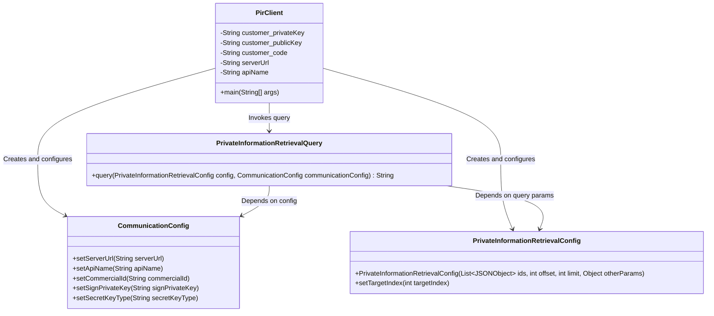

# Basic Information

|      |      |
|------|------|
| Name | PirClient |
| Language | .java |
| Code Path | WeFe/serving/serving-service/sdk_dir/PirClient.java |
| Package Name | None |
| Dependencies | ['com.alibaba.fastjson.JSONObject', 'com.welab.wefe.mpc.config.CommunicationConfig', 'com.welab.wefe.mpc.pir.sdk.PrivateInformationRetrievalQuery', 'com.welab.wefe.mpc.pir.sdk.config.PrivateInformationRetrievalConfig', 'java.util.List'] |
| Brief Description | The Java class PirClient implements private information retrieval functionality, configuring client keys, service addresses, and APIs to query target data with JSON parameters and return results. |

# Description

The PirClient class is a Java-implemented private information retrieval client, containing configuration items such as client private key, public key, client code, and service address. It uses CommunicationConfig to set the service address, API name, client code, and private key, with RSA specified as the encryption type. In the main method, a JSON array containing multiple member_id and model_id is constructed as query parameters. After setting the target index, a query is initiated via PrivateInformationRetrievalQuery, and the result or error message is finally output.

# Class Summary

| Name   | Type  | Description |
|-------|------|-------------|
| PirClient | class | The Java class PirClient implements private information retrieval functionality, configuring client keys, service addresses, and APIs to query specified target data through RSA encryption and return results. |

## Class PirClient

|      |      |
|------|------|
| Access Modifier | public |
| Type | class |
| Name | PirClient |
| Description | The Java class PirClient implements private information retrieval functionality, configuring client keys, service addresses, and APIs to query specified target data through RSA encryption and return results. |

### UML Class Diagram

This code demonstrates a Private Information Retrieval (PIR) client implementation, encompassing configuration management, query construction, and remote service invocation functionalities. The PirClient serves as the entry class, configuring communication parameters via CommunicationConfig, setting query parameters with PrivateInformationRetrievalConfig, and ultimately executing encrypted queries through PrivateInformationRetrievalQuery. The class diagram clearly illustrates dependencies between components, with the core being the PrivateInformationRetrievalQuery class that combines configuration and parameter objects to perform secure queries. The overall design adopts a layered architecture, adhering to the Single Responsibility Principle.

### Internal Method Call Graph

This code flowchart illustrates the main execution flow of the PirClient class. The process begins with the main method, which first initializes a communication configuration object and sets its parameters. It then constructs query data in JSON format and parses it into an object list. Subsequently, it creates a private information retrieval configuration and query object, sets the target index, executes the query operation, and finally outputs the query result or captures exceptions. The entire process demonstrates the complete lifecycle of a client-side private information retrieval request, including key steps such as parameter preparation, query construction, and execution.

### Field List

| Name  | Type  | Description |
|-------|-------|------|
| customer_publicKey = "***" | String | private static final String stores the customer's public key. |
| customer_code = "***" | String | private static final String customer_code = "***"; |
| customer_privateKey = "***" | String | Private static constant string stores the customer's private key. |
| apiName = "api/*****" | String | The code defines a private static constant string variable apiName with the value "api/*****". |
| serverUrl = "http://xxxxx.com/xxxx/" | String | private static final String serverUrl stores the server address "http://xxxxx.com/xxxx/" |

### Method List

| Name  | Type  | Description |
|-------|-------|------|
| main | void | Configure communication parameters in the Java main method, setting the service address, API name, client code, and private key using RSA encryption. Define a JSON array as query parameters, create a private information retrieval configuration, execute the query, and output the result. |

