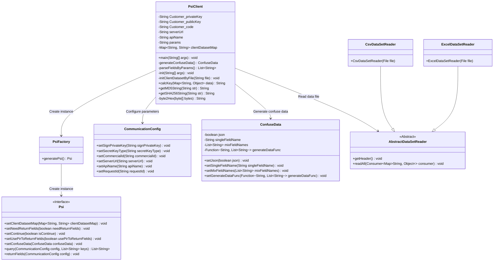
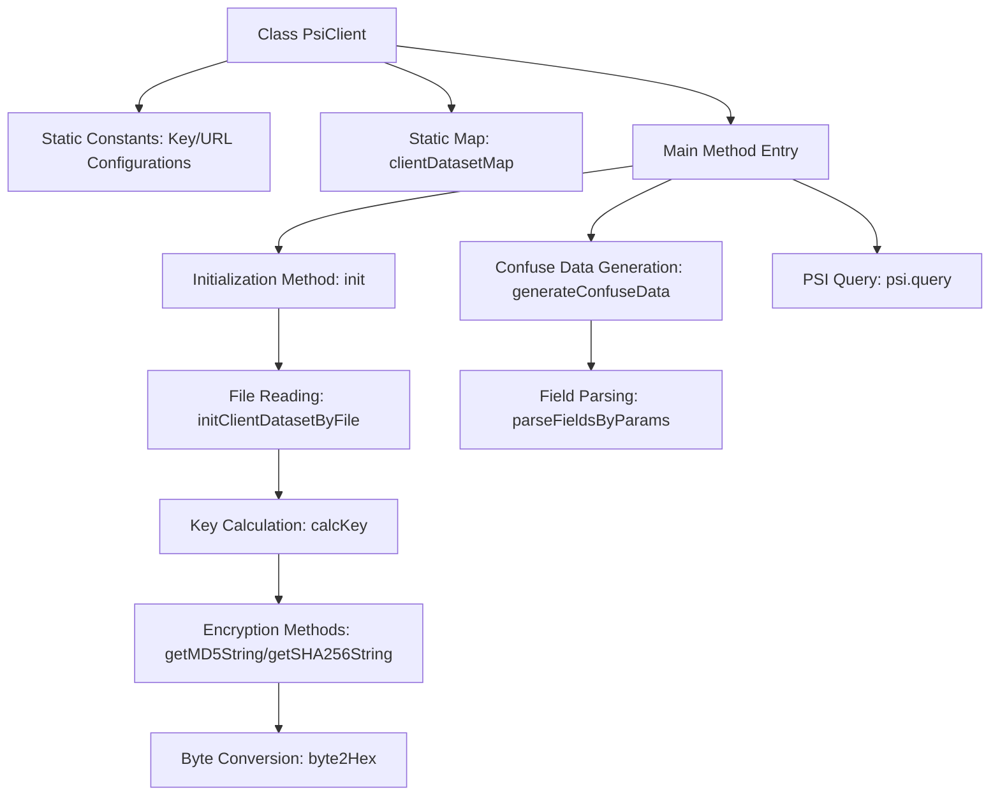
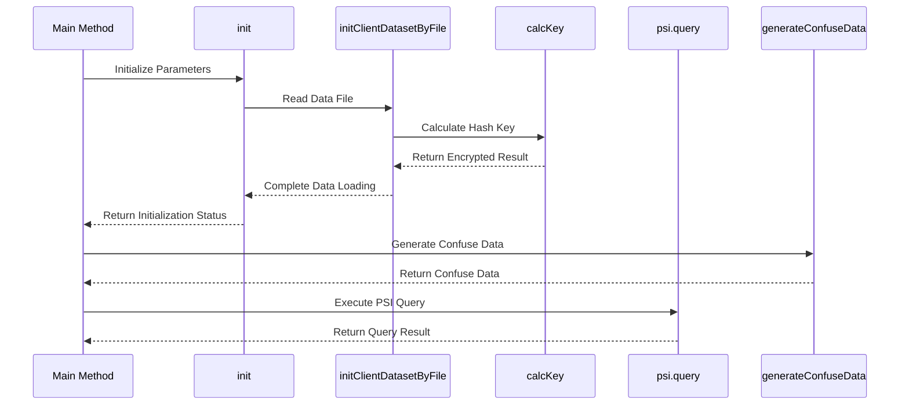

# Basic Information

|      |      |
|------|------|
| Name | PsiClient |
| Language | .java |
| Code Path | WeFe/serving/serving-service/sdk_dir/PsiClient.java |
| Package Name | None |
| Dependencies | ['java.io.File', 'java.math.BigInteger', 'java.security.MessageDigest', 'java.util.ArrayList', 'java.util.Arrays', 'java.util.LinkedHashMap', 'java.util.LinkedList', 'java.util.List', 'java.util.Map', 'java.util.Random', 'com.alibaba.fastjson.JSONArray', 'com.alibaba.fastjson.JSONObject', 'com.welab.wefe.mpc.config.CommunicationConfig', 'com.welab.wefe.mpc.psi.sdk.Psi', 'com.welab.wefe.mpc.psi.sdk.PsiFactory', 'com.welab.wefe.mpc.psi.sdk.excel.AbstractDataSetReader', 'com.welab.wefe.mpc.psi.sdk.excel.CsvDataSetReader', 'com.welab.wefe.mpc.psi.sdk.excel.ExcelDataSetReader', 'com.welab.wefe.mpc.psi.sdk.model.ConfuseData'] |
| Brief Description | The PsiClient class implements private set intersection functionality, encompassing key configuration, data obfuscation, hash computation, and service communication logic. It supports MD5/SHA256 encryption and initializes datasets via CSV/Excel files. |

# Description

The PsiClient class implements a privacy-preserving set intersection (PSI)-based client system for secure data comparison. Core functionalities include initializing client keys, service addresses, and API configurations, with support for MD5/SHA256 hash algorithms to process input data. The system constructs dataset mappings (hash values to raw data) by reading CSV/Excel files and generates obfuscated data to enhance privacy. The main workflow includes PSI queries, result statistics, and optional field return capabilities, while supporting resume mode and RSA/SM2 encrypted communication. The data processing module automatically parses parameter rules to achieve multi-field joint hashing and JSON format conversion, ensuring secure data transmission and efficient comparison.

# Class Summary

| Name   | Type  | Description |
|-------|------|-------------|
| PsiClient | class | The PsiClient class implements the client-side functionality of the PSI protocol, encompassing key configuration, data obfuscation, hash computation, and service communication logic. It supports CSV/Excel data input, generates query keys via MD5/SHA256 encryption, and interacts with the server to retrieve matching results. |

## Class PsiClient

|      |      |
|------|------|
| Access Modifier | public |
| Type | class |
| Name | PsiClient |
| Description | The PsiClient class implements the client-side functionality of the PSI protocol, encompassing key configuration, data obfuscation, hash computation, and service communication logic. It supports CSV/Excel data input, generates query keys via MD5/SHA256 encryption, and interacts with the server to retrieve matching results. |

### UML Class Diagram

This code implements a PSI (Private Set Intersection) client, with main functionalities including initializing client datasets, generating confuse data, and executing private set intersection queries. The PsiClient class creates a Psi instance via PsiFactory, configures communication parameters using CommunicationConfig, and reads CSV or Excel format data files through subclasses of AbstractDataSetReader. The code implements MD5 and SHA256 hash algorithms, supports single-field and multi-field confuse data generation, and enables flexible query parameter configuration. The class diagram illustrates the relationships and responsibility divisions among core classes, including key components such as data reading, PSI protocol execution, and communication configuration.

### Internal Method Call Graph

This code implements a PSI (Private Set Intersection) client, with core functionalities including: initializing configuration parameters, reading client dataset files, performing encrypted hashing on data, generating confuse data, and finally conducting private set intersection queries with the server via the PSI protocol. The class diagram clearly illustrates the class structure relationships, while the sequence diagram details the complete call chain from initialization to query execution, highlighting three key phases: file reading, data encryption, and PSI query.

### Field List

| Name  | Type  | Description |
|-------|-------|------|
| params = "[{\"field\":\"xxx\",\"operator\":\"xxx\"}]" | String | The static string variable `params` stores a JSON array containing key-value pairs of fields and operators. |
| Customer_code = "xxxx" | String | private static final String CUSTOMER_CODE = "xxxx"; |
| Customer_privateKey = "xxxx" | String | Private static constant string, storing the client private key "xxxx". |
| serverUrl = "http://xxxxx.com/xxxx/" | String | private static final String serverUrl stores the server address "http://xxxxx.com/xxxx/" |
| Customer_publicKey = "xxxx" | String | Private static constant string storing the customer public key "xxxx". |
| clientDatasetMap | Map<String, String> | Define a private static map variable clientDatasetMap with both keys and values of string type. |
| apiName = "api/*****" | String | The private static constant string variable apiName has a value of "api/*****". |

### Method List

| Name  | Type  | Description |
|-------|-------|------|
| parseFieldsByParams | List<String> | Parse JSON parameters and extract the field list, then store the result in a List and return it. |
| generateConfuseData | ConfuseData | Methods for generating obfuscated data, which produce single-value or JSON-formatted random data based on a list of field names, with a default of mixing in 4 data entries. |
| initClientDatasetByFile | void | The method initializes the client dataset through a file, supporting both CSV and Excel formats. After verifying the file is not empty, it selects a reader based on the file extension, reads the header and all data rows, stores them in a Map, and calculates key values. |
| calcKey | String | The method calcKey processes input data according to rules to generate a hash value. It iterates through the rule array, concatenates and hashes each field based on the operator (MD5, SHA256, or no processing), and saves the original data to JSON. Finally, it stores the hash value along with the original data in a mapping and returns the hash result. |
| main | void | The Java main method initializes the PSI query, configures settings such as the private key and client ID, executes the query, and outputs the result size and time consumption. |
| getMD5String | String | This is a Java method used to convert an input string into an MD5 hash value, handling exceptions with UTF-8 encoding. |
| init | void | Initialization method checks the parameters; if none are provided, it attempts to load the data.csv file. An exception is thrown if the file does not exist or is empty. Upon successful loading, it prints the client dataset size. |
| getSHA256String | String | Java Method: Encrypts an input string using the SHA-256 algorithm and returns the hash value in hexadecimal format. Handles exceptions and prints errors. |
| byte2Hex | String | Convert a byte array to a hexadecimal string, pad single bytes with zeros, and concatenate the result before returning. |

