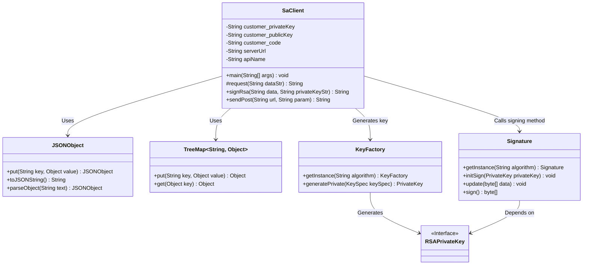

# Basic Information

|      |      |
|------|------|
| Name | SaClient |
| Language | .java |
| Code Path | WeFe/serving/serving-service/sdk_dir/SaClient.java |
| Package Name | None |
| Dependencies | ['java.io.BufferedReader', 'java.io.IOException', 'java.io.InputStreamReader', 'java.io.PrintWriter', 'java.net.URL', 'java.net.URLConnection', 'java.security.interfaces.RSAPrivateKey', 'java.security.spec.PKCS8EncodedKeySpec', 'java.util.TreeMap', 'java.math.BigInteger', 'java.nio.charset.StandardCharsets', 'java.security.KeyFactory', 'java.security.Signature', 'java.util', 'com.alibaba.fastjson.JSONObject', 'com.welab.wefe.mpc.util.RSAUtil'] |
| Brief Description | The Java class SaClient implements multi-party secure statistical functionality, including RSA signatures, POST requests, and parameter processing. It requires configuration of public/private keys, client codes, and service addresses. |

# Description

The SaClient class is a Java client implementation designed to interact with multi-party secure statistical services. It includes static configuration items such as the client's private key, public key, client code, and service address. The main method constructs query parameters and invokes the request method to generate a signed request body, which is then sent via a POST request using sendPost. The request method employs the RSA algorithm to sign the data, producing a JSON request body containing the client ID, signature, and data. The sendPost method handles HTTP connections, sets request headers, and transmits the data. The class also contains a commented-out implementation of the SM2 signature method, though it is currently inactive. The entire process involves parameter assembly, digital signature generation, and HTTP request transmission.

# Class Summary

| Name   | Type  | Description |
|-------|------|-------------|
| SaClient | class | The Java class SaClient implements multi-party secure statistical functionality, including RSA signatures, POST requests, and parameter processing. It requires configuration of public/private keys, client codes, and service addresses. |

## Class SaClient

|      |      |
|------|------|
| Access Modifier | public |
| Type | class |
| Name | SaClient |
| Description | The Java class SaClient implements multi-party secure statistical functionality, including RSA signatures, POST requests, and parameter processing. It requires configuration of public/private keys, client codes, and service addresses. |

### UML Class Diagram

This code describes a client class named `SaClient`, primarily used for interacting with security services. It includes configuration parameters, request construction, RSA signing, and HTTP POST request sending functionalities. The class diagram illustrates the relationships between `SaClient` and utility classes like `JSONObject` and `TreeMap`, as well as interactions with encryption-related components such as `Signature`, `KeyFactory`, and the `RSAPrivateKey` interface. The overall design reflects the core workflow of secure client communication, encompassing parameter assembly, data signing, and network requests.

### Internal Method Call Graph

```mermaid
graph TD
    A["Class SaClient"]
    B["Static Constant: customer_privateKey"]
    C["Static Constant: customer_publicKey"]
    D["Static Constant: customer_code"]
    E["Static Constant: serverUrl"]
    F["Static Constant: apiName"]
    G["Main Method: main(String[] args)"]
    H["Method: request(String dataStr)"]
    I["Method: signRsa(String data, String privateKeyStr)"]
    J["Method: sendPost(String url, String param)"]
    K["Create JSONObject queryParams"]
    L["Create JSONObject data"]
    M["Invoke request method"]
    N["Output parameters and URL"]
    O["Invoke sendPost method"]
    P["Base64 decode private key"]
    Q["Generate RSA signature"]
    R["Construct request body JSON"]
    S["Initialize URL connection"]
    T["Set request headers"]
    U["Send POST request"]

    A --> B
    A --> C
    A --> D
    A --> E
    A --> F
    A --> G
    G --> K
    G --> L
    G --> M
    G --> N
    G --> O
    A --> H
    H --> P
    H --> Q
    H --> R
    A --> I
    I --> P
    I --> Q
    A --> J
    J --> S
    J --> T
    J --> U
```

This code implements a secure client (SaClient) primarily used for constructing and sending encrypted HTTP POST requests. It includes functionalities such as RSA signature generation, request parameter construction, and HTTP connection management. The main workflow involves: initializing request parameters, generating signatures, constructing the request body, and sending POST requests while handling responses. The code has a clear structure divided into four main parts: constant definitions, main process control, signature generation, and network requests, making it suitable for scenarios requiring secure communication.

### Field List

| Name  | Type  | Description |
|-------|-------|------|
| apiName = "api/*****" | String | The private static constant string apiName has the value "api/*****". |
| customer_publicKey = "***" | String | The code defines a private static constant customer_publicKey with the value "***". |
| serverUrl = "http://xxxxx.com/xxxx/" | String | Defined a private static constant serverUrl with the value set to the specified server URL. |
| customer_privateKey = "***" | String | The private static constant string stores the customer's private key with the value "***". |
| customer_code = "***" | String | private static final String customer_code = "***"; |

### Method List

| Name  | Type  | Description |
|-------|-------|------|
| signRsa | String | Sign the data using the SHA1withRSA algorithm and a Base64-encoded private key, returning the Base64-encoded signature result. |
| request | String | The method takes a string parameter, parses it into JSON and signs it, constructs a JSON object containing the customer ID, signature, data, and request ID, and returns its string representation. |
| main | void | Java code example: Create JSON parameters, call an API, and print the request URL and response. Key steps include setting query parameters, sending a POST request, and outputting debug information. |
| sendPost | String | Java Method: Send a POST request to a specified URL, set request headers, pass parameters, and return the response result. Exception handling and resource closure are included. |

