# Basic Information

|      |      |
|------|------|
| Name | com |
| Language | .java |
| Code Path | WeFe/serving/serving-service/src/main/java/com |
| Package Name | docs.serving.serving-service.src.main.java.com |
| Brief Description | Config Class: A Spring component that loads external configurations, defines file paths, email subjects, and other properties, with support for UTF-8 encoding.  XxxModelProcessor Class: Inherits from an abstract class with empty implementations for pre-processing and post-processing methods.  Federated Learning Core API: Provides encrypted communication, member management, and other functionalities, designed in a RESTful style.  Prediction Engine: Supports joint prediction, including standard, batch, and debug modes.  ORM Layer: Implements data management using JPA, containing 20+ entity classes.  Toolset: Includes signature verification, encryption, and more.  Enum Module: Defines service statuses and types.  Privacy Computing Framework: Handles PSI/PIR/SA requests.  Feature Management: Unifies the management of data sources and models.  Service Governance: Manages global configurations and model lifecycle.  Scheduled Tasks: Executes statistics and maintains statuses.  DTO Management: Encapsulates business data interactions.  Log Processing: Records API logs to MySQL.  Startup Listener: Executes initialization tasks.  Feature Processing Framework: Annotation and SQL-driven.  ServingService Main Class: Spring Boot application startup configuration. |

# Description

## Overview  
This module is a core component collection of the federated learning service system, designed with a microservices architecture. Its primary responsibilities include system configuration management, federated prediction execution, data persistence, and secure communication. The interface specifications are hierarchically unified: configuration classes adopt Spring property injection (e.g., Config), processor classes follow the template method pattern (e.g., XxxModelProcessor), and the API layer inherits the AbstractApi base class to implement RESTful interactions. Key data structures are aggregated into four categories: system configurations (e.g., PSI batch size), prediction parameters (e.g., FederatedPredictParam), persistence models (e.g., PredictLogMySqlModel), and enumerated states (e.g., ServiceTypeEnum). External dependencies, after deduplication, include the Spring ecosystem (JPA/Cloud), encryption components (SM2/RSA), multi-database drivers (MySQL/Doris/Hive), and JNI calls. For example, Config manages SM2 keys, and PromoterPredictor coordinates multi-party predictions.  

## Key Business Scenarios  
The module supports the full lifecycle management of federated learning, with business processes integrated as follows: 1) System initialization (key generation → configuration loading → service registration); 2) Federated prediction (feature acquisition → secure computation → result aggregation); 3) Service governance (log statistics → billing settlement → status tracking). The typical interaction pattern resembles a master-slave architecture, where PromoterPredictor coordinates multi-node computations, relying on a signature verification framework to ensure communication security. Functional completeness is reflected in the collaboration of the configuration center (Config), prediction engine (Predicter), persistence layer (Database), and service governance (Service). For instance, in a financial risk control scenario, a bank initializes via InitializeApi → invokes PromoterPredictor → records PredictLogMySqlModel → generates FeeDetailMysqlModel. API types cover encrypted communication, member management, model prediction, and scheduled tasks, with integration examples visible in the startup process of ServingService (loading processors → initializing listeners → launching API services).

### Package Internal Structure View

```mermaid
graph TD
    serving --> service
    serving --> predicter
    serving --> database
    serving --> utils
    serving --> enums
    serving --> service_processor
    serving --> manager
    serving --> scheduler
    serving --> dto
    serving --> operation
    serving --> listener
    serving --> feature
    
    service --> api
    service --> globalconfig
    service --> model
    service --> EmailService.java
    service --> TableModelService.java
    service --> ModelPredictScoreRecordService.java
    service --> ModelPredictScoreStatisticsService.java
    service --> PartnerService.java
    service --> ApiRequestRecordService.java
    service --> AccountService.java
    service --> ServiceCallLogService.java
    service --> FeeConfigService.java
    service --> PredictStatisticsService.java
    service --> MessageService.java
    service --> PredictLogService.java
    service --> TestTempService.java
    service --> RequestStatisticsService.java
    service --> PaymentsRecordsService.java
    service --> UnionServiceService.java
    service --> ModelMemberService.java
    service --> ClientServiceService.java
    service --> CacheObjects.java
    service --> PrivacyDatabaseEncryptService.java
    service --> ServiceOrderService.java
    service --> ModelService.java
    service --> DataSourceService.java
    service --> MemberService.java
    service --> ServiceService.java
    service --> OperationLogService.java
    service --> OrderStatisticsService.java
    service --> FeeDetailService.java
    service --> PsiServiceResultService.java
    service --> ModelSqlConfigService.java
    
    api --> crypto
    api --> client
    api --> system
    api --> account
    api --> orderstatistics
    api --> partner
    api --> apirequestrecord
    api --> sa
    api --> predict
    api --> feeconfig
    api --> serviceorder
    api --> clientservice
    api --> paymentsrecords
    api --> logger
    api --> requeststatistics
    api --> file
    api --> feedetail
    api --> pir
    api --> operation
    api --> datasource
    api --> member
    api --> model
    
    predicter --> single
    predicter --> batch
    predicter --> Predictor.java
    
    database --> repository
    database --> entity
    database --> config
    
    utils --> deep_learning
    utils --> sign
    utils --> component
    utils --> SHA256Utils.java
    utils --> MD5Util.java
    utils --> ServiceUtil.java
    utils --> SerializeUtil.java
    utils --> ZipUtils.java
    utils --> RedisIntermediateCache.java
    utils --> ServingFileUtil.java
    utils --> SignUtils.java
    utils --> DeepLearningUtil.java
    
    feature --> code
    feature --> sql
    feature --> SqlFeatureDataHandler.java
    feature --> AbstractFeatureDataHandler.java
    feature --> CodeFeatureDataHandler.java
```

This flowchart illustrates the complete directory structure of the WeFe service module, starting from the top-level serving node and progressively expanding into major functional modules such as service, api, and predicter. The service module contains over 30 specific service classes, while the api module is subdivided into more than 20 submodules, each containing multiple API implementation classes. The overall structure clearly demonstrates core components like the service layer, API layer, database layer, and utility layer, along with their hierarchical relationships, reflecting the characteristics of a modular microservices architecture design.

# File List

| Name   | Type  | Description |
|-------|------|-------------|
| [welab](welab/_module.md) | package | Config Class: A Spring component that loads external configurations, defines file paths, email subjects, and other properties, with support for UTF-8 encoding.  XxxModelProcessor Class: Inherits from an abstract class, with empty implementations for pre-processing and post-processing methods.  Federated Learning Core API: Provides functionalities such as encrypted communication and member management, designed in a RESTful style.  Prediction Engine: Supports joint prediction, including standard, batch, and debug modes.  ORM Layer: Implements data management using JPA, with 20+ entity classes.  Toolset: Includes signature verification, encryption, and more.  Enum Module: Defines service statuses and types.  Privacy Computing Framework: Handles PSI/PIR/SA requests.  Feature Management: Unifies the management of data sources and models.  Service Governance: Manages global configurations and model lifecycle.  Scheduled Tasks: Executes statistics and maintains statuses.  DTO Management: Encapsulates business data interactions.  Log Processing: Records API logs to MySQL.  Startup Listener: Executes initialization tasks.  Feature Processing Framework: Annotation and SQL-driven.  ServingService Main Class: Spring Boot application startup configuration. |

