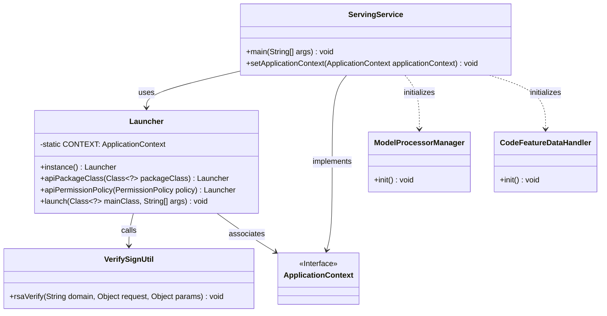
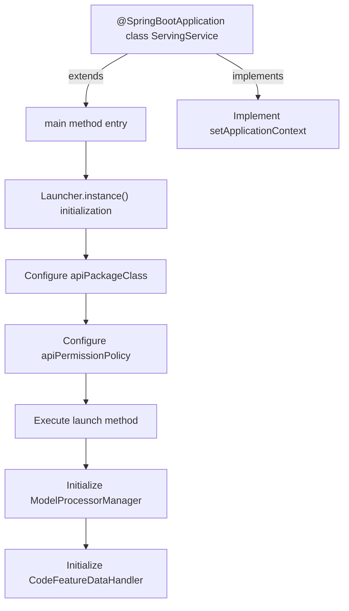
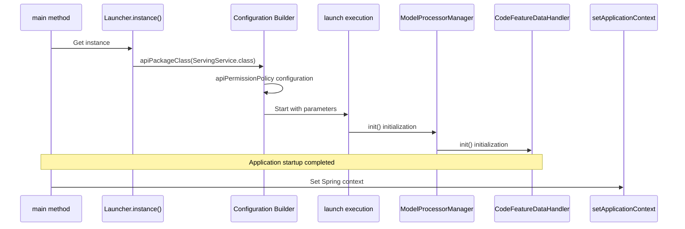

# Basic Information

|      |      |
|------|------|
| Name | ServingService |
| Language | .java |
| Code Path | WeFe/serving/serving-service/src/main/java/com/welab/wefe/serving/service/ServingService.java |
| Package Name | com.welab.wefe.serving.service |
| Dependencies | ['org.springframework.beans.BeansException', 'org.springframework.boot.autoconfigure.SpringBootApplication', 'org.springframework.boot.autoconfigure.jdbc.DataSourceAutoConfiguration', 'org.springframework.context.ApplicationContext', 'org.springframework.context.ApplicationContextAware', 'org.springframework.context.annotation.ComponentScan', 'org.springframework.scheduling.annotation.EnableScheduling', 'com.welab.wefe.common.web.Launcher', 'com.welab.wefe.common.web.config.ApiBeanNameGenerator', 'com.welab.wefe.serving.sdk.manager.ModelProcessorManager', 'com.welab.wefe.serving.service.feature.CodeFeatureDataHandler', 'com.welab.wefe.serving.service.utils.sign.VerifySignUtil'] |
| Brief Description | This is a Spring Boot application startup class that excludes data source auto-configuration, enables scheduled tasks, and customizes component scanning naming rules. The main method is launched via Launcher, which configures API permission validation logic and initializes the model and feature processors. It also implements application context injection functionality. |

# Description

This is a main class of ServingService based on Spring Boot, annotated with `@SpringBootApplication` while excluding data source auto-configuration. It specifies a custom bean name generator and base scan packages through `@ComponentScan`. The class implements the `ApplicationContextAware` interface to obtain the application context. In the `main` method, it configures API package classes and authentication policies (including signature verification) via a `Launcher` instance, then launches the application. Additionally, it initializes the model processor and feature processor modules. The class primarily handles service startup configuration and core component initialization.

# Class Summary

| Name   | Type  | Description |
|-------|------|-------------|
| ServingService | class | This is a Spring Boot application startup class that excludes data source auto-configuration, enables scheduled tasks, and customizes component scanning naming rules. The main method initializes the API starter, model processor, and feature processor, and sets up the application context. |

## Class ServingService

|      |      |
|------|------|
| Access Modifier | @EnableScheduling;@SpringBootApplication(exclude = {DataSourceAutoConfiguration.class});@ComponentScan(nameGenerator = ApiBeanNameGenerator.class,;        basePackageClasses = {Launcher.class, ServingService.class});public |
| Type | class |
| Name | ServingService |
| Description | This is a Spring Boot application startup class that excludes data source auto-configuration, enables scheduled tasks, and customizes component scanning naming rules. The main method initializes the API starter, model processor, and feature processor, and sets up the application context. |

### UML Class Diagram

This code demonstrates a Spring Boot-based service class ServingService, which launches the application and configures API permission policies through the Launcher class. The class diagram clearly illustrates relationships between core classes: ServingService acts as the entry point, relying on Launcher for application startup and configuration, while interacting with utility class VerifySignUtil, initialization managers ModelProcessorManager and CodeFeatureDataHandler. The Launcher class maintains a static application context, and ServingService implements the ApplicationContextAware interface to set the context.

### Internal Method Call Graph

This code represents the startup class of a Spring Boot application. It configures API permission policies and package scanning paths through the Launcher builder pattern, initializing model and feature processors after service startup. The flowchart illustrates the call chain from the main method to component initialization, while the sequence diagram details the runtime interaction sequence between objects, particularly the chained configuration process of Launcher. The setApplicationContext implements Spring context injection to support subsequent DI operations.

### Field List

| Name  | Type  | Description |
|-------|-------|------|

### Method List

| Name  | Type  | Description |
|-------|-------|------|
| main | void | The Java main method initializes the service launcher, configures API permission verification and signature validation, and initializes the model and feature processors. |
| setApplicationContext | void | This method overrides setApplicationContext, assigning the passed ApplicationContext to the static variable Launcher.CONTEXT. |

