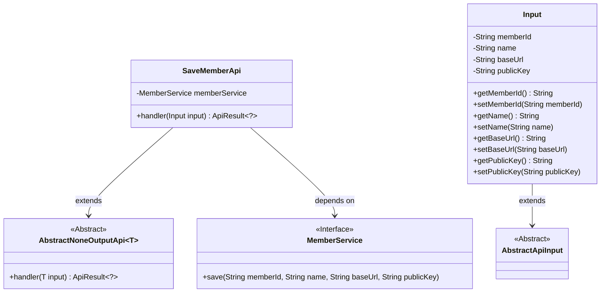
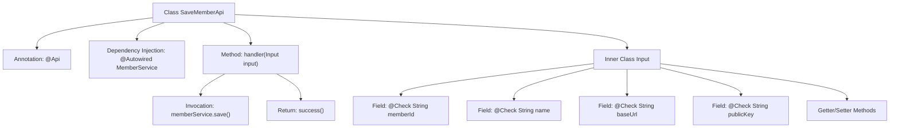

# Basic Information

|      |      |
|------|------|
| Name | SaveMemberApi |
| Language | .java |
| Code Path | WeFe/serving/serving-service/src/main/java/com/welab/wefe/serving/service/api/SaveMemberApi.java |
| Package Name | com.welab.wefe.serving.service.api |
| Dependencies | ['com.welab.wefe.common.fieldvalidate.annotation.Check', 'com.welab.wefe.common.web.api.base.AbstractNoneOutputApi', 'com.welab.wefe.common.web.api.base.Api', 'com.welab.wefe.common.web.api.base.Caller', 'com.welab.wefe.common.web.dto.AbstractApiInput', 'com.welab.wefe.common.web.dto.ApiResult', 'com.welab.wefe.serving.service.service.MemberService', 'org.springframework.beans.factory.annotation.Autowired'] |
| Brief Description | API class for saving member information, which requires member ID, name, invocation path, and public key, and calls MemberService to save the data. |

# Description

This is a Java class named SaveMemberApi, used for saving member information. It extends AbstractNoneOutputApi and processes input of type Input. The class is annotated with an API path of member_save, a name of "Save Member Information," allowing signed access, and a caller domain of Caller.Board. The class injects MemberService and calls the save method of memberService through the handler method to save member information. The Input inner class extends AbstractApiInput and includes four required fields: identity ID, member name, invocation path, and public key, each with corresponding getter and setter methods. The handler method returns a success result after executing the save operation.

# Class Summary

| Name   | Type  | Description |
|-------|------|-------------|
| SaveMemberApi | class | API interface for saving member information, requiring identity ID, name, invocation path, and public key. Calls require signing and belong to the Board domain. |

## Class SaveMemberApi

|      |      |
|------|------|
| Access Modifier | @Api(;        path = "member_save",;        name = "保存成员信息",;        allowAccessWithSign = true,;        domain = Caller.Board;);public |
| Type | class |
| Name | SaveMemberApi |
| Description | API interface for saving member information, requiring identity ID, name, invocation path, and public key. Calls require signing and belong to the Board domain. |

### UML Class Diagram

This class diagram illustrates the structure of SaveMemberApi and its related classes. SaveMemberApi inherits from AbstractNoneOutputApi<Input> and depends on the MemberService interface. The Input class, as an inner class, extends AbstractApiInput and contains member information fields along with their getter/setter methods. The MemberService interface defines an abstract method for saving member information. The overall structure reflects a typical pattern where an API processes input and invokes a service to persist data.

### Internal Method Call Graph

This flowchart illustrates the structure and workflow of the SaveMemberApi class. The class is an API controller annotated with @Api, inheriting from AbstractNoneOutputApi, and contains an inner Input class for parameter validation. The main process involves invoking the memberService.save() service through the handler method to save member information, ultimately returning a success result. The Input class includes four mandatory fields (memberId, name, baseUrl, publicKey) with their getter/setter methods, each annotated with @Check to ensure data integrity.

### Field List

| Name  | Type  | Description |
|-------|-------|------|
| memberService | MemberService | Automatically inject the MemberService instance. |

### Method List

| Name  | Type  | Description |
|-------|-------|------|
| handler | ApiResult<?> | Process the input data and save the member information, then return the result upon success. |

