# Basic Information

|      |      |
|------|------|
| Name | api |
| Language | .java |
| Code Path | WeFe/serving/serving-service/src/main/java/com/welab/wefe/serving/service/api |
| Package Name | docs.serving.serving-service.src.main.java.com.welab.wefe.serving.service.api |
| Brief Description | The GenerateRsaKeyPairApi generates an RSA key pair and returns the public key. The client management module supports CRUD operations and validates IPs and public keys. The system module manages global configurations and keys. The account module handles SSO login and queries. The order statistics module provides query, download, and save functionalities. The partner module manages additions, deletions, modifications, and queries. The API log module supports querying and downloading. The security aggregation module processes aggregation results. The prediction module offers model prediction services. The billing module manages configurations. The service order module handles order management. The client service module manages the service lifecycle. The payment record module supports querying and downloading. The log module provides statistics and queries. The file module supports chunked uploads and merging. The expense details module queries expenses. The PIR module provides private information retrieval. The data source module manages database connections. The member module manages federation members. The model module manages the model lifecycle. The SaveMemberApi saves member information. |

# Description

## Overview  
This module is the core API collection of the federated learning service system, providing foundational functionalities such as encrypted communication, client management, system configuration, and account authentication, akin to the infrastructure layer in a microservices architecture. The interface specifications uniformly inherit from the AbstractApi base class and adopt a RESTful design, with paths categorized by functionality (e.g., `crypto/`, `client/`, etc.). Inputs and outputs are encapsulated via structured classes. Key data structures include RSA key pairs, client information models (ID/name/public key), federated member models (ID/address/status), etc., all fields annotated with validation. External dependencies, after deduplication, encompass 12 core service components, such as ClientService and GlobalConfigService. For example, the GenerateRsaKeyPairApi generates key pairs, while the InitializeApi initializes the federated environment.  

## Key Business Scenarios  
The module supports end-to-end federated learning operations: 1) Secure communication (e.g., key generation/reset), 2) Member management (CRUD operations + status maintenance), 3) Service orchestration (model prediction/log statistics), 4) System operations (configuration management/file upload). A typical interaction pattern involves: client login via SSO → key acquisition → invocation of prediction services → generation of billing records. Example workflow: InitializeApi initialization → SaveClientApi registration → PredictApi inference → FeeDetailApi billing. API types span encryption (e.g., RSA), management (e.g., CRUD), utility (e.g., file chunk upload), and monitoring (e.g., log query), with integration examples visible across the federated learning lifecycle management.

### Package Internal Structure View

```mermaid
graph TD
    api --> crypto
    api --> client
    api --> system
    api --> account
    api --> orderstatistics
    api --> partner
    api --> apirequestrecord
    api --> sa
    api --> predict
    api --> feeconfig
    api --> serviceorder
    api --> clientservice
    api --> paymentsrecords
    api --> logger
    api --> requeststatistics
    api --> service
    api --> servicecalllog
    api --> file
    api --> feedetail
    api --> pir
    api --> operation
    api --> datasource
    api --> member
    api --> model
    api --> SaveMemberApi.java
    
    crypto --> GenerateRsaKeyPairApi.java
    client --> QueryClientListApi.java
    client --> UpdateApi.java
    client --> SaveClientApi.java
    client --> QueryClientApi.java
    system --> InitializeUnionModeApi.java
    system --> ResetRsaKeyApi.java
    system --> GlobalConfigUpdateApi.java
    system --> UpdateRsaKeyByBoardApi.java
    system --> InitializeApi.java
    system --> GlobalConfigDetailApi.java
    system --> IsInitializeApi.java
    account --> SsoLoginApi.java
    account --> QueryAllApi.java
    orderstatistics --> QueryListApi.java
    orderstatistics --> DownloadApi.java
    orderstatistics --> SaveApi.java
    partner --> QueryPartnerListApi.java
    partner --> SavePartnerApi.java
    partner --> UpdateApi.java
    partner --> DetailPartnerApi.java
    partner --> QueryPartnerAllApi.java
    partner --> InitPartnerApi.java
    apirequestrecord --> QueryListApi.java
    apirequestrecord --> DownloadApi.java
    sa --> SecureAggregationForResultApi.java
    predict --> deep_learning
    predict --> PredictApi.java
    predict --> DebugApi.java
    predict --> SqlConfigTestApi.java
    predict --> PromoterApi.java
    predict --> ProviderApi.java
    deep_learning --> DeepLearningPredictApi.java
    feeconfig --> SaveApi.java
    feeconfig --> QueryApi.java
    serviceorder --> QueryListApi.java
    serviceorder --> DownloadApi.java
    serviceorder --> SaveApi.java
    clientservice --> ServiceUrlTestApi.java
    clientservice --> QueryListApi.java
    clientservice --> QueryApi.java
    clientservice --> UpdateApi.java
    clientservice --> ActivateServiceApi.java
    clientservice --> DeleteActivateServiceApi.java
    clientservice --> UpdateClientServiceInfoApi.java
    clientservice --> DetailApi.java
    clientservice --> UpdateStatusApi.java
    clientservice --> SaveApi.java
    clientservice --> UpdateActivateServiceApi.java
    paymentsrecords --> QueryListApi.java
    paymentsrecords --> DownloadApi.java
    paymentsrecords --> SaveApi.java
    logger --> StatisticsApi.java
    logger --> QueryApi.java
    logger --> DateTypeEnumApi.java
    logger --> ModelListApi.java
    requeststatistics --> QueryListApi.java
    service --> QueryApi.java
    service --> RouteApi.java
    service --> UnionServiceApi.java
    service --> UpdateApi.java
    service --> QueryOneApi.java
    service --> OfflineApi.java
    service --> AddApi.java
    service --> ExportSDKApi.java
    service --> DetailApi.java
    service --> OnlineApi.java
    service --> ServiceShowSQLApi.java
    service --> InitApi.java
    service --> ServiceSQLTestApi.java
    servicecalllog --> QueryListApi.java
    file --> security
    file --> FileUploadApi.java
    file --> MergeApi.java
    security --> FileSecurityChecker.java
    feedetail --> QueryListApi.java
    pir --> PrivateInformationRetrievalForNaorPinkasResultsApi.java
    pir --> PrivateInformationRetrievalForRandomLegalApi.java
    pir --> PrivateInformationRetrievalForResultsApi.java
    pir --> PrivateInformationRetrievalForRandomApi.java
    operation --> LogQueryApi.java
    datasource --> QueryApi.java
    datasource --> QueryTablesApi.java
    datasource --> UpdateApi.java
    datasource --> DeleteApi.java
    datasource --> AddApi.java
    datasource --> TestDBConnectApi.java
    datasource --> QueryTableFieldsApi.java
    member --> QueryApi.java
    member --> DeleteApi.java
    member --> SaveApi.java
    model --> QueryApi.java
    model --> ProviderModelStatusCheckApi.java
    model --> ImportApi.java
    model --> PsiApi.java
    model --> UpdateModelApi.java
    model --> SaveModelApi.java
    model --> DetailApi.java
    model --> ModelStatusCheckApi.java
    model --> EnableApi.java
```

This flowchart illustrates the complete structure of a microservice API module, comprising 28 major functional categories (such as system, client, predict, etc.), each containing several specific API implementation classes. The predict module has a secondary submodule deep_learning, and the file module includes a security submodule. The overall structure clearly demonstrates the layered design and functional division of server-side APIs, covering core business domains such as system configuration, client management, prediction services, and logging.

# File List

| Name   | Type  | Description |
|-------|------|-------------|
| [model](model/_module.md) | package | QueryApi queries model information, ProviderModelStatusCheckApi checks model status, ImportApi imports model files, PsiApi calculates model stability metrics, UpdateModelApi updates SQL configurations, SaveModelApi saves model information, DetailApi retrieves model details, ModelStatusCheckApi checks model status, EnableApi handles model activation/deactivation. |
| [datasource](datasource/_module.md) | package | QueryApi queries data source information, with Input containing ID and name, and Output containing details. QueryTablesApi queries data source table information, with Input containing ID, and Output containing tables and fields. UpdateApi updates a data source, with Input containing ID and other parameters, and Output containing ID. DeleteApi deletes a data source, with Input containing ID. AddApi adds a new data source, with Input containing name and other parameters, and Output containing ID. TestDBConnectApi tests database connection, with Input containing parameters or ID, and Output containing results. QueryTableFieldsApi queries table fields, with Input containing ID and table name, and Output containing field information. |
| [crypto](crypto/_module.md) | package | API for generating RSA key pairs, returning the public key for encrypted data transmission. |
| [clientservice](clientservice/_module.md) | package | ServiceUrlTestApi test URL; QueryListApi query service list; QueryApi query service details; UpdateApi update service; ActivateServiceApi activate service; DeleteActivateServiceApi delete activation; UpdateClientServiceInfoApi update service information; DetailApi get details; UpdateStatusApi update status; SaveApi save service; UpdateActivateServiceApi update activation status. |
| [SaveMemberApi.java](SaveMemberApi.md) | file | API class for saving member information, which requires providing member ID, name, invocation path, and public key, and calls MemberService to save the data. |
| [member](member/_module.md) | package | The QueryApi class handles member queries, with the path member/query, accepting inputs including ID and name, and outputs paginated member information. The DeleteApi class handles member deletion, with the path member/delete, requiring an ID as input. The SaveApi class handles member addition, with the path member/save, accepting inputs containing mandatory fields. |
| [operation](operation/_module.md) | package | The LogQueryApi is used for paginated querying of operation logs. The input includes the interface, operator ID, and time range, while the output is a paginated list of operation logs. |
| [pir](pir/_module.md) | package | The information describes four API classes, all inheriting from AbstractApi, designed to handle different private information retrieval requests. NaorPinkasResultsApi processes Naor-Pinkas protocol result queries, RandomLegalApi handles random legal information queries, ResultsApi manages retrieval result queries, and RandomApi deals with random information retrieval. All APIs operate without requiring login and include input-output definitions along with logging functionality. |
| [feedetail](feedetail/_module.md) | package | Fee Details Query API: Input includes service name, client name, type, time range, etc., and outputs paginated results containing service details, call count, total cost, etc. |
| [paymentsrecords](paymentsrecords/_module.md) | package | QueryListApi handles payment record queries, supporting pagination and conditional filtering. DownloadApi provides payment record download functionality, setting HTTP response headers. SaveApi is used for saving payment records, including fields such as payment type and amount. All inherit from AbstractApi and process business logic through PaymentsRecordsService. |
| [file](file/_module.md) | package | FileSecurityChecker is an abstract class for checking file security, defining allowed types as json, zip, and txt, and providing validation methods. FileUploadApi handles chunked uploads, supporting chunk verification and storage. MergeApi merges chunked files, handles exceptions, and performs security checks. |
| [servicecalllog](servicecalllog/_module.md) | package | API class for querying service invocation logs, including input parameters (service ID, order ID) and output results (caller, request/response ID, data, IP, time, etc.), with pagination handling. |
| [service](service/_module.md) | package | QueryApi handles service list queries, RouteApi forwards requests, UnionServiceApi queries federated services, UpdateApi updates service information, QueryOneApi queries by ID, OfflineApi takes services offline, AddApi adds services, ExportSDKApi exports SDKs, DetailApi retrieves details, OnlineApi brings services online, ServiceShowSQLApi displays SQL results, ServiceSQLTestApi tests SQL. |
| [requeststatistics](requeststatistics/_module.md) | package | API class for querying request statistics list, which accepts pagination parameters, time range, service name, and client name, and returns paginated request statistics results. |
| [logger](logger/_module.md) | package | The StatisticsApi class inherits from AbstractApi and handles log statistics requests, accepting inputs with validation fields and outputting a list of statistical results. The QueryApi class manages paginated log queries, accepting inputs with various query conditions and outputting detailed log information. The DateTypeEnumApi class returns a collection of date type enumeration values. The ModelListApi class returns a string of model lists without requiring login. |
| [serviceorder](serviceorder/_module.md) | package | QueryListApi handles service order queries and returns paginated results. DownloadApi processes order downloads and returns file responses. SaveApi saves order data, generating default IDs and statuses. |
| [feeconfig](feeconfig/_module.md) | package | SaveApi is a Java class for saving billing configurations, which inherits from AbstractApi, processes Input data, and invokes FeeConfigService to save. QueryApi is a class for querying fee configurations, inheriting from AbstractApi, which queries through FeeConfigService and returns results. Both contain an inner class Input to define request parameters. |
| [predict](predict/_module.md) | package | Deep Learning Prediction API class, path `predict/deep_learning`, no login required, decompresses the model and invokes PaddleServing for prediction. Input includes model ID and image path, output includes image and JSON results. `PredictApi` supports signed access, checks model status, handles batch or single-user predictions, and requires fields such as `requestId` in the input. `DebugApi` is used for debugging, path `predict/debug`, input requires model ID, etc., and performs prediction after parameter validation. `SqlConfigTestApi` tests SQL scripts, path `predict/sql_config_test`, input requires mandatory fields such as data source ID. `PromoterApi` and `ProviderApi` are located at paths `predict/promoter` and `predict/provider` respectively, support signed access, check model status, handle single prediction, and require fields such as `requestId` in the input. |
| [sa](sa/_module.md) | package | The SecureAggregationForResultApi handles secure aggregation result queries, accepting inputs containing parameters such as uuid, DH public key, operator, weights, etc. It invokes the QueryResultService to process the request and returns a response. |
| [apirequestrecord](apirequestrecord/_module.md) | package | The QueryListApi class provides the functionality to query API records, with the endpoint path as `apirequestrecord/query-list`. It supports filtering based on specified conditions and returns paginated results, including detailed information such as services, clients, response times, and more. |
| [partner](partner/_module.md) | package | QueryPartnerListApi queries the partner list, SavePartnerApi saves collaborator information, UpdateApi updates the collaborator, DetailPartnerApi retrieves details, QueryPartnerAllApi fetches all partners, InitPartnerApi initializes partners. |
| [orderstatistics](orderstatistics/_module.md) | package | The QueryListApi is used to query the order statistics list, handle pagination and multi-condition queries, and return statistical information. The DownloadApi downloads order statistics data as a CSV file, validates input parameters, and handles exceptions. The SaveApi adds new order statistics and saves the input data to the service. |
| [account](account/_module.md) | package | The SsoLoginApi handles single sign-on, with the path account/sso_login, returning user ID, token, mobile number, and nickname. The QueryAllApi queries all accounts, with the path account/queryAll, returning a list of IDs and nicknames. |
| [system](system/_module.md) | package | Initialize API Class: Set global parameters, validate inputs, then invoke service initialization.  Reset RSA Key API: Parameterless request to update keys.  Global Configuration Update API: Receive group configuration data and update accordingly.  Synchronize Board Key API: Update the RSA key for the board.  System Initialization Interface: Set parameters and generate key pairs.  Global Configuration Details API: Retrieve configuration details by group name.  System Initialization Status API: Return a boolean value indicating initialization status. |
| [client](client/_module.md) | package | The QueryClientListApi is used for paginated querying of client lists, including parameters such as name and time. The UpdateApi handles client updates, validating mandatory fields and IP format. The SaveClientApi saves client information, validating IP and public key. The QueryClientApi queries details of a single client. All inherit from the base API class and are processed via the ClientService. |

