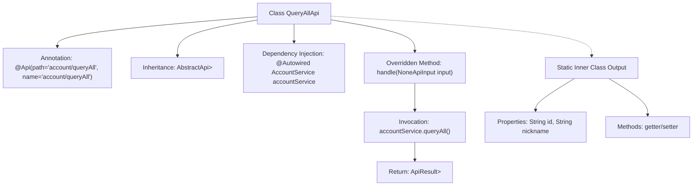

# Basic Information

|      |      |
|------|------|
| Name | QueryAllApi |
| Language | .java |
| Code Path | WeFe/serving/serving-service/src/main/java/com/welab/wefe/serving/service/api/account/QueryAllApi.java |
| Package Name | com.welab.wefe.serving.service.api.account |
| Dependencies | ['java.util.List', 'org.springframework.beans.factory.annotation.Autowired', 'com.welab.wefe.common.web.api.base.AbstractApi', 'com.welab.wefe.common.web.api.base.Api', 'com.welab.wefe.common.web.dto.AbstractApiOutput', 'com.welab.wefe.common.web.dto.ApiResult', 'com.welab.wefe.common.web.dto.NoneApiInput', 'com.welab.wefe.serving.service.service.AccountService'] |
| Brief Description | The QueryAllApi class is used to query all account information, invoking the queryAll method of AccountService to return a list containing id and nickname. |

# Description

The code defines an API class named `QueryAllApi`, which is used to query all account information. It inherits from `AbstractApi`, accepts `NoneApiInput` as input, and returns an `ApiResult` containing a list of `Output` objects. The `Output` class includes two attributes, `id` and `nickname`, along with corresponding getter and setter methods. The API path is `account/queryAll`, and it retrieves data by invoking the `queryAll` method of the injected `AccountService`. The processing logic is implemented in the `handle` method, which returns the query results upon success.

# Class Summary

| Name   | Type  | Description |
|-------|------|-------------|
| QueryAllApi | class | The QueryAllApi class is used to query all account information, accepts empty input, returns a list containing id and nickname, and implements this by calling the queryAll method of AccountService. |


## Class QueryAllApi

|      |      |
|------|------|
| Access Modifier | @Api(path = "account/queryAll", name = "account/queryAll");public |
| Type | class |
| Name | QueryAllApi |
| Description | The QueryAllApi class is used to query all account information, accepts empty input, returns a list containing id and nickname, and implements this by calling the queryAll method of AccountService. |


### UML Class Diagram

```mermaid
classDiagram
    class QueryAllApi {
        -AccountService accountService
        +handle(NoneApiInput input) ApiResult~List~Output~~
    }

    class AbstractApi~T, R~ {
        <<Abstract>>
    }

    class NoneApiInput {
    }

    class ApiResult~T~ {
    }

    class AccountService {
        <<Interface>>
        +queryAll() List~QueryAllApi.Output~
    }

    class QueryAllApi$Output {
        -String id
        -String nickname
        +getNickname() String
        +getId() String
        +setId(String id)
        +setNickname(String nickname)
    }

    class AbstractApiOutput {
        <<Abstract>>
    }

    QueryAllApi --> AbstractApi : Extends
    QueryAllApi --> AccountService : Depends on
    QueryAllApi --> NoneApiInput : Uses
    QueryAllApi --> ApiResult : Returns
    QueryAllApi --> QueryAllApi$Output : Nested class
    QueryAllApi$Output --> AbstractApiOutput : Extends
    AccountService ..|> QueryAllApi$Output : Returns
```

This code demonstrates a `QueryAllApi` class for querying all account information. It inherits from the generic abstract class `AbstractApi`, takes `NoneApiInput` as input parameter, and returns an `ApiResult` containing a list of `Output` objects. `Output` is a static nested class inheriting from `AbstractApiOutput`, containing account ID and nickname fields. `QueryAllApi` retrieves data through the dependency-injected `AccountService` interface and implements the `handle` method to process requests. The class diagram clearly illustrates the relationships and hierarchical structure among these classes.


### Internal Method Call Graph



This code defines an API class named `QueryAllApi` for querying all account information. The class inherits from `AbstractApi`, invokes the `queryAll()` method via `AccountService` to retrieve data, and returns an `ApiResult` containing a list of `Output` objects. `Output` is a static inner class with `id` and `nickname` properties along with their getter/setter methods. The flowchart illustrates the class structure, method invocation relationships, and data processing flow, clearly presenting the complete chain from request handling to result return.

### Field List

| Name  | Type  | Description |
|-------|-------|------|
| accountService | AccountService | Use @Autowired to automatically inject an instance of AccountService. |

### Method List

| Name  | Type  | Description |
|-------|-------|------|
| handle | ApiResult<List<Output>> | This code rewrites the handle method, invoking accountService to query all data and return a successful result. |


