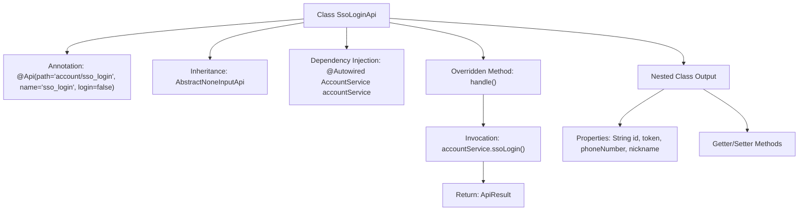

# Basic Information

|      |      |
|------|------|
| Name | SsoLoginApi |
| Language | .java |
| Code Path | WeFe/serving/serving-service/src/main/java/com/welab/wefe/serving/service/api/account/SsoLoginApi.java |
| Package Name | com.welab.wefe.serving.service.api.account |
| Dependencies | ['com.welab.wefe.common.exception.StatusCodeWithException', 'com.welab.wefe.common.web.api.base.AbstractNoneInputApi', 'com.welab.wefe.common.web.api.base.Api', 'com.welab.wefe.common.web.dto.AbstractApiOutput', 'com.welab.wefe.common.web.dto.ApiResult', 'com.welab.wefe.serving.service.service.AccountService', 'org.springframework.beans.factory.annotation.Autowired'] |
| Brief Description | SSO login API class, no login required, calling accountService.ssoLogin returns user ID, token, phone number, and nickname. |

# Description

The code defines an API class named SsoLoginApi, which handles single sign-on requests. The API path is account/sso_login and can be accessed without login. The class inherits from AbstractNoneInputApi, with the output type being the inner class Output. By injecting the AccountService, it calls the ssoLogin method to process the request and returns an output result containing the user ID, token, phone number, and nickname. The Output class inherits from AbstractApiOutput and includes four read-write string properties: id, token, phoneNumber, and nickname.

# Class Summary

| Name   | Type  | Description |
|-------|------|-------------|
| SsoLoginApi | class | SSO login API class, no login required, calling accountService.ssoLogin() returns user ID, token, phone number, and nickname. |


## Class SsoLoginApi

|      |      |
|------|------|
| Access Modifier | @Api(path = "account/sso_login", name = "sso_login", login = false);public |
| Type | class |
| Name | SsoLoginApi |
| Description | SSO login API class, no login required, calling accountService.ssoLogin() returns user ID, token, phone number, and nickname. |


### UML Class Diagram

```mermaid
classDiagram
    class AbstractNoneInputApi~T~ {
        <<abstract>>
        +handle() ApiResult~T~
    }

    class SsoLoginApi {
        -AccountService accountService
        +handle() ApiResult~Output~
    }

    class AccountService {
        <<Interface>>
        +ssoLogin() SsoLoginApi$Output
    }

    class AbstractApiOutput {
        <<abstract>>
    }

    class SsoLoginApi$Output {
        -String id
        -String token
        -String phoneNumber
        -String nickname
        +get/set methods
    }

    SsoLoginApi --|> AbstractNoneInputApi : Inheritance
    SsoLoginApi --> AccountService : Dependency
    SsoLoginApi$Output --|> AbstractApiOutput : Inheritance
    AccountService ..> SsoLoginApi$Output : Creation
```

This code demonstrates the implementation structure of an SSO login API. SsoLoginApi inherits from the generic abstract class AbstractNoneInputApi, utilizing the AccountService interface to implement single sign-on functionality, returning an output object containing user ID, token, phone number, and nickname. The class diagram clearly illustrates inheritance relationships (SsoLoginApi→AbstractNoneInputApi, Output→AbstractApiOutput), dependency relationships (SsoLoginApi→AccountService), and interface implementation relationships, with Output as a static inner class encapsulating post-login user information. The entire design adheres to object-oriented principles, achieving excellent extensibility through abstract classes and interfaces.


### Internal Method Call Graph



This flowchart illustrates the core structure of the SSO login API. The SsoLoginApi class defines the interface path via the @Api annotation, inherits from an abstract base class, and injects AccountService. The main logic resides in the handle() method, which invokes the ssoLogin() service of accountService and returns an encapsulated result. The nested Output class defines a data structure containing user ID, token, phone number, and nickname, with access control provided through Getter/Setter methods. The entire design reflects clear hierarchical relationships and the single responsibility principle.

### Field List

| Name  | Type  | Description |
|-------|-------|------|
| accountService | AccountService | Automatically inject the AccountService instance. |

### Method List

| Name  | Type  | Description |
|-------|-------|------|
| handle | ApiResult<Output> | This is a Java method override that invokes the `ssoLogin` method of `accountService` to perform single sign-on, returning either a successful result or an exception. |


