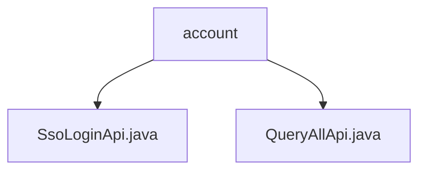

# Basic Information

|      |      |
|------|------|
| Name | account |
| Language | .java |
| Code Path | WeFe/serving/serving-service/src/main/java/com/welab/wefe/serving/service/api/account |
| Package Name | docs.serving.serving-service.src.main.java.com.welab.wefe.serving.service.api.account |
| Brief Description | The SsoLoginApi handles single sign-on, with the path account/sso_login, returning user ID, token, mobile number, and nickname. The QueryAllApi queries all accounts, with the path account/queryAll, returning a list of IDs and nicknames. |

# Description

## Overview  
The core responsibility of this module is to provide API services related to account management, including single sign-on (SSO) and account information query functionalities. The interface specifications adhere to the RESTful style, such as `account/sso_login` for handling SSO login requests and `account/queryAll` for retrieving account lists. Key data structures include the `Output` class (containing fields like user ID and token) and `ApiResult` (encapsulating list results). The only external dependency is `AccountService`, which handles business logic. For example, `SsoLoginApi` generates tokens via the `ssoLogin` method, while `QueryAllApi` retrieves account lists through `queryAll`.  

## Key Business Scenarios  
The module supports two typical scenarios: users obtaining access tokens via SSO login (similar to the OAuth flow) or administrators querying all account information (akin to CRUD operations). Both interaction modes involve synchronous HTTP requests, such as login returning `{id, token}` and queries returning a `[{id, nickname}]` list. Functional completeness is reflected in stateless design and layered architecture, with `AbstractApi` uniformly handling input and output. API types include unauthenticated interfaces (e.g., login) and authenticated interfaces (e.g., queries), with integration cases capable of interfacing with frontends or third-party authentication systems.

### Package Internal Structure View

This flowchart illustrates the structure of two API files under the account directory in the WeFe project. The root node is the account folder, which contains two child nodes: SsoLoginApi.java and QueryAllApi.java, representing the API implementation classes for single sign-on and querying all data, respectively. The entire structure presents a clear and concise hierarchy of account-related APIs.

# File List

| Name   | Type  | Description |
|-------|------|-------------|
| [SsoLoginApi.java](SsoLoginApi.md) | file | SSO Login API class, no login required. Calling accountService.ssoLogin returns user ID, token, phone number, and nickname. |
| [QueryAllApi.java](QueryAllApi.md) | file | The QueryAllApi class is used to query all account information, calling the AccountService's queryAll method to return a list containing id and nickname. |

